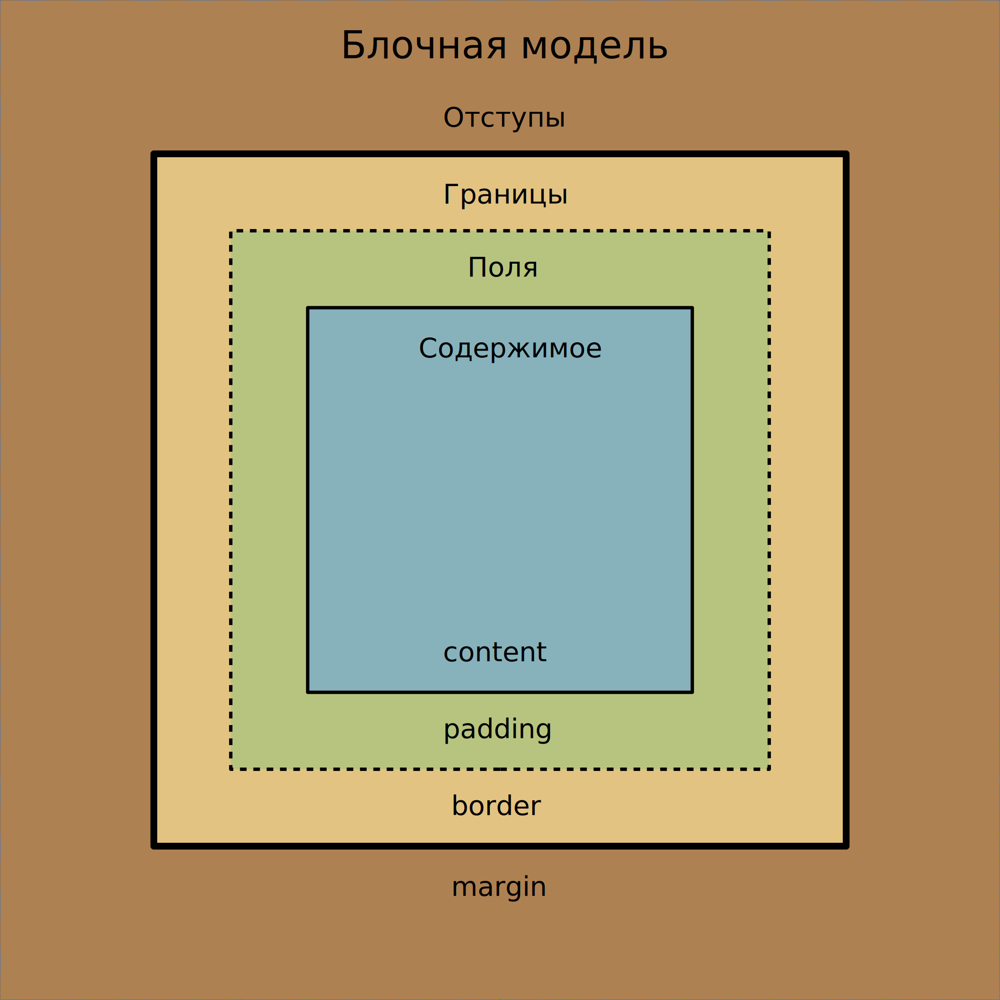

# План курса

Общая продолжительность курса - 7 месяцев.

Курс состоит из трёх тематических блоков и трёх лабораторных работ. Разбиение блоков по времени:

- HTML и CSS - 2 месяца (29%).
- JavaScript - 3 месяцев (42%).
- Популярные фреймворки - 2 месяца (29%).

Каждое занятие состоит из двух пар. На первой паре даётся теоретический материал, на второй паре студенты выполняют самостоятельные задания и сдают их преподавателю. Задания должны покрывать все аспекты пройденного материала.

## 1. HTML и CSS

Блок рассчитан на два месяца, т.е. примерно восемь еженедельных занятий по две пары. Ниже рассмотрим план на каждое занятие.

Ожидаемый итог - студент свободно оперирует HTML-элементами и создаёт блоки объявлений CSS.

В конце блока студенту выдаётся первая лабораторная работа.

### 1.1. Введение

::: tip На заметку
Затраты времени (из доступных **180 минут**):

- **30-50 минут** - объяснение материала.
- **50-150 минут** - выполнение заданий студентами.

Перенести описание [валидатора](https://validator.w3.org/) и атрибута [lang](https://webref.ru/html/attr/lang) из третьего занятия в первое.

Отформатировать все примеры кода.
:::

Темы занятия:

- Инструменты разработчика Chrome.
- Базовые элементы HTML.
- Атрибуты элементов.
- Универсальные атрибуты [`title`](https://webref.ru/html/attr/title) и [`style`](https://webref.ru/html/attr/style).
- Свойства CSS для установки цвета текста и фона.

#### Что нового?

- HTML:

  - Тип документа [`<!DOCTYPE>`](https://webref.ru/html/!doctype).
  - Корневой элемент [`<html>`](https://webref.ru/html/html).
  - Блок невизуальных элементов [`<head>`](https://webref.ru/html/head).
  - Блок визуальных элементов [`<body>`](https://webref.ru/html/body).
  - Заголовок документа [`<title>`](https://webref.ru/html/title).
  - Контекстная информация о документе [`<meta>`](https://webref.ru/html/meta) и его атрибут [`charset`](https://webref.ru/html/meta/charset).
  - Абзац [`<p>`](https://webref.ru/html/p).
  - Заголовки [`<h1>`](https://webref.ru/html/h1), [`<h2>`](https://webref.ru/html/h2), [`<h3>`](https://webref.ru/html/h3), [`<h4>`](https://webref.ru/html/h4), [`<h5>`](https://webref.ru/html/h5), [`<h6>`](https://webref.ru/html/h6).
  - Горизонтальная линия [`<hr>`](https://webref.ru/html/hr).
  - Комментарий [`<!-- -->`](https://webref.ru/html/!--).
  - Всплывающая подсказка - универсальный атрибут [`title`](https://webref.ru/html/attr/title).
  - Стилизация элемента - универсальный атрибут [`style`](https://webref.ru/html/attr/style).
  - Универсальный строчный элемент [`<span>`](https://webref.ru/html/span).

- CSS:

  - Цвет текста [`color`](https://webref.ru/css/color).
  - Цвет фона [`background-color`](https://webref.ru/css/background-color).

#### Сценарий

Представиться студентам. Попросить их не шуметь, переговариваться шёпотом, не ругаться и уважать друг друга. Если у студентов возникнут вопросы в ходе лекции, можно немедленно их задавать.

Дать ссылку на этот веб-сайт. Кратко описать содержимое ссылок на главной странице.

Открываем в браузере любой сайт и открываем инструменты разработчика. Демонстрируем, как выглядят HTML и CSS в современном сайте.

Показываем [список элементов HTML](https://webref.ru/html) и [свойств CSS](https://webref.ru/css). Их довольно много, при случае лучше обращаться к этому справочнику.

Показываем структуру HTML-элемента.


Обратить внимание, что все угловые скобки должны быть закрыты, в закрывающем тэге должна быть косая черта перед именем элемента. Атрибут и его значение разделяются знаком `=`, значение атрибута обрамляется двойными кавычками.

Показываем, как правильно настроить [Visual Studio Code](https://code.visualstudio.com/), чтобы можно было повторять действия за преподавателем:

1. Установить расширение [Live Server](https://marketplace.visualstudio.com/items?itemName=ritwickdey.LiveServer).
2. Открыть папку через редактор.
3. Создать файл `index.html`.
4. Нажать на кнопку `Go Live`.

Показываем базовую структуру страницы. `<!DOCTYPE>` обозначает тип документа.

```html
<!DOCTYPE html>

<html>
  <head></head>
  <body></body>
</html>
```

Добавляем в `<head>` заголовок страницы и указание кодировки содержимого. Здесь у `<meta>` появляется атрибут, к тому же этот элемент не требует наличие закрывающего тэга.

```html
<!DOCTYPE html>

<html>
  <head>
    <meta charset="utf-8">
    <title>Заголовок страницы</title>
  </head>
  <body>Содержимое страницы</body>
</html>
```

Заполняем элементами `<body>`. Появляется параграф `<p>`, заголовки шести уровней `<h1>`, `<h2>`, `<h3>`, `<h4>`, `<h5>`, `<h6>` и горизонтальная линия `<hr>`. Показываем, что в HTML можно добавлять комментарии в виде `<!-- -->`. Указываем у любого элемента универсальный атрибут `title` - всплывающая подсказка.

```html
<!DOCTYPE html>

<html>
  <head>
    <meta charset="utf-8">
    <title>Базовые элементы</title>
  </head>
  <body>
    <!-- Блок текста -->
    <p>Параграф</p>

    <!-- Заголовки -->
    <h1>Заголовок первого уровня</h1>
    <h2>Заголовок второго уровня</h2>
    <h3>Заголовок третьего уровня</h3>
    <h4>Заголовок четвёртого уровня</h4>
    <h5>Заголовок пятого уровня</h5>
    <h6>Заголовок шестого уровня</h6>

    <!-- Горизонтальная линия -->
    <hr title="Горизонтальная линия">
  </body>
</html>
```

Выбирать уровень заголовка следует исходя из текущего контекста, а не его внешнего вида. Внешний вид заголовка (размер шрифта и т.п.) следует устанавливать с помощью CSS.

Оформляем текст с помощью универсального атрибута `style`. Устанавливаем цвет текста `color` и фона `background-color`. Свойства записываютсяс помощью *объявлений* вида `свойство: значение`. Несколько *объявлений* разделяются точкой с запятой. С помощью элемента `<span>` можно применять стили к отдельным участкам текста внутри элемента `<p>`.

Цвет можно записать по названию, либо по его шестнадцатеричному значению. Подробнее можно прочитать [в статье](https://webref.ru/html/value/color).

```html
<!DOCTYPE html>

<html>
  <head>
    <meta charset="utf-8">
    <title>Цвет текста и фона</title>
  </head>
  <body>
    <p style="color: blue">Синий текст</p>
    <p style="background-color: yellow">Текст на жёлтом фоне</p>
    <p style="color: #ffffff; background-color: #ff0000">
      Белый текст на красном фоне
    </p>

    <p>
      Lorem ipsum dolor sit amet, consectetuer adipiscing elit,
      sed diam nonummy nibh euismod tincidunt ut laoreet dolore
      magna aliquam erat volutpat.
      <span title="Зелёный текст" style="color: green">
        Ut wisi enim ad minim veniam, quis nostrud exerci tation
        ullamcorper suscipit lobortis nisl ut aliquip ex ea
        commodo consequat.
      </span>
      Duis autem vel eum iriure dolor in hendrerit in vulputate
      velit esse molestie consequat, vel illum dolore eu feugiat
      nulla facilisis at vero eros et accumsan et iusto odio
      dignissim qui blandit praesent luptatum zzril delenit augue
      duis dolore te feugait nulla facilisi.
    </p>
  </body>
</html>
```

Кратко повторить пройденный материал.

Студенты переходят к выполнению самостоятельных заданий. Кратко описать, что нужно сделать в заданиях. Обратить внимание на раздел `Теоретические сведения`, а также на подсказки к заданиям.

### 1.2. Таблицы стилей. Списки

::: tip На заметку
Затраты времени (из доступных **180 минут**):

- **60-70 минут** - объяснение материала.
- **40-120 минут** - выполнение заданий студентами.

Добавить описание универсального атрибута, группировки атрибутов, селектора классов (указание имени элемента, мультиклассы).

Забыл упомянуть, что можно для текста устанавливать несколько теней.

Неправильно объяснил, как делать вложенные списки.

Рассказать о том, как делать комментарии в CSS.

Переименовать *селектор элементов* в *селектор типа*. Определиться, использовать мн.ч. или ед.ч. для наименования селекторов. В целом, желательно соответствовать материалам с Webref.
:::

Темы занятия:

- Элемент [`<style>`](https://webref.ru/html/style).
- Универсальные атрибуты [`id`](https://webref.ru/html/attr/id) и [`class`](https://webref.ru/html/attr/class).
- Универсальный селектор, cелекторы типа, идентификатора и класса.
- Свойства CSS для стилизации текста.
- Элементы для создания списков.
- Свойства CSS для стилизации списков.

#### Что нового?

- HTML:

  - Таблицы стилей для всего документа [`<style>`](https://webref.ru/html/style).
  - Идентификатор элемента - универсальный атрибут [`id`](https://webref.ru/html/attr/id).
  - Класс элемента - универсальный атрибут [`class`](https://webref.ru/html/attr/class).

  - Элементы списков:

    - Маркированный список [`<ul>`](https://webref.ru/html/ul).
    - Нумерованный список [`<ol>`](https://webref.ru/html/ol) и его атрибуты [`reversed`](https://webref.ru/html/ol/reversed) и [`start`](https://webref.ru/html/ol/start).
    - Пункт списка [`<li>`](https://webref.ru/html/li).

- CSS:

  - Селекторы:

    - [Селектор типа](https://webref.ru/css/selector/tag).
    - [Универсальный селектор](https://webref.ru/css/selector/universal).
    - [Селектор идентификатора](https://webref.ru/css/selector/id).
    - [Селектор класса](https://webref.ru/css/selector/class).

  - Характеристики шрифта:

    - Начертание шрифта [`font-style`](https://webref.ru/css/font-style).
    - Способ отображения строчных букв [`font-variant`](https://webref.ru/css/font-variant).
    - Насыщенность шрифта [`font-weight`](https://webref.ru/css/font-weight).
    - Размер шрифта [`font-size`](https://webref.ru/css/font-size).
    - Минимальная высота строки текста [`line-height`](https://webref.ru/css/line-height).
    - Семейство шрифта [`font-family`](https://webref.ru/css/font-family).
    - Универсальное свойство для установки различных характеристик шрифта и текста [`font`](https://webref.ru/css/font).

  - Отображения текста:

    - Горизонтальное выравнивание текста [`text-align`](https://webref.ru/css/text-align).
    - Величина отступа первой строки блока текста [`text-indent`](https://webref.ru/css/text-indent).
    - Интервал между словами [`word-spacing`](https://webref.ru/css/word-spacing).
    - Интервал между символами [`letter-spacing`](https://webref.ru/css/letter-spacing).
    - Преобразование регистра символов текста [`text-transform`](https://webref.ru/css/text-transform).

  - Оформление текста:

    - Тень текста [`text-shadow`](https://webref.ru/css/text-shadow).
    - Добавление декоративной линии к тексту [`text-decoration-line`](https://webref.ru/css/text-decoration-line).
    - Стиль декоративной линии [`text-decoration-style`](https://webref.ru/css/text-decoration-style).
    - Цвет декоративной линии [`text-decoration-color`](https://webref.ru/css/text-decoration-color).
    - Универсальное свойство для добавления декоративной линии [`text-decoration`](https://webref.ru/css/text-decoration).

  - Оформление списков:

    - Вид маркеров элементов списка [`list-style-type`](https://webref.ru/css/list-style-type).
    - Положение маркеров элементов списка относительно текста [`list-style-position`](https://webref.ru/css/list-style-position).
    - Изображение вместо стандартных маркеров элементов списка [`list-style-image`](https://webref.ru/css/list-style-image).
    - Универсальное свойство для оформления списков [`list-style`](https://webref.ru/css/list-style).

#### Сценарий

Попросить студентов не шуметь, переговариваться шёпотом, не ругаться и уважать друг друга. Если у студентов возникнут вопросы в ходе лекции, можно немедленно их задавать.

Кратко напомнить содержимое предыдущего занятия.

Помимо универсального атрибута [`style`](https://webref.ru/html/attr/style) существует также элемент[`<style>`](https://webref.ru/html/style). Его следует помещать в элемент [`<head>`](https://webref.ru/html/head). Он позволяет описать правила CSS, которые будут действовать на весь документ.

В дальнейшем стилизовать элементы с помощью атрибута [`style`](https://webref.ru/html/attr/style) следует лишь в тех случаях, где применение элемента [`style`](https://webref.ru/html/attr/style) по какой-либо причине не обосновано.

Показываем структуру правила CSS.


Каждое правило CSS имеет две основные части — *селектор* и *блок объявлений*. *Селектор*, расположенный в левой части правила, определяет, на какие части документа распространяется правило. *Блок объявлений* располагается в правой части правила. Он помещается в фигурные скобки, и, в свою очередь, состоит из одного или более *объявлений*, разделённых знаком `;`. Каждое *объявление* представляет собой сочетание *свойства* CSS и *значения*, разделённых знаком `:`. Селекторы могут группироваться в одной строке через запятую. В таком случае свойство применяется к каждому из них.

Блок объявлений мы писали на прошлом занятии. Сейчас рассмотрим, что из себя представляет селектор. Селекторы бывают разные. Мы начнём с селектора элементов.

Селектор элементов позволяет применить блок объявлений к одноимённому элементу. Также в примере показать, как писать комментарии в CSS.

```html
<!DOCTYPE html>

<html>
  <head>
    <meta charset="utf-8">
    <title>Селектор элементов</title>
    <style>
      /* Применить ко всем заголовкам первого уровня. */
      h1 { color: blue; }

      /* Применить ко всем блокам текста. */
      p { color: green; }

      /* Группировка селекторов */
      h1, p { background-color: yellow; }
    </style>
  </head>
  <body>
    <h1>Заголовок</h1>
    <p>Первый абзац</p>
    <p>Второй абзац</p>
  </body>
</html>
```

Помимо имени, к элементам можно обращаться индивидуально с помощью универсального атрибута [`id`](https://webref.ru/html/attr/id), который даёт элементу идентификатор - уникальное имя. Идентификатор состоит по меньшей мере из одного символа и не должен содержать пробел. В имя идентификатора допустимо включать цифры, символ подчёркивания, дефис и др. Идентификатор, как и имена элементов и атрибутов, лучше писать на английском. Имя идентификатора должно отображать смысл содержимого элемента.

Чтобы применить правило CSS к элементу с уникальным именем, необходимо использовать селектор идентификаторов. Селектор идентификаторов представляет собой имя идентификатора конкретного элемента, предварённое символом `#`.

```html
<!DOCTYPE html>

<html>
  <head>
    <meta charset="utf-8">
    <title>Селектор идентификаторов</title>
    <style>
      /* Применить к элементу с идентификатором "about". */
      #about { color: orange; }
    </style>
  </head>
  <body>
    <p id="about">Блок текста</p>
  </body>
</html>
```

Чтобы применить стиль к одному элементу или группе элементов независимо от их типов или идентификаторов, используется селектор классов. Чтобы у элемента появился класс, необходимо использовать универсальный атрибут [`class`](https://webref.ru/html/attr/class). В значении атрибута допускается указывать сразу несколько классов, разделяя их между собой пробелом. К имени класса предъявляются те же требования, что и к имени идентификатора.

Чтобы применить правило CSS к элементам с требуемым классом, необходимо использовать селектор классов. Селектор классов представляет собой имя требуемого класса, предварённое символом `.`.

```html
<!DOCTYPE html>

<html>
  <head>
    <meta charset="utf-8">
    <title>Селектор классов</title>
    <style>
      /* Применить ко всем элементам с классом "blue-text". */
      .blue-text { color: blue; }

      /* Применить ко всем элементам с классом "yellow-background". */
      .yellow-background { background-color: yellow; }
    </style>
  </head>
  <body>
    <p class="blue-text">Синий текст</p>
    <p class="yellow-background">Текст на жёлтом фоне</p>

    <!-- У этого элемента указаны два класса -->
    <p class="blue-text yellow-background">
      Синий текст на жёлтом фоне
    </p>
  </body>
</html>
```

Теперь перейдём к рассмотрению свойств CSS, предназначенных для стилизации текста, и их значений. Во время описания нового свойства сначала открывать страницу с его описанием в справочнике, а затем показывать его применение на практике (если необходимо).

А начнём мы с группы свойств, устанавливающих различные характеристики шрифта:

- Начертание шрифта [`font-style`](https://webref.ru/css/font-style).
- Способ отображения строчных букв [`font-variant`](https://webref.ru/css/font-variant).
- Насыщенность шрифта [`font-weight`](https://webref.ru/css/font-weight).
- Размер шрифта [`font-size`](https://webref.ru/css/font-size).
- Минимальная высота строки текста [`line-height`](https://webref.ru/css/line-height).
- Семейство шрифта [`font-family`](https://webref.ru/css/font-family).
- Универсальное свойство для установки различных характеристик шрифта и текста [`font`](https://webref.ru/css/font).

```html
<!DOCTYPE html>

<html>
  <head>
    <meta charset="utf-8">
    <title>Характеристики шрифта</title>
    <style>
      p {
        font: italic 14pt Arial;
      }
    </style>
  </head>
  <body>
    <p>
      Lorem ipsum dolor sit amet, consectetuer adipiscing elit,
      sed diam nonummy nibh euismod tincidunt ut laoreet dolore
      magna aliquam erat volutpat.
      Ut wisi enim ad minim veniam, quis nostrud exerci tation
      ullamcorper suscipit lobortis nisl ut aliquip ex ea
      commodo consequat.
      Duis autem vel eum iriure dolor in hendrerit in vulputate
      velit esse molestie consequat, vel illum dolore eu feugiat
      nulla facilisis at vero eros et accumsan et iusto odio
      dignissim qui blandit praesent luptatum zzril delenit augue
      duis dolore te feugait nulla facilisi.
    </p>
  </body>
</html>
```

Следующая группа свойств позволяет устанавливать параметры отображения текста:

- Горизонтальное выравнивание текста [`text-align`](https://webref.ru/css/text-align).
- Величина отступа первой строки блока текста [`text-indent`](https://webref.ru/css/text-indent).
- Интервал между словами [`word-spacing`](https://webref.ru/css/word-spacing).
- Интервал между символами [`letter-spacing`](https://webref.ru/css/letter-spacing).
- Преобразование регистра сиволов текста [`text-transform`](https://webref.ru/css/text-transform).

```html
<!DOCTYPE html>

<html>
  <head>
    <meta charset="utf-8">
    <title>Параметры отображения текста</title>
    <style>
      p {
        text-align: justify;
        text-indent: 20pt;
      }
    </style>
  </head>
  <body>
    <p>
      Lorem ipsum dolor sit amet, consectetuer adipiscing elit,
      sed diam nonummy nibh euismod tincidunt ut laoreet dolore
      magna aliquam erat volutpat.
      Ut wisi enim ad minim veniam, quis nostrud exerci tation
      ullamcorper suscipit lobortis nisl ut aliquip ex ea
      commodo consequat.
      Duis autem vel eum iriure dolor in hendrerit in vulputate
      velit esse molestie consequat, vel illum dolore eu feugiat
      nulla facilisis at vero eros et accumsan et iusto odio
      dignissim qui blandit praesent luptatum zzril delenit augue
      duis dolore te feugait nulla facilisi.
    </p>
  </body>
</html>
```

Следующая группа свойств позволяет добавлять оформление текста:

- Тень текста [`text-shadow`](https://webref.ru/css/text-shadow).
- Добавление декоративной линии к тексту [`text-decoration-line`](https://webref.ru/css/text-decoration-line).
- Стиль декоративной линии [`text-decoration-style`](https://webref.ru/css/text-decoration-style).
- Цвет декоративной линии [`text-decoration-color`](https://webref.ru/css/text-decoration-color).
- Универсальное свойство для добавления декоративной линии [`text-decoration`](https://webref.ru/css/text-decoration).

При показе примера спросить студентов, как будет выглядеть конечный результат, перед тем, как отобразить его в браузере.

```html
<!DOCTYPE html>

<html>
  <head>
    <meta charset="utf-8">
    <title>Оформление текста</title>
    <style>
      h1 { text-shadow: 5px 5px 3px lightgray; }
      p { text-decoration: underline wavy red; }
    </style>
  </head>
  <body>
    <h1>Заголовок</h1>
    <p>Блок текста</p>
  </body>
</html>
```

Теперь рассмотрим группу элементов, позволяющих создать списки:

- Маркированный список [`<ul>`](https://webref.ru/html/ul).
- Нумерованный список [`<ol>`](https://webref.ru/html/ol) и его атрибуты [`reversed`](https://webref.ru/html/ol/reversed) и [`start`](https://webref.ru/html/ol/start).
- Пункт списка [`<li>`](https://webref.ru/html/li).

Атрибут [`reversed`](https://webref.ru/html/ol/reversed) позволяет сменить нумерацию в списке на обратный порядок. Атрибут [`start`](https://webref.ru/html/ol/start) позволяет задать число, с которого будет начинаться нумерованный список.

Оба вида списка хранят в себе пункты списка, либо другие вложенные списки. Ничего другого класть внутрь списков не желательно.


```html
<!DOCTYPE html>

<html>
  <head>
    <meta charset="utf-8">
    <title>Списки</title>
    <style>
      ul {
        list-style: square;
      }

      ol {
        list-style: upper-roman
      }
    </style>
  </head>
  <body>
    <p>Основные ингредиенты теста для хлеба в хлебопечке:</p>
    <ul>
      <li>Мука</li>
      <li>Соль</li>
      <li>Сахар</li>
      <li>Дрожжи</li>
      <li>Пищевая сода и пекарный порошок</li>

      <li>Жидкие ингредиенты:
        <ul>
          <li>Молоко</li>
          <li>Соки</li>
          <li>Пиво</li>
        </ul>
      </li>

      <li>Яйца</li>
      <li>Жиры и растительный масла</li>
    </ul>

    <p>Цвета радуги:</p>
    <ol reversed>
      <li>Фиолетовый</li>
      <li>Голубой</li>
      <li>Синий</li>
      <li>Зелёный</li>
      <li>Жёлтый</li>
      <li>Оранжевый</li>
      <li>Красный</li>
    </ol>
  </body>
</html>
```

Кратко повторить пройденный материал.

Студенты переходят к выполнению самостоятельных заданий. Кратко описать, что нужно сделать в заданиях. Обратить внимание на раздел `Теоретические сведения`, а также на подсказки к заданиям. Для тех, у кого есть долги, сейчас самое время сдать их, перед началом работы над новыми заданиями.

### 1.3. Таблицы, ссылки, мультимедиа и фреймы. Псевдоклассы

::: tip На заметку
Затраты времени (из доступных **180 минут**):

- **100-120 минут** - объяснение материала.
- **60-80 минут** - выполнение заданий студентами.

Слишком много материала для одной пары. Даже если говорить сокращённо, едва можно уложиться в одну пару. Возможно, тут поможет хорошо продуманный сценарий. А, возможно, следует просто вынести часть материала в отдельные занятия.

Добавить описание атрибута `autoplay` у медиаэлементов.

Объём практических заданий требовал сильно больше времени, чем оставалось у студентов. В результате студенты к концу второй пары едва успели закончить делать первое задание.

Доработать сценарий.
:::

Темы занятия:

- Универсальный атрибут [`lang`](https://webref.ru/html/attr/lang).
- Проверка кода с помощью [валидатора](https://validator.w3.org/).
- Свойства CSS для добавления границ к элементам.
- Элементы для создания таблиц.
- Свойства CSS для стилизации таблиц.
- Псевдоклассы.
- Ссылки и их свойства.
- Элементы мультимедиа: изображения, аудио и видео.
- Встроенный фрейм [`<iframe>`](https://webref.ru/html/iframe).
- Свойства CSS для указания размеров элементов.

#### Что нового?

- HTML:

  - Указание языка текста - универсальный атрибут [`lang`](https://webref.ru/html/attr/lang).

  - Элементы таблиц:

    - Содержимое таблицы [`<table>`](https://webref.ru/html/table).
    - Заголовок таблицы [`<caption>`](https://webref.ru/html/caption).
    - Шапка таблицы [`<thead>`](https://webref.ru/html/thead).
    - Основное тело таблицы [`<tbody>`](https://webref.ru/html/tbody).
    - Подвал таблицы [`<tfoot>`](https://webref.ru/html/tfoot).
    - Строка таблицы [`<tr>`](https://webref.ru/html/tr).
    - Обычная [`<td>`](https://webref.ru/html/td) и заголовочная [`<th>`](https://webref.ru/html/th) ячейки таблицы, и их атрибуты [`colspan`](https://webref.ru/html/td/colspan) и [`rowspan`](https://webref.ru/html/td/rowspan).

  - Ссылка [`<a>`](https://webref.ru/html/a) и её атрибуты [`href`](https://webref.ru/html/a/href), [`target`](https://webref.ru/html/a/target) и [`download`](https://webref.ru/html/a/download).

  - Элементы мультимедиа:

    - Изображение [``](https://webref.ru/html/img) и его атрибуты.
    - Аудиозапись [`<audio>`](https://webref.ru/html/audio) и его атрибуты.
    - Видеоролик [`<video>`](https://webref.ru/html/video) и его атрибуты.
    - Текстовая дорожка [`<track>`](https://webref.ru/html/track) и её атрибуты.

  - Встроенный фрейм [`<iframe>`](https://webref.ru/html/iframe) и его атрибуты.

- CSS:

  - Границы элемента (вместо `*` подставить одно из следующих значений: `top`, `bottom`, `left`, `right`):

    - Толщина границы [`border-width`](https://webref.ru/css/border-width) и `border-*-width`.
    - Стиль границы [`border-style`](https://webref.ru/css/border-style) и `border-*-style`.
    - Цвет границы [`border-color`](https://webref.ru/css/border-color) и `border-*-color`.
    - Универсальное свойство [`border`](https://webref.ru/css/border) и `border-*`.
    - Радиус скругления углов границы [`border-radius`](https://webref.ru/css/border-radius) и `border-*-*-radius`.

  - Оформление таблиц:

    - Положение заголовка [`caption-side`](https://webref.ru/css/caption-side).
    - Отображение границ ячеек [`border-collapse`](https://webref.ru/css/border-collapse).
    - Расстояние между границами ячеек [`border-spacing`](https://webref.ru/css/border-spacing).
    - Отображение пустых ячеек [`empty-cells`](https://webref.ru/css/empty-cells).

  - Псевдоклассы:

    - Первый дочерний элемент [`:first-child`](https://webref.ru/css/first-child).
    - Последний дочерний элемент [`:last-child`](https://webref.ru/css/last-child).
    - Группа дочерних элементов в соответствии с их нумерацией в дереве элементов [`:nth-child()`](https://webref.ru/css/nth-child) и [`:nth-last-child()`](https://webref.ru/css/nth-last-child) (нумерация в обратном порядке).
    - Непосещённая ссылка [`:link`](https://webref.ru/css/link).
    - Посещённая ссылка [`:visited`](https://webref.ru/css/visited).
    - Элемент, на который наведён указатель мыши [`:hover`](https://webref.ru/css/hover).

  - Размеры элементов:

    - Ширина [`width`](https://webref.ru/css/width).
    - Высота [`height`](https://webref.ru/css/height).

#### Сценарий

Попросить студентов не шуметь, переговариваться шёпотом, не ругаться и уважать друг друга. Если у студентов возникнут вопросы в ходе лекции, можно немедленно их задавать.

Кратко напомнить содержимое предыдущего занятия.

Помимо кодировки документа следует также указывать язык текста документа. Для этого используется универсальный атрибут [`lang`](https://webref.ru/html/attr/lang). Его можно указать в элементе [`<html>`](https://webref.ru/html/html) для всего документа или локально для отдельных элементов. В качестве значение необходимо указать код языка. Посмотреть некоторые распространенные языки и их коды можно в [справочнике](https://webref.ru/html/value/lang).

```html
<!DOCTYPE html>

<html lang="ru">
  <head>
    <meta charset="utf-8">
    <title>Универсальный атрибут lang</title>
  </head>
  <body>
    <p>Я говорю на русском.</p>
    <p lang="en">I speak English.</p>
    <p lang="de">Ich spreche Deutsch.</p>
    <p lang="fr">Je parle francais.</p>
  </body>
</html>
```

Рассказать про [валидатор](https://validator.w3.org/). Он используется для проверки документов HTML на правильность. Показать его работу на примере с языками. Добавить в ошибку и показать вывод валидатора в этом случае.

Рассмотрим группу свойств, позволяющих устанавливать границы элемента (вместо `*` подставить одно из следующих значений: `top`, `bottom`, `left`, `right`):

- Толщина границы [`border-width`](https://webref.ru/css/border-width) и `border-*-width`.
- Стиль границы [`border-style`](https://webref.ru/css/border-style) и `border-*-style`.
- Цвет границы [`border-color`](https://webref.ru/css/border-color) и `border-*-color`.
- Универсальное свойство [`border`](https://webref.ru/css/border) и `border-*`.
- Радиус скругления углов границы [`border-radius`](https://webref.ru/css/border-radius) и `border-*-*-radius`.

Границы можно устанавливать как все вместе, так и по отдельности. Углы границы можно делать как скруглёнными, так и эллиптическими

```html
<!DOCTYPE html>

<html lang="ru">
  <head>
    <meta charset="utf-8">
    <title>Границы элемента</title>
    <style>
      p {
        border-top: 10px solid red;
        border-bottom: 10px double green;
        border-left: 10px dashed blue;
        border-right: 10px dotted yellow;
        border-radius: 30px 60px 20px 80px / 50px 100px 30px 120px;
      }
    </style>
  </head>
  <body>
    <p>
      Lorem ipsum dolor sit amet, consectetuer adipiscing elit,
      sed diam nonummy nibh euismod tincidunt ut laoreet dolore
      magna aliquam erat volutpat.
      Ut wisi enim ad minim veniam, quis nostrud exerci tation
      ullamcorper suscipit lobortis nisl ut aliquip ex ea
      commodo consequat.
      Duis autem vel eum iriure dolor in hendrerit in vulputate
      velit esse molestie consequat, vel illum dolore eu feugiat
      nulla facilisis at vero eros et accumsan et iusto odio
      dignissim qui blandit praesent luptatum zzril delenit augue
      duis dolore te feugait nulla facilisi.
    </p>
  </body>
</html>
```

Теперь рассмотрим группу элементов, позволяющих создавать таблицы:

- Содержимое таблицы [`<table>`](https://webref.ru/html/table).
- Заголовок таблицы [`<caption>`](https://webref.ru/html/caption).
- Шапка таблицы [`<thead>`](https://webref.ru/html/thead).
- Основное тело таблицы [`<tbody>`](https://webref.ru/html/tbody).
- Подвал таблицы [`<tfoot>`](https://webref.ru/html/tfoot).
- Строка таблицы [`<tr>`](https://webref.ru/html/tr).
- Обычная [`<td>`](https://webref.ru/html/td) и заголовочная [`<th>`](https://webref.ru/html/th) ячейки таблицы, и их атрибуты [`colspan`](https://webref.ru/html/td/colspan) и [`rowspan`](https://webref.ru/html/td/rowspan).

В таблице может быть только по одному элементу типа [`<thead>`](https://webref.ru/html/thead) и [`<tfoot>`](https://webref.ru/html/tfoot). Допускается указывать несколько элементов [`<tbody>`](https://webref.ru/html/tbody) внутри таблицы.

Вместе с элементами стоит также рассмотреть группу свойств, позволяющих устанавливать параметры отображения элементов таблиц:

- Положение заголовка [`caption-side`](https://webref.ru/css/caption-side).
- Отображение границ ячеек [`border-collapse`](https://webref.ru/css/border-collapse).
- Расстояние между границами ячеек [`border-spacing`](https://webref.ru/css/border-spacing).
- Отображение пустых ячеек [`empty-cells`](https://webref.ru/css/empty-cells).

Значения свойств [`border-spacing`](https://webref.ru/css/border-spacing) и [`empty-cells`](https://webref.ru/css/empty-cells) игнорируются, если свойству [`border-collapse`](https://webref.ru/css/border-collapse) установлено значение `collapse`.

```html
<!DOCTYPE html>

<html lang="ru">
  <head>
    <meta charset="utf-8">
    <title>Таблицы</title>
    <style>
      table, td, th {
        text-align: center;
        border: 1px solid black;
        border-collapse: collapse;
      }
    </style>
  </head>
  <body>
    <table>
      <caption>Заголовок таблицы</caption>

      <thead>
        <tr>
          <th colspan="2">Шапка таблицы</th>
        </tr>
        <tr>
          <th>Заглавная ячейка 1</th>
          <th>Заглавная ячейка 2</th>
        </tr>
      </thead>

      <tbody>
        <tr>
          <td>Ячейка 1</td>
          <td rowspan="2">Ячейка 2</td>
        </tr>
        <tr>
          <td>Ячейка 3</td>
        </tr>
      </tbody>

      <tfoot>
        <tr>
          <td colspan="2">Подвал таблицы</td>
        </tr>
      </tfoot>
    </table>
  </body>
</html>
```

Для стилизации таблиц полезно также использовать псевдоклассы. Псевдоклассы позволяют динамически применить стиль к элементам исходя из их положения в дереве элементов или действий пользователя. Полный список псевдоклассов можно посмотреть в [справочнике](https://webref.ru/css/type/pseudoclass).

Псевдоклассы указываются вместе с селекторами, перед именем псевдокласса ставится знак `:`.

Рассмотрим следующую группу псевдоклассов:

- Первый дочерний элемент [`:first-child`](https://webref.ru/css/first-child).
- Последний дочерний элемент [`:last-child`](https://webref.ru/css/last-child).
- Группа дочерних элементов в соответствии с их нумерацией в дереве элементов [`:nth-child()`](https://webref.ru/css/nth-child) и [`:nth-last-child()`](https://webref.ru/css/nth-last-child) (нумерация в обратном порядке).

Запись `:first-child` равноценна записи `:nth-child(1)`, то же самое касается и `:last-child` и `:nth-last-child(1)`.

```html
<!DOCTYPE html>

<html lang="ru">
  <head>
    <meta charset="utf-8">
    <title>Псевдоклассы</title>
    <style>
       table, td {
         border: 1px solid black;
         border-collapse: collapse;
       }

       tr:first-child {
         color: white;
         background-color: red;
       }

       tr:nth-child(even) {
         background-color: yellow;
       }
    </style>
  </head>
  <body>
    <table>
      <caption>Заголовок таблицы</caption>
      <tbody>
        <tr>
          <td>Ячейка 11</td>
          <td>Ячейка 12</td>
        </tr>
        <tr>
          <td>Ячейка 21</td>
          <td>Ячейка 22</td>
        </tr>
        <tr>
          <td>Ячейка 31</td>
          <td>Ячейка 32</td>
        </tr>
        <tr>
          <td>Ячейка 41</td>
          <td>Ячейка 42</td>
        </tr>
        <tr>
          <td>Ячейка 51</td>
          <td>Ячейка 52</td>
        </tr>
        <tr>
          <td>Ячейка 61</td>
          <td>Ячейка 62</td>
        </tr>
      </tbody>
    </table>
  </body>
</html>
```

Ссылка [`<a>`](https://webref.ru/html/a) и её атрибуты [`href`](https://webref.ru/html/a/href), [`target`](https://webref.ru/html/a/target) и [`download`](https://webref.ru/html/a/download).

Псевдоклассы:

- Непосещённая ссылка [`:link`](https://webref.ru/css/link).
- Посещённая ссылка [`:visited`](https://webref.ru/css/visited).
- Элемент, на который наведён указатель мыши [`:hover`](https://webref.ru/css/hover).

Адреса бывают абсолютные и относительные: [статья](https://webref.ru/html/value/url). Можно ссылаться по `id`.


```html
<!DOCTYPE html>

<html lang="ru">
  <head>
    <meta charset="utf-8">
    <title>Ссылки</title>
    <style>
    </style>
  </head>
  <body>
  </body>
</html>
```

Элементы мультимедиа:

- Изображение [``](https://webref.ru/html/img) и его атрибуты.
- Аудиозапись [`<audio>`](https://webref.ru/html/audio) и его атрибуты.
- Видеоролик [`<video>`](https://webref.ru/html/video) и его атрибуты.
- Текстовая дорожка [`<track>`](https://webref.ru/html/track) и её атрибуты.

Встроенный фрейм [`<iframe>`](https://webref.ru/html/iframe) и его атрибуты.

Размеры элементов:

- Ширина [`width`](https://webref.ru/css/width).
- Высота [`height`](https://webref.ru/css/height).

Размеры можно указывать в пискелях и процентах.

```html
<!DOCTYPE html>

<html lang="ru">
  <head>
    <meta charset="utf-8">
    <title>Элементы мультимедиа и фреймы</title>
    <style>
      h1 {
        text-align: center;
      }

      audio, video, img, iframe {
        width: 100%;
      }

      iframe {
        border: none;
      }
    </style>
  </head>
  <body>
    <h1>Изображение</h1>
    

    <h1>Аудиозапись</h1>
    <audio src="assets/audio.mp3" controls>
      <p>Ваш веб-браузер не поддерживает проигрывание аудио.</p>
    </audio>

    <h1>Видеоролик</h1>
    <video src="assets/video.mp4" controls>
      <track kind="subtitles" src="assets/subtitles.en.vtt"
             srclang="en" label="English">
      <track kind="subtitles" src="assets/subtitles.ru.vtt"
             srclang="ru" label="Русский" default>
      <p>Ваш веб-браузер не поддерживает проигрывание видео.</p>
    </video>

    <h1>Встроенный фрейм</h1>
    <iframe src="https://www.youtube.com/embed/aqz-KE-bpKQ?rel=0"
            width="560" height="315" allowfullscreen
            allow="autoplay; encrypted-media">
      Ваш веб-браузер не поддерживает встроенные фреймы.
    </iframe>
  </body>
</html>
```

Кратко повторить пройденный материал.

Студенты переходят к выполнению самостоятельных заданий. Кратко описать, что нужно сделать в заданиях. Обратить внимание на раздел `Теоретические сведения`, а также на подсказки к заданиям. Для тех, у кого есть долги, сейчас самое время сдать их, перед началом работы над новыми заданиями.

### 1.4. Блочная модель. Псевдоэлементы. Emmet

::: tip На заметку
Затраты времени (из доступных **180 минут**):

- **80-90 минут** - объяснение материала.
- **90-100 минут** - выполнение заданий студентами.

Доработать сценарий.

Сегодняшние селекторы (за исключением селектора атрибута) ещё называют комбинаторами.
:::

Темы занятия:

- Связь с внешними документами с помощью элемента [`<link>`](https://webref.ru/html/link).
- Блочная модель и относящиеся к ней свойства CSS.
- Блочные, строчные и строчно-блочные элементы, свойство [`display`](https://webref.ru/css/display).
- Прочие виды селекторов.
- Псевдоэлементы.
- [Emmet](https://emmet.io).

#### Что нового?

- HTML:

  - Связь с внешним документом [`<link>`](https://webref.ru/html/link) и его атрибуты [`href`](https://webref.ru/html/link/href) и [`rel`](https://webref.ru/html/link/rel).
  - Универсальный блочный элемент [`<div>`](https://webref.ru/html/div).

- CSS:

  - Блочная модель (вместо `*` подставить одно из следующих значений: `top`, `bottom`, `left`, `right`):

    - Величина полей [`padding`](https://webref.ru/css/padding) и `padding-*`.
    - Величина отступа [`margin`](https://webref.ru/css/padding) и `margin-*`.

  - Алгоритм расчёта ширины и высоты элемента [`box-sizing`](https://webref.ru/css/box-sizing).
  - Способ отображения элемента [`display`](https://webref.ru/css/display).

  - Селекторы:

    - [Вложенный селектор](https://webref.ru/css/selector/descendant).
    - [Дочерний селектор](https://webref.ru/css/selector/child).
    - [Соседний селектор](https://webref.ru/css/selector/adjacent).
    - [Родственный селектор](https://webref.ru/css/selector/sibling).
    - [Селектор атрибута](https://webref.ru/css/selector/attr).

  - Псевдоэлементы:

    - Первый символ в тексте [`::first-letter`](https://webref.ru/css/first-letter).
    - Первая строка текста [`::first-line`](https://webref.ru/css/first-line).
    - Отображения контента до содержимого элемента [`::before`](https://webref.ru/css/before), после содержимого элемента [`::after`](https://webref.ru/css/after) и свойство [`content`](https://webref.ru/css/content).
    - Выделенный текст [`::selection`](https://webref.ru/css/first-line).

#### Сценарий

Попросить студентов не шуметь, переговариваться шёпотом, не ругаться и уважать друг друга. Если у студентов возникнут вопросы в ходе лекции, можно немедленно их задавать.

Кратко напомнить содержимое предыдущего занятия.

Подключение иконки и внешних стилей с помощью элемента [`<link>`](https://webref.ru/html/link) и его атрибутов [`href`](https://webref.ru/html/link/href) и [`rel`](https://webref.ru/html/link/rel).

```html
<!DOCTYPE html>

<html lang="ru">

<head>
  <meta charset="utf-8">
  <title>Внешние документы</title>
  <link rel="icon" href="icons/icon192.png">
  <link rel="stylesheet" href="styles/style.css">
</head>

<body>
  <h1>Заголовок</h1>
</body>

</html>
```

```css
h1 {
  color: white;
  background-color: red;
}
```

В блочной модели элемент рассматривается как прямоугольный контейнер, имеющий область содержимого и необязательные рамки и отступы (внутренние и внешние).



Блочная модель:

- *Содержимое* - содержимое элемента (например, текст или изображение, или другой элемент).
- *Поля* - расстояние между содержимым и границей элемента. Задаётся свойством [`padding`](https://webref.ru/css/padding).
- *Границы* - видимая граница элемента. Задаётся свойством [`border`](https://webref.ru/css/border).
- *Отступы* - расстояние снаружи элемента от границы до соседних элементов. Задаётся свойством [`margin`](https://webref.ru/css/margin).

Показать блочную модель нескольких элементов в инструментах разработчика Chrome.

Алгоритм расчёта ширины и высоты элемента можно изменить с помощью свойства [`box-sizing`](https://webref.ru/css/box-sizing).

```html
<!DOCTYPE html>

<html lang="ru">

<head>
  <meta charset="utf-8">
  <title>Блочная модель</title>
  <style>
    .box {
      box-sizing: border-box;
      width: 200px;
      padding: 50px;
      border: 3px solid red;
      margin: 50px;
    }
  </style>
</head>

<body>
  <p class="box">
    Lorem ipsum dolor sit amet, consectetuer adipiscing elit,
    sed diam nonummy nibh euismod tincidunt ut laoreet dolore
    magna aliquam erat volutpat.
    Ut wisi enim ad minim veniam, quis nostrud exerci tation
    ullamcorper suscipit lobortis nisl ut aliquip ex ea
    commodo consequat.
    Duis autem vel eum iriure dolor in hendrerit in vulputate
    velit esse molestie consequat, vel illum dolore eu feugiat
    nulla facilisis at vero eros et accumsan et iusto odio
    dignissim qui blandit praesent luptatum zzril delenit augue
    duis dolore te feugait nulla facilisi.
  </p>
</body>

</html>
```

Свойство [`display`](https://webref.ru/css/display) определяет тип контейнера элемента. Для каждого элемента существует значение браузера по умолчанию. Это значение можно при необходимости изменить. Элементы бывают:

- Блочные - `display: block` (`<h1>`, `<h2>`, `<h3>`, `<h4>`, `<h5>`, `<h6>`, `<p>`, `<hr>`, `<ul>`, `<ol>`, `<li>`, `<table>` и др.). Создают разрыв строки перед элементом и после него, образуя прямоугольную область, по ширине занимающую всю ширину веб-страницы или блока-родителя (если для элемента не задано значение ширины). Блочные элементы могут содержать как строчные, так и блочные элементы, но не оба типа элементов сразу. Блочные элементы могут содержаться только в пределах блочных элементов.
- Строчные - `display: inline` (`<span>`, `<a>`, ``, `<iframe>` и др.). Ширина и высота строчного элемента зависит только от его содержимого, задать размеры с помощью CSS нельзя. Можно увеличить расстояние между соседними элементами по горизонтали с помощью горизонтальных полей и отступов.
- Строчно-блочные - `display: inline-block` (`<audio>`, `<video>` и др.). Такие элементы являются строочными, но для них можно задавать поля, отступы, ширину и высоту.

Мы уже знаем универсальный строчный элемент [`<span>`](https://webref.ru/html/span), который использовался для выделения отдельных строк, символов или других строчных элементов для дальнейшего изменения их оформления с помощью стилей. Универсальный блочный элемент [`<div>`](https://webref.ru/html/div) предназначен для группирования элементов документа с целью изменения вида содержимого через стили.

```html
<!DOCTYPE html>

<html lang="ru">

<head>
  <meta charset="utf-8">
  <title>Свойство display</title>
  <style>
    div {
      width: 50px;
      height: 50px;
      margin: 5px;
      padding: 5px;
      text-align: center;
    }

    .block {
      display: block;
      border: 3px solid red;
      background-color: orange;
    }

    .inline {
      display: inline;
      border: 3px solid black;
      background-color: lightgreen;
    }

    .inline-block {
      display: inline-block;
      border: 3px solid blue;
      background-color: yellow;
    }
  </style>
</head>

<body>
  <!-- display: block -->
  <div class="block">block1</div>
  <div class="block">block2</div>

  <!-- display: inline -->
  <div class="inline">inline1</div>
  <div class="inline">inline2</div>

  <!-- display: inline-block -->
  <div class="inline-block">inline-block1</div>
  <div class="inline-block">inline-block2</div>
</body>

</html>
```

Подробнее можно почитать в статье ["Открываем блочную модель"](https://webref.ru/layout/learn-html-css/box-model).

Селекторы:

- [Вложенный селектор](https://webref.ru/css/selector/descendant) - `A B`.
- [Дочерний селектор](https://webref.ru/css/selector/child) `A > B`.
- [Соседний селектор](https://webref.ru/css/selector/adjacent) `A + B`.
- [Родственный селектор](https://webref.ru/css/selector/sibling) `A ~ B`.
- [Селектор атрибута](https://webref.ru/css/selector/attr) `[attr]`.

Полный список вариантов использования селектора атрибута:

| Селектор          | Описание                                                                                                                                                       |
| ----------------- | -------------------------------------------------------------------------------------------------------------------------------------------------------------- |
| `[attr]`          | Все элементы с атрибутом по имени `attr`.                                                                                                                      |
| `[attr="value"]`  | Все элементы с атрибутом по имени `attr`, значение которого в точности совпадает с `"value"`.                                                                  |
| `[attr^="value"]` | Все элементы с атрибутом по имени `attr`, значение которого начинается с `"value"`.                                                                            |
| `[attr$="value"]` | Все элементы с атрибутом по имени `attr`, значение которого заканчивается на `"value"`.                                                                        |
| `[attr*="value"]` | Все элементы с атрибутом по имени `attr`, значение которого содержит по крайней мере одно вхождение  `"value"` как подстроки.                                  |
| `[attr~="value"]` | Все элементы с атрибутом по имени `attr`, значением которого является набор слов, разделённых пробелами, одно из которых в точности совпадает с `"value"`.     |
| `[attr|="value"]` | Все элементы с атрибутом по имени `attr`, значение которого или в точности совпадает с `"value"`, или начинается с `"value"`, после которого идёт дефис `"-"`. |

Повторить все виды селекторов, вкючая рассмотренные ранее.

Псевдоэлементы позволяют задать стиль элементов не определённых в дереве элементов документа, а также генерировать содержимое, которого нет в исходном коде текста. Псевдоэлементы начинаются с `::`, чтобы отличить их от псевдоклассов.

Псевдоэлементы (почти все существующие):

- Первый символ в тексте [`::first-letter`](https://webref.ru/css/first-letter).
- Первая строка текста [`::first-line`](https://webref.ru/css/first-line).
- Отображения контента до содержимого элемента [`::before`](https://webref.ru/css/before), после содержимого элемента [`::after`](https://webref.ru/css/after) и свойство [`content`](https://webref.ru/css/content).
- Выделенный текст [`::selection`](https://webref.ru/css/first-line).

Рассказать про [Emmet](https://emmet.io).

Кратко повторить пройденный материал.

Студенты переходят к выполнению самостоятельных заданий. Кратко описать, что нужно сделать в заданиях. Обратить внимание на раздел `Теоретические сведения`, а также на подсказки к заданиям. Для тех, у кого есть долги, сейчас самое время сдать их, перед началом работы над новыми заданиями.

### 1.5. Наследование и каскадность стилей. Позиционирование и CSS Grid Layout. Семантические элементы

::: tip На заметку
Затраты времени (из доступных **180 минут**):

- **X минут** - объяснение материала.
- **Y минут** - выполнение заданий студентами.

Доработать сценарий.
:::

Темы занятия:

- Псевдокласс [`:not()`](https://webref.ru/css/not).
- [Наследование](https://metanit.com/web/html5/5.9.php) и [каскадность](https://metanit.com/web/html5/5.10.php) стилей, специфичность и значение [`!important`](https://webref.ru/css/%21important).
- Способы задания [цвета](https://webref.ru/css/value/color).
- Единицы измерения CSS для задания [размеров](https://webref.ru/css/value/size).
- Свойства CSS для указания позиции элементов и ограничения размеров.
- [CSS Grid Layout](https://metanit.com/web/html5/13.1.php).
- Элементы, формирующие структуру документа и другие семантические элементы.

#### Что нового?

- HTML:

  - Структура документа:

    - Основное содержимое документа [`<main>`](https://webref.ru/html/main).
    - Шапка документа [`<header>`](https://webref.ru/html/header).
    - Подвал документа [`<footer>`](https://webref.ru/html/footer).
    - Боковая панель документа [`<aside>`](https://webref.ru/html/aside).
    - Панель навигации [`<nav>`](https://webref.ru/html/nav).
    - Единичная статья [`<article>`](https://webref.ru/html/article).
    - Блок статей [`<section>`](https://webref.ru/html/section).

  - Семантические элементы:

    - Информация об авторе [`<address>`](https://webref.ru/html/address).
    - Указание даты и времени [`<time>`](https://webref.ru/html/time) и его атрибут [`datetime`](https://webref.ru/html/time/datetime).

- CSS:

  - Ограничение границ действия селектора - псевдокласс [`:not()`](https://webref.ru/css/not).

  - Уровень прозрачности элемента [`opecity`](https://webref.ru/css/opacity).

  - Позиция элементов:

    - Способ позиционирования элемента [`position`](https://webref.ru/css/position).
    - Расстояние от верхнего [`top`](https://webref.ru/css/top), правого [`right`](https://webref.ru/css/right), нижнего [`bottom`](https://webref.ru/css/bottom), левого [`left`](https://webref.ru/css/left) краёв родительского элемента до соответствующего края дочернего элемента.
    - Порядок наложения элементов друг на друга [`z-index`](https://webref.ru/css/z-index).

  - Ограничение размеров:

    - Минимальная [`min-width`](https://webref.ru/css/min-width) и максимальная [`max-width`](https://webref.ru/css/max-width) ширина.
    - Минимальная [`min-height`](https://webref.ru/css/min-height) и максимальная [`max-height`](https://webref.ru/css/max-height) высота.

  - CSS Grid Layout:

    - Количество и размер строк [`grid-template-rows`](https://developer.mozilla.org/en-US/docs/Web/CSS/grid-template-rows), столбцов [`grid-template-columns`](https://developer.mozilla.org/en-US/docs/Web/CSS/grid-template-columns), комбинированное свойство [`grid`](https://developer.mozilla.org/en-US/docs/Web/CSS/grid) и функция [`repeat()`](https://developer.mozilla.org/en-US/docs/Web/CSS/CSS_Grid_Layout).
    - Промежуток между строками [`grid-row-gap`](https://developer.mozilla.org/en-US/docs/Web/CSS/row-gap), столбцами [`grid-column-gap`](https://developer.mozilla.org/en-US/docs/Web/CSS/column-gap) и комбинированное свойство [`grid-gap`](https://developer.mozilla.org/en-US/docs/Web/CSS/gap).
    - Шаблон сетки [`grid-template-areas`](https://developer.mozilla.org/en-US/docs/Web/CSS/grid-template-areas).
    - Привязка элемента в области сетки [`grid-area`](https://developer.mozilla.org/en-US/docs/Web/CSS/grid-area).

#### Сценарий

Попросить студентов не шуметь, переговариваться шёпотом, не ругаться и уважать друг друга. Если у студентов возникнут вопросы в ходе лекции, можно немедленно их задавать.

Кратко напомнить содержимое предыдущего занятия.

##### Псевдокласс [`:not()`](https://webref.ru/css/not)

Псевдокласс [`:not()`](https://webref.ru/css/not) задаёт правила стилей для элементов, которые не содержат указанный селектор. Пример использования псевдокласса:

```html
<!DOCTYPE html>

<html lang="ru">

<head>
  <meta charset="utf-8">
  <title>Псевдокласс :not()</title>
  <style>
    p:not([title]) {
      color: red;
    }
  </style>
</head>

<body>
  <p title="Всплывающая подсказка">Абзац 1</p>
  <p>Абзац 2</p>
  <p>Абзац 3</p>
</body>

</html>
```

##### Наследование стилей

Для упрощения определения стилей в CSS применяется механизм [наследования стилей](https://metanit.com/web/html5/5.9.php). Этот механизм предполагает, что вложенные элементы могут наследовать стили своих элементов-контейнеров.

Если нам нежелателен унаследованный стиль, то мы его можем переопределить для определенных элементов. При нескольких уровнях вложенности элементы наследуют стили только ближайшего контейнера.

Однако не ко всем свойствам CSS применяется наследование стилей. Например, свойства, которые представляют отступы ([`margin`](https://webref.ru/css/margin) и [`padding`](https://webref.ru/css/padding)) и границы ([`border`](https://webref.ru/css/border)) элементов, не наследуются. В справочнике у каждого свойства указано, наследуется ли оно.

Кроме того, браузеры по умолчанию также применяют ряд предустановленных стилей к элементам. Например, заголовки имеют определенную высоту и т.д.

В примере наследования стилей продемонстрировать, что:

1. Два селектора `h2, div > p` можно заменить на один `div`.
2. Унаследованные стили можно переопределять.

```html
<!DOCTYPE html>

<html>

<head>
  <meta charset="utf-8">
  <title>Наследование стилей</title>
  <style>
    /* body {
      color: orange;
    } */

    h2, div > p {
      color: red;
    }
  </style>
</head>

<body>
  <div>
    <h2>Заголовок в блоке</h2>
    <p>Абзац в блоке</p>
  </div>
  <p>Абзац</p>
</body>

</html>
```

##### Каскадность стилей, специфичность и значение [`!important`](https://webref.ru/css/%21important)

В CSS действует механизм [каскадности](https://metanit.com/web/html5/5.10.php), которую можно определить как набор правил, определяющих последовательность применения множества стилей к одному и тому же элементу.

Если к элементу веб-страницы применяется несколько стилей, которые не конфликтуют между собой, то браузер объединяет их в один стиль.

Если же стили конфликтуют между собой, например, определяют разный цвет текста, то в этом случае применяется сложная система правил для вычисления специфичности каждого стиля.

Значения специфичности:

| Специфичность | Применимость                                                                                                                                                                                                                                                                                                                                   |
| :-----------: | ---------------------------------------------------------------------------------------------------------------------------------------------------------------------------------------------------------------------------------------------------------------------------------------------------------------------------------------------- |
| 0             | [Универсальный](https://webref.ru/css/selector/universal), [вложенный](https://webref.ru/css/selector/descendant), [дочерний](https://webref.ru/css/selector/child), [соседний](https://webref.ru/css/selector/adjacent), [родственный](https://webref.ru/css/selector/sibling) селекторы и псевдокласс [`:not()`](https://webref.ru/css/not). |
| 1             | [Селектор типа](https://webref.ru/css/selector/tag) и [псевдоэлементы](https://webref.ru/css/type/pseudoelement).                                                                                                                                                                                                                              |
| 10            | Селекторы [класса](https://webref.ru/css/selector/class), [атрибута](https://webref.ru/css/selector/attr) и [псевдоклассы](https://webref.ru/css/type/pseudoclass).                                                                                                                                                                            |
| 100           | [Селектор идентификатора](https://webref.ru/css/selector/id).                                                                                                                                                                                                                                                                                  |
| 1000          | Объявления, указанные с помощью универсального атрибута [`style`](https://webref.ru/html/attr/style).                                                                                                                                                                                                                                          |

CSS предоставляет возможность полностью отменить значимость стилей. Для этого в конце стиля указывается значение [`!important`](https://webref.ru/css/%21important).

В примере каскадности стилей:

1. Показать, что свойства [`font-size`](https://webref.ru/css/font-size) и [`font-style`](https://webref.ru/css/font-style) не конфликтуют и оба применяются к элементу.
2. Вычислить селектор с наибольшей специфичностью.
3. Добавить значение [`!important`](https://webref.ru/css/%21important) к селектору с наименьшей специфичностью.

```html
<!DOCTYPE html>

<html>

<head>
  <meta charset="utf-8">
  <title>Расчёт специфичности</title>
  <style>
    /* Специфичность: 12 = 10 + 1 + 1 */
    .nav li a {
      color: red;
      font-size: 16pt;
    }

    /* Специфичность: 101 = 100 + 1 */
    #menu a {
      color: blue;
    }

    /* Специфичность: 20 = 10 + 10 */
    .nav .menuItem {
      color: green;
      font-style: italic;
    }

    /* Специфичность: 21 = 10 + 10 + 1 */
    a.menuItem:not(.newsLink) {
      color: orange;
    }

    /* Специфичность: 4 = 1 + 1 + 1 + 1 */
    div ul li a {
      color: purple;
    }
  </style>
</head>

<body>
  <div id="menu">
    <ul class="nav">
      <li><a class="menuItem">Ссылка 1</a></li>
      <li><a class="menuItem">Ссылка 2</a></li>
      <li><a class="menuItem">Ссылка 3</a></li>
      <li><a class="menuItem">Ссылка 4</a></li>
    </ul>
  </div>
</body>

</html>
```

##### Способы задания цвета

```css
* {
    /* Шестнадцатеричное значение */
    color: #1C4463;
    color: #5522AA;
    color: #52A;
    color: #eeeeee;
    color: #eee;

    /* RGB, RGBA = красный, синий, зелёный, прозрачность */
    color: rgb(100%, 100%, 100%);
    color: rgb(0%, 0%, 0%);
    color: rgb(28, 68, 99);
    color: rgba(28, 68, 99, 0.6);
    color: rgba(28, 68, 99, .6);

    /* HSL, HSLA = тон, насыщенность, осветлённость, прозрачность */
    color: hsl(206, 56%, 25%);
    color: hsla(206, 56%, 25%, .6);

    /* Строковое значение */
    color: red;
    color: yellow;
    color: green;

    /* Прозрачность */
    opacity: 0.4;
}
```

Название формата HSL образовано от сочетания первых букв Hue (оттенок), Saturate (насыщенность) и Lightness (светлота). Оттенок это значение цвета на цветовом круге (рис. 1) и задаётся в градусах. 0° соответствует красному цвету, 120° — зелёному, а 240° — синему. Значение оттенка может изменяться от 0 до 359.

Насыщенностью называется интенсивность цвета, измеряется в процентах от 0% до 100%. Значение 0% обозначает отсутствие цвета и оттенок серого, 100% максимальное значение насыщенности.

Светлота задает, насколько цвет яркий и указывается в процентах от 0% до 100%. Малые значения делают цвет темнее, а высокие светлее, крайние значения 0% и 100% соответствуют чёрному и белому цвету.

Формат HSLA похож по синтаксису на HSL, но включает в себя альфа-канал, задающий прозрачность элемента. Значение 0 соответствует полной прозрачности, 1 — непрозрачности, а промежуточное значение вроде 0.5 — полупрозрачности.

##### Единицы измерения CSS для задания размеров

Для задания [размеров](https://webref.ru/css/value/size) различных элементов в CSS используются абсолютные и относительные единицы измерения. Абсолютные единицы не зависят от устройства вывода, а относительные единицы определяют размер элемента относительно значения другого размера.

Относительные единицы:

- `em` - размер шрифта текущего элемента.
- `rem` - размер шрифта корневого элемента.
- `vw` - 1% от ширины области просмотра.
- `vh` - 1% от высоты области просмотра.
- `vmin` - 1% от меньшего из значений ширины и высоты области просмотра.
- `vmax` - 1% от большего из значений ширины и высоты области просмотра.

Единица `em` - это изменяемое значение, которое зависит от размера шрифта текущего элемента (размер устанавливается через стилевое свойство [`font-size`](https://webref.ru/css/font-size)). В каждом браузере заложен размер текста, применяемый в том случае, когда этот размер явно не задан. Поэтому изначально `1em` равен размеру шрифта, заданного в браузере по умолчанию или размеру шрифта родительского элемента. Процентная запись идентична `em`, в том смысле, что значения `1em` и `100%` равнозначны.

Разница между `em` и `rem` следующая: `em` зависит от размера шрифта родителя элемента и меняется вместе с ним, а `rem` привязан к корневому элементу, т.е. размеру шрифта заданного для элемента [`<html>`](https://webref.ru/html/html).

Процентная запись обычно применяется в тех случаях, когда надо изменить значение относительно родительского элемента или когда размеры зависят от внешних условий.

Абсолютные единицы:

- `px` - пиксель.
- `in` - дюйм.
- `pt` - пункт (1/72 дюйма).
- `cm` - сантиметр.
- `mm` - миллиметр.

Абсолютные единицы представляют собой физические размеры — дюймы, сантиметры, миллиметры, пункты, а также пиксели. Для устройств с низким dpi (количество точек приходящихся на один дюйм, определяет плотность точек) привязка идёт к пикселю. В этом случае один дюйм равен 96 пикселям. Очевидно, что реальный дюйм не будет совпадать с дюймом на таком устройстве. На устройствах с высоким dpi реальный дюйм совпадает с дюймом на экране, поэтому размер пикселя вычисляется как 1/96 от дюйма.

##### Свойства CSS для указания позиции элементов и ограничения размеров

Значения свойства [`position`](https://webref.ru/css/position):

- `static` - статичное позиционирование. Значение по умолчанию. Использование свойств [`top`](https://webref.ru/css/top), [`right`](https://webref.ru/css/right), [`bottom`](https://webref.ru/css/bottom) и [`left`](https://webref.ru/css/left) не приводит к каким-либо результатам.

- `relative` относительное позиционирование. Положение элемента устанавливается относительно его исходного места. Добавление свойств [`top`](https://webref.ru/css/top), [`right`](https://webref.ru/css/right), [`bottom`](https://webref.ru/css/bottom) и [`left`](https://webref.ru/css/left) изменяет позицию элемента и сдвигает его в ту или иную сторону от первоначального расположения.

- `absolute` - абсолютное позиционирование. Указывает, что элемент абсолютно позиционирован, при этом другие элементы отображаются на веб-странице словно абсолютно позиционированного элемента и нет. Положение элемента задаётся свойствами [`top`](https://webref.ru/css/top), [`right`](https://webref.ru/css/right), [`bottom`](https://webref.ru/css/bottom) и [`left`](https://webref.ru/css/left), также на положение влияет значение свойства [`position`](https://webref.ru/css/position) родительского элемента. Так, если у родителя значение [`position`](https://webref.ru/css/position) установлено как `static` или родителя нет, то отсчёт координат ведётся от края окна браузера. Если у родителя значение [`position`](https://webref.ru/css/position) задано как `relative`, то отсчёт координат ведётся от края родительского элемента.

- `fixed` фиксированное позиционирование. По своему действию это значение близко к `absolute`, но в отличие от него привязывается к указанной свойствами [`top`](https://webref.ru/css/top), [`right`](https://webref.ru/css/right), [`bottom`](https://webref.ru/css/bottom) и [`left`](https://webref.ru/css/left) точке на экране и не меняет своего положения при прокрутке веб-страницы.

- `sticky` - это сочетание относительного и фиксированного позиционирования. Элемент рассматривается как позиционированный относительно, пока он не пересекает определённый порог, после чего рассматривается как фиксированный. Обычно применяется для фиксации заголовка на одном месте, пока содержимое, к которому относится заголовок, прокручивается на странице.

Свойство [`position`](https://webref.ru/css/position) применяется совместно со свойствами, устанавливающими расстояние от верхнего [`top`](https://webref.ru/css/top), правого [`right`](https://webref.ru/css/right), нижнего [`bottom`](https://webref.ru/css/bottom), левого [`left`](https://webref.ru/css/left) краёв родительского элемента до соответствующего края дочернего элемента.

Пример позиционирования элементов:

```html
<!DOCTYPE html>

<html>

<head>
  <meta charset="utf-8">
  <title>Позиционирование элементов</title>
  <style>
    body {
      height: 1000px;
    }

    div {
      padding: 5px;
      border: 1px solid black;
      margin: 5px;

      text-align: center;
    }

    .static {
      background-color: orange;
    }

    .relative {
      position: relative;
      left: 50%;

      background-color: red;
      color: white;
    }

    .absolute {
      position: absolute;
      top: 30px;

      background-color: green;
      color: white;
    }

    .fixed {
      position: fixed;
      right: 0;
      bottom: 0;

      color: white;
      background-color: blue;
    }

    .sticky {
      position: sticky;
      top: 5px;

      background-color: yellow;
    }

    div:not(.relative) {
      width: 100px;
      height: 100px;
    }
  </style>
</head>

<body>
  <div class="static">static</div>
  <div class="relative">
    <span>relative</span>
    <div class="absolute">absolute</div>
  </div>
  <div class="fixed">fixed</div>
  <div class="sticky">sticky</div>
</body>

</html>
```

Порядок наложения элементов друг на друга определяется свойством [`z-index`](https://webref.ru/css/z-index). Любые позиционированные элементы на веб-странице могут накладываться друг на друга в определенном порядке, имитируя тем самым третье измерение, перпендикулярное экрану. Каждый элемент может находиться как ниже, так и выше других объектов веб-страницы, их размещением по z-оси и управляет [`z-index`](https://webref.ru/css/z-index). Это свойство работает только для элементов, у которых значение свойства [`position`](https://webref.ru/css/position) задано как `absolute`, `fixed` или `relative`.

Пример использования свойства [`z-index`](https://webref.ru/css/z-index):

```html
<!DOCTYPE html>

<html>

<head>
  <meta charset="utf-8">
  <title>z-индекс</title>
  <style>
    div {
      width: 100px;
      height: 100px;
      border: 1px solid black;

      position: fixed;
    }

    .block1 {
      z-index: 2;

      background-color: rgba(255, 0, 0, 0.9);
    }

    .block2 {
      top: 40px;
      left: 40px;
      z-index: 1;

      background-color: rgba(0, 128, 0, 0.9);
    }

    .block3 {
      top: 80px;
      left: 80px;
      z-index: 3;

      background-color: rgba(0, 0, 255, 0.9);
    }
  </style>
</head>

<body>
  <div class="block1"></div>
  <div class="block2"></div>
  <div class="block3"></div>
</body>

</html>
```

Ограничение размеров:

- Минимальная [`min-width`](https://webref.ru/css/min-width) и максимальная [`max-width`](https://webref.ru/css/max-width) ширина.
- Минимальная [`min-height`](https://webref.ru/css/min-height) и максимальная [`max-height`](https://webref.ru/css/max-height) высота.

Если значение ширины (width) меньше значения min-width, то ширина элемента принимается равной min-width.

Если значение ширины (width) больше значения max-width, то ширина элемента принимается равной значению max-width.

Если значение высоты (height) меньше значения min-height, то высота элемента принимается равной min-height.

Если значение высоты (height) больше значения max-height, то высота элемента принимается равной значению max-height.

##### CSS Grid Layout

CSS Grid Layout:

- Количество и размер строк [`grid-template-rows`](https://developer.mozilla.org/en-US/docs/Web/CSS/grid-template-rows), столбцов [`grid-template-columns`](https://developer.mozilla.org/en-US/docs/Web/CSS/grid-template-columns), комбинированное свойство [`grid`](https://developer.mozilla.org/en-US/docs/Web/CSS/grid) и функция [`repeat()`](https://developer.mozilla.org/en-US/docs/Web/CSS/CSS_Grid_Layout).
- Промежуток между строками [`grid-row-gap`](https://developer.mozilla.org/en-US/docs/Web/CSS/row-gap), столбцами [`grid-column-gap`](https://developer.mozilla.org/en-US/docs/Web/CSS/column-gap) и комбинированное свойство [`grid-gap`](https://developer.mozilla.org/en-US/docs/Web/CSS/gap).
- Шаблон сетки [`grid-template-areas`](https://developer.mozilla.org/en-US/docs/Web/CSS/grid-template-areas).
- Привязка элемента в области сетки [`grid-area`](https://developer.mozilla.org/en-US/docs/Web/CSS/grid-area).

Сказать, что мы не будем рассматривать все свойства CSS Grid Layout, а только самые основные. Из-за этого мы не сможем, например накладывать элементы сытки друг на друга.

Кроме точных размеров можно задавать автоматические размеры с помощью слова `auto`. В этом случае ширина столбцов и высота строк вычисляются исходя из размеров содержимого.

Для установки пропорциональных размеров применяется специальная единица измерения `fr`. Она представляет собой часть пространства (fraction), которое отводится для данного столбца или строки. Значение `fr` еще называют *flex-фактором* (flex factor).

Описание свойств:

```css
* {
  /* Включение CSS Grid */
  display: grid;
  display: inline-grid;

  /* Количество и размер строк */
  grid-template-rows: 40px 20px;

  /* Количество и размер столбцов */
  grid-template-columns: 20px 30px;

  /* Комбинированное свойство (строки, столбцы) */
  grid: 20px 30px / 40px 20px;

  /* Отступ между строками */
  grid-row-gap: 20px;

  /* Отступ между столбцами */
  grid-column-gap: 10px;

  /* Комбинированное свойства (строки, столбцы) */
  grid-gap: 20px;
  grid-gap: 20px 10px;

  /* Горизонтальная линия, с которой начинается элемент */
  grid-row-start: 1;

  /* Горизонтальная линия, на которой заканчивается элемент */
  grid-row-end: 2;

  /* Комбинированное свойство (grid-row-start, grid-row-end) */
  grid-row: 1 / 2;
  grid-row: 1 / span 2;

  /* Вертикальная линия, с которой начинается элемент */
  grid-column-start: 3;

  /* Вертикальная линия, на которой заканчивается элемент */
  grid-column-end: 4;

  /* Комбинированное свойство (grid-column-start, grid-column-end) */
  grid-column: 3 / 4;
  grid-column: 3 / span 4;

  /* Комбинированное свойство (grid-row-start, grid-column-start,
  grid-row-end, grid-column-end) */
  grid-area: 1 / 3 / 2 / 4;

  /* Порядок элементов (заполняются строки, заполняются столбцы) */
  grid-auto-flow: row;
  grid-auto-flow: column;

  /* Порядок элемента (по умолчанию 0) */
  order: 1;

  /* Области контейнера */
  grid-template-areas:
    "header header"
    "sidebar content"
    "sidebar content";
  grid-area: header;

  /* Повторение значений */
  grid-template-columns: 20px 20px 20px 20px 20px;
  grid-template-columns: repeat(5, 20px);
  grid-template-columns: 20% 3em 20% 3em;
  grid-template-columns: repeat(2, 20% 3em);
  grid-template-columns: auto 20px 20px;
  grid-template-columns: auto repeat(2, 20px);
}
```

Пример использования CSS Grid Layout:

```html
<!DOCTYPE html>

<html>

<head>
  <meta charset="utf-8">
  <title>z-индекс</title>
  <style>
    div {
      border: 1px solid;
    }

    .container {
      display: grid;
      height: 100vh;
      padding: 5px;
      grid-gap: 5px;
      grid-template-areas:
        "block1 block1 block2"
        "block4 .      block2"
        "block4 block3 block3";
    }

    .block1 {
      grid-area: block1;
      background-color: red;
    }

    .block2 {
      grid-area: block2;
      background-color: green;
    }

    .block3 {
      grid-area: block3;
      background-color: blue;
    }

    .block4 {
      grid-area: block4;
      background-color: yellow;
    }
  </style>
</head>

<body>
  <div class="container">
    <div class="block1"></div>
    <div class="block2"></div>
    <div class="block3"></div>
    <div class="block4"></div>
  </div>
</body>

</html>
```

##### Элементы, формирующие структуру документа и другие семантические элементы

Элементы, формирующие структуру документа:

- Элемент [`<main>`](https://webref.ru/html/main) (от англ. *main — основной, главный*) предназначен для основного содержимого документа. На странице может быть только один [`<main>`](https://webref.ru/html/main) и он не должен располагаться внутри элементов [`<article>`](https://webref.ru/html/article), [`<aside>`](https://webref.ru/html/aside), [`<footer>`](https://webref.ru/html/footer), [`<header>`](https://webref.ru/html/header), [`<nav>`](https://webref.ru/html/nav) или [`<section>`](https://webref.ru/html/section). Элемент [`<main>`](https://webref.ru/html/main) включает в себя содержимое, которое является уникальным для данного документа, и не должен включать повторяющиеся разделы сайта, такие как навигация, название сайта, логотип, поисковая форма, баннеры и др.

- Элемент [`<header>`](https://webref.ru/html/header) (от англ. *header — верхний колонтитул, шапка*) задаёт «шапку» сайта или раздела веб-страницы. Внутри «шапки» сайта обычно располагается логотип, название сайта, поисковая форма, навигационные ссылки и др. [`<header>`](https://webref.ru/html/header) нельзя вкладывать внутрь другого [`<header>`](https://webref.ru/html/header), а также внутрь элементов [`<address>`](https://webref.ru/html/address) и [`<footer>`](https://webref.ru/html/footer). Внутри [`<header>`](https://webref.ru/html/header) не должно быть элемента [`<main>`](https://webref.ru/html/main).

- Элемент [`<footer>`](https://webref.ru/html/footer) (от англ. *footer — нижний колонтитул, подвал*) задаёт «подвал» сайта или раздела веб-страницы, в нём может располагаться имя автора, дата документа, контактная и правовая информация. [`<footer>`](https://webref.ru/html/footer) нельзя вкладывать внутрь другого [`<footer>`](https://webref.ru/html/footer), а также внутрь элементов [`<address>`](https://webref.ru/html/address) и [`<header>`](https://webref.ru/html/header). Внутри [`<footer>`](https://webref.ru/html/footer) не должно быть элемента [`<main>`](https://webref.ru/html/main).

- Элемент [`<aside>`](https://webref.ru/html/aside) (от англ. *aside — в стороне, отступление*) представляет собой раздел страницы, который имеет косвенное отношение к содержимому страницы и может быть рассмотрен отдельно от этого содержимого. [`<aside>`](https://webref.ru/html/aside) применяется для боковых панелей, рекламных блоков, ссылок на архив, меток и другой информации, которая отделена от основного содержимого страницы.

- Элемент [`<nav>`](https://webref.ru/html/nav) (от англ. *navigation — навигация*) задаёт навигацию по сайту. Если на странице несколько блоков ссылок, то в [`<nav>`](https://webref.ru/html/nav) обычно помещают приоритетные ссылки. Также допустимо использовать несколько [`<nav>`](https://webref.ru/html/nav) в документе. Запрещается вкладывать [`<nav>`](https://webref.ru/html/nav) внутрь [`<address>`](https://webref.ru/html/address).

- Элемент [`<article>`](https://webref.ru/html/article) (от англ. *article — статья*) представляет собой независимый фрагмент веб-страницы и, как правило, включает «шапку», основное содержимое и «подвал», в которых располагаются такие части, как заголовок, текст, имя автора, дата публикации, метки, рейтинг статьи и др. [`<article>`](https://webref.ru/html/article) обычно применяется для статей сайта, сообщений блога и форума, комментариев. Внутри [`<article>`](https://webref.ru/html/article) запрещено использовать элемент [`<main>`](https://webref.ru/html/main). Каждый элемент [`<article>`](https://webref.ru/html/article) обязательно должен содержать заголовок через [`<h1>`](https://webref.ru/html/h1), [`<h2>`](https://webref.ru/html/h2), [`<h3>`](https://webref.ru/html/h3), [`<h4>`](https://webref.ru/html/h4), [`<h5>`](https://webref.ru/html/h5), [`<h6>`](https://webref.ru/html/h6).

- Элемент [`<section>`](https://webref.ru/html/section) (от англ. *section — раздел*) задаёт раздел документа, может применяться для блока новостей, контактной информации, глав текста, вкладок в диалоговом окне и др. Раздел обычно содержит заголовок. Допускается вкладывать один элемент [`<section>`](https://webref.ru/html/section) внутрь другого.

Семантические элементы:

- Элемент [`<address>`](https://webref.ru/html/address) (от англ. *address — адрес*) предназначен для хранения контактной информации автора (адрес, телефон, e-mail, ссылка на сайт и др.) и может включать в себя любые элементы HTML вроде ссылок, текста, выделений и т. д. Планируется, что поисковые системы будут анализировать содержимое этого элемента для сбора информации об авторах. [`<address>`](https://webref.ru/html/address) не должен использоваться для разметки почтовых адресов в целом, только для контактной информации.
Внутри [`<address>`](https://webref.ru/html/address) нельзя размещать заголовки [`<h1>`](https://webref.ru/html/h1), [`<h2>`](https://webref.ru/html/h2), [`<h3>`](https://webref.ru/html/h3), [`<h4>`](https://webref.ru/html/h4), [`<h5>`](https://webref.ru/html/h5), [`<h6>`](https://webref.ru/html/h6), элементы [`<header>`](https://webref.ru/html/header), [`<footer>`](https://webref.ru/html/footer) и другой [`<address>`](https://webref.ru/html/address). Используйте [`<address>`](https://webref.ru/html/address) в следующем контексте:

  - Если [`<address>`](https://webref.ru/html/address) располагается внутри [`<body>`](https://webref.ru/html/body), то информация внутри [`<address>`](https://webref.ru/html/address) относится ко всему документу в целом.
  - Если [`<address>`](https://webref.ru/html/address) располагается внутри [`<article>`](https://webref.ru/html/article), то информация внутри [`<address>`](https://webref.ru/html/address) относится к автору статьи.

- Элемент [`<time>`](https://webref.ru/html/time) (от англ. *time — время*) помечает текст внутри себя как дату, время, или оба значения. Может указываться непосредственно внутри контейнера [`<time>`](https://webref.ru/html/time), либо задаваться через атрибут [`datetime`](https://webref.ru/html/time/datetime).

Пример с применением пройденный элементов:

```html
<!DOCTYPE html>

<html lang="ru">

<head>
  <meta charset="utf-8">
  <title>Структура документа</title>
</head>

<body>
  <header>
    <h2>Шапка страницы</h2>
  </header>

  <nav>
    <h2>Панель навигации</h2>
    <a>Ссылка 1</a>
    <a>Ссылка 2</a>
    <a>Ссылка 3</a>
  </nav>

  <main>
    <section>
      <h3>Блок новостей</h3>
      <article>
        <address>Автор новости 1</address>
        <time>00:00:00</time>
        <h4>Заголовок новости 1</h4>
        <p>Текст новости 1</p>
      </article>
      <article>
        <address>Автор новости 2</address>
        <time>00:00:00</time>
        <h4>Заголовок новости 2</h4>
        <p>Текст новости 2</p>
      </article>
    </section>

    <section>
      <h2>Блок статей</h2>
      <article>
        <address>Автор статьи 1</address>
        <time>00:00:00</time>
        <h4>Заголовок статьи 1</h4>
        <p>Текст статьи 1</p>
      </article>
      <article>
        <address>Автор статьи 2</address>
        <time>00:00:00</time>
        <h4>Заголовок статьи 2</h4>
        <p>Текст статьи 2</p>
      </article>
    </section>
  </main>

  <aside>
    <h1>Рекламный блок 1</h1>
  </aside>

  <aside>
    <h1>Рекламный блок 2</h1>
  </aside>

  <footer>Подвал страницы</footer>
  <address>Автор сайта</address>
</body>

</html>
```

Кратко повторить пройденный материал.

Студенты переходят к выполнению самостоятельных заданий. Кратко описать, что нужно сделать в заданиях. Обратить внимание на раздел `Теоретические сведения`, а также на подсказки к заданиям. Для тех, у кого есть долги, сейчас самое время сдать их, перед началом работы над новыми заданиями.

### 1.6. "Полезные вещи"

Темы занятия:

- [CSS Flexible box Layout](https://metanit.com/web/html5/12.1.php).
- Формы и связяные с ними свойства и псевдоклассы.
- [Методология БЭМ](https://ru.bem.info).

### 1.7. "Всякие полезности".

Темы занятия:

- Другие полезные семантические элементы HTML.
- Полезные метатэги.
- Другие полезные свойства CSS.
- Вендорные префиксы.
- Экранирование специальных символов в HTML.
- Пользовательские свойства.
- Функции CSS.
- Величины CSS.
- `!important`.

### 1.8. "Красивости"

Темы занятия:

- @-правила.
- Анимации и переходы.
- Градиенты.
- Фон.

## 2. JavaScript

- JS in Browser.
- Node.js.

## 3. Популярные фреймворки

- [Express](http://expressjs.com).
- [Bootstrap](https://getbootstrap.com).
- [Vue.js](https://ru.vuejs.org/index.html).