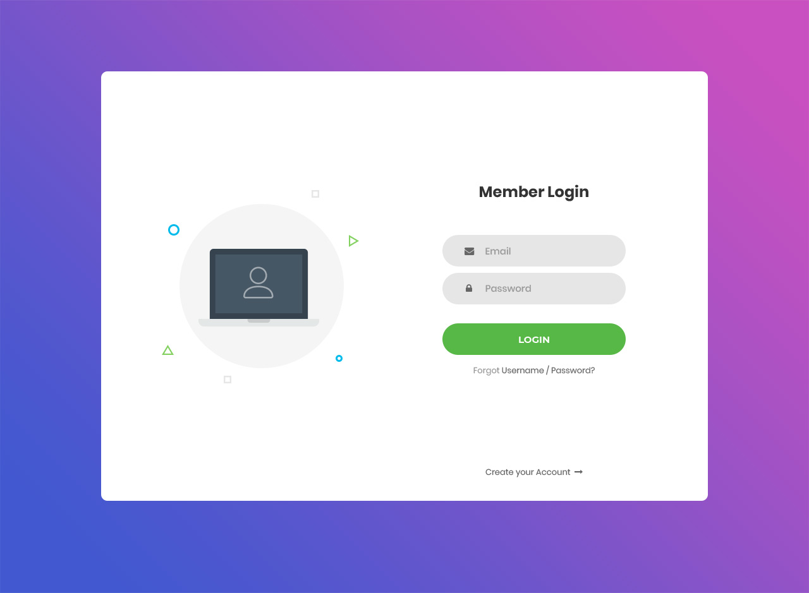
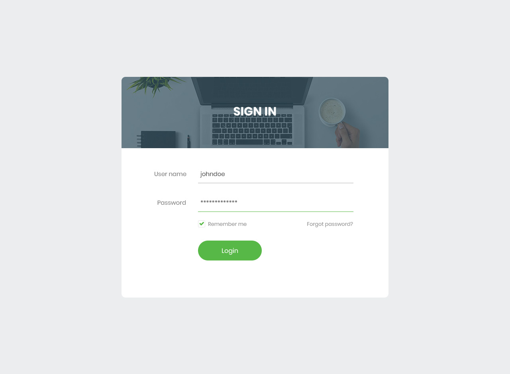
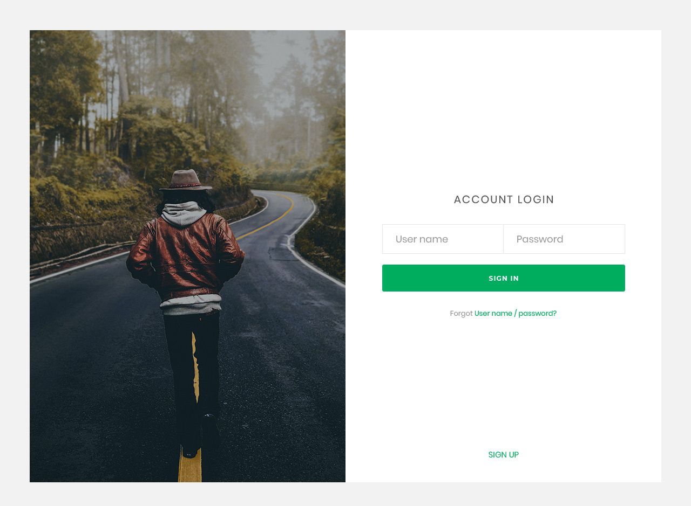

# Экзамен

## Общая информация

На выполнение экзаменационного задания даётся **2 часа**.

Суть экзамена состоит в выполнении задания и защите вашего решения перед 
преподавателем. Экзамен призван продемонстрировать глубину усвоенного вами 
материала, изучаемого на этом курсе.

На оценку за экзамен оказывает влияние показатель вашей общей успеваемости.
Общая успеваемость формируется из:

- Посещаемости: `17%`.
- Выполнения практических заданий: `33%`.
- Выполнения лабораторных работ: `50%`.

На основе общей успеваемости определяется рекомендуемая для вас оценка:

- Неудовлетворительно: `<66%`.
- Удовлетворительно: `<75%`.
- Хорошо: `<90%`.
- Отлично: `≥90%`.

Свою рекомендуемую оценку вы можете посмотреть в [журнале успеваемости
](https://docs.google.com/spreadsheets/d/11zr8hoBczJjDeymf9hln2TO-HC8GdzppIweR8Ws3XRw/edit?usp=sharing).

Итоговая оценка за экзамен будет основана на рекомендуемой оценке
и результате выполнения вами экзаменационного задания.

## Экзаменационное задание

1. Получите от преподавателя свой вариант задания.

2. Создайте страницу с формой авторизации на основе вашего макета.

3. На поля формы установите следующие ограничения:

    - логин не может быть короче `5` и длиннее `30` символов,
    
    - пароль не может быть короче `8` и длиннее `15` символов, и может состоять
    только из цифр и латинских символов в верхнем и нижнем регистре,
    
    - при нажатии на кнопку входа не должно происходить обновление страницы 
    или переход на другую страницу, поля формы должны сохранить введённые 
    значения.

4. При нажатии на кнопку входа или клавиши `ENTER` отправляйте
[HTTP-запрос](#запрос-кnиента) с методом `POST` и телом с данными формата JSON
по следующему адресу:

    ```
    https://reqres.in/api/login
    ```
    
5. Сервер вернёт [HTTP-ответ](#ответ-сервера) с телом с данными формата JSON. 
Преобразуйте данные формата JSON в значение JavaScript и отобразите это 
значение в консоли браузера.
    
6. Пригласите преподавателя для проверки вашей работы:

    - поясните, насколько полно вы воспроизвели страницу авторизации,
    представленную на макете,
    - продемонстрируйте работу формы,    
    - будьте готовы ответить на вопросы по исходному коду.

## Варианты задания

### Определение варианта задания

<exam-table/>

### Вариант №1


[Страница макета](https://colorlib.com/wp/template/login-form-v1) |
[Демонстрация](https://colorlib.com/etc/lf/Login_v1/index.html) |
[Исходный код](https://colorlib.com/download/224)

### Вариант №2


[Страница макета](https://colorlib.com/wp/template/login-form-v15) |
[Демонстрация](https://colorlib.com/etc/lf/Login_v15/index.html) |
[Исходный код](https://colorlib.com/download/272)

### Вариант №3


[Страница макета](https://colorlib.com/wp/template/login-form-v17) |
[Демонстрация](https://colorlib.com/etc/lf/Login_v17/index.html) |
[Исходный код](https://colorlib.com/download/276)

### Вариант №4


[Страница макета](https://colorlib.com/wp/template/login-form-v18) |
[Демонстрация](https://colorlib.com/etc/lf/Login_v18/index.html) |
[Исходный код](https://colorlib.com/download/278)

## Формат данных

### Запрос клиента

В теле HTTP-запроса необходимо передавать данные формата JSON следующего вида:

```json
{
  "email": "george.bluth@reqres.in",
  "password": "qwerty12345"
}
```

Описание полей:

- `email` - электронный адрес пользователя; для успешного запроса значением
поля должна быть одна из следующих строк:

  1. `"george.bluth@reqres.in"`,
  2. `"janet.weaver@reqres.in"`,
  3. `"emma.wong@reqres.in"`,
  4. `"eve.holt@reqres.in"`,
  5. `"charles.morris@reqres.in"`,
  6. `"tracey.ramos@reqres.in"`,
  7. `"michael.lawson@reqres.in"`,
  8. `"lindsay.ferguson@reqres.in"`,
  9. `"tobias.funke@reqres.in"`,
  10. `"byron.fields@reqres.in"`,
  11. `"george.edwards@reqres.in"`,
  12. `"rachel.howell@reqres.in"`.

- `password` - пароль пользователя; для успешного запроса значением поля
должна быть непустая строка.

При отправке запроса данные для полей `email` и `password` возьмите с формы
авторизации.

### Ответ сервера

В случае успешной обработки запроса клиента сервер вернёт ответ со статусом 
`200 OK` и телом с данными формата JSON следующего вида:

```json
{
  "token": "QpwL5tke4Pnpja7X1"
}
```

В случае возникновении ошибки при обработке запроса клиента сервер вернёт 
ответ со статусом `400 Bad Request` и телом с данными формата JSON,
в зависимости от ситуации имеющими следующий вид:

- в теле запросе отсуствовало поле `email`, либо его значением была
пустая строка:

  ```json
  {
    "error": "Missing email or username"
  }
  ```
  
- в теле запроса отсутствовало поле `password`, либо его значением была
пустая строка:

  ```json
  {
    "error": "Missing password"
  }
  ```
  
- в качестве значения поля `email` была указана недопустимая строка:

  ```json
  {
    "error": "user not found"
  }
  ```

<disqus-comments
  page-uuid="8a4d094b-b441-4ab2-b50f-46bd550e43b9"
  page-title="Экзамен"/>