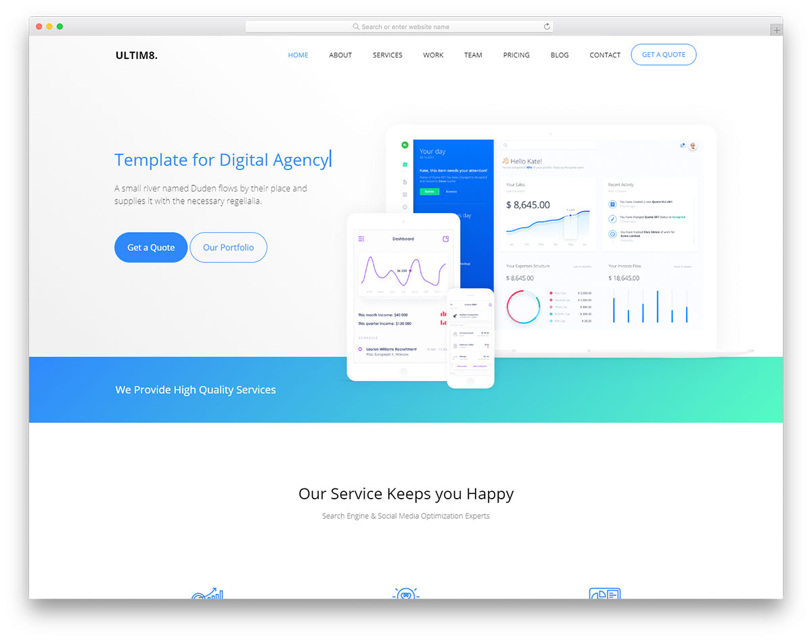
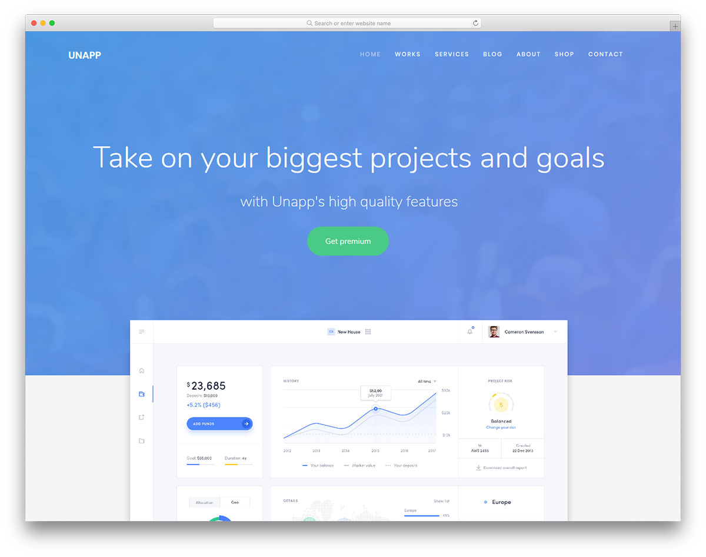
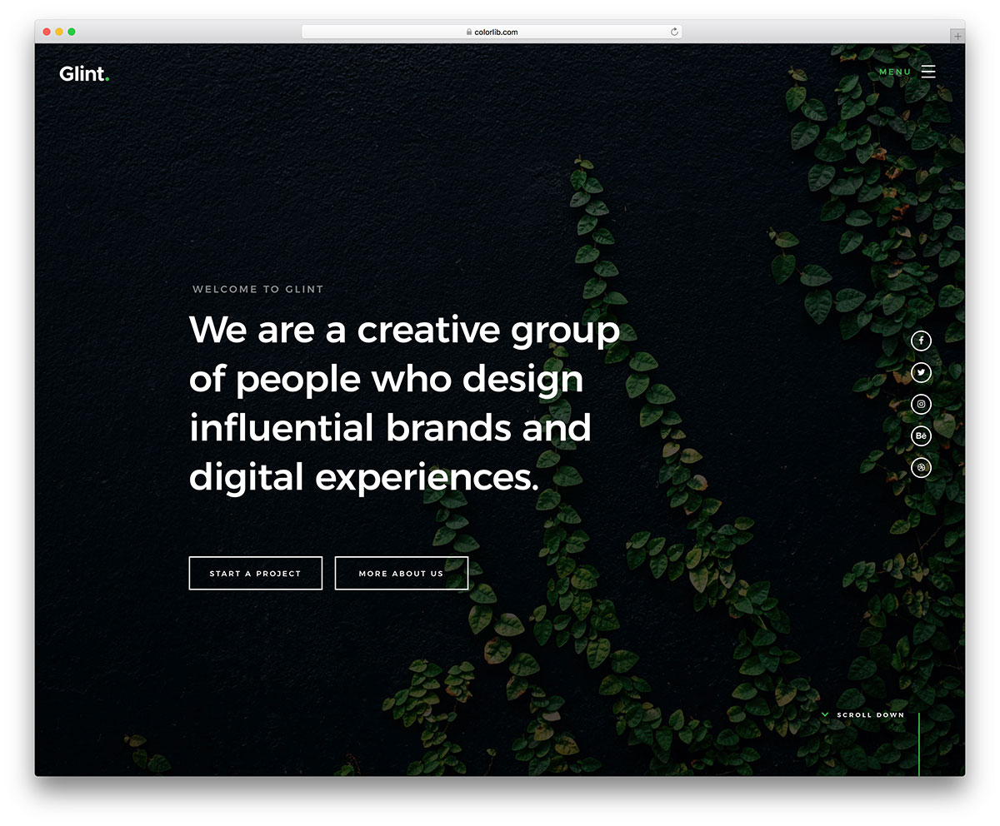
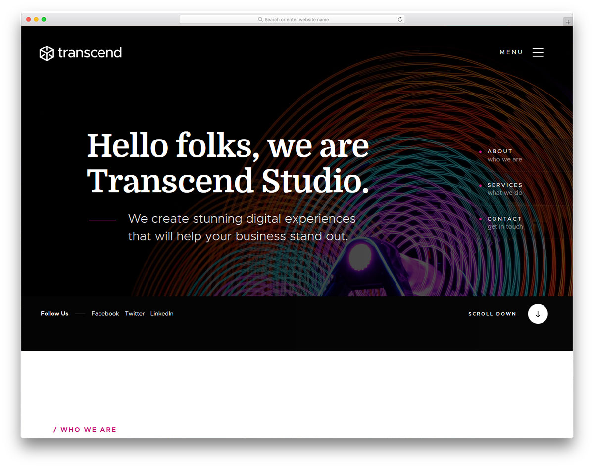
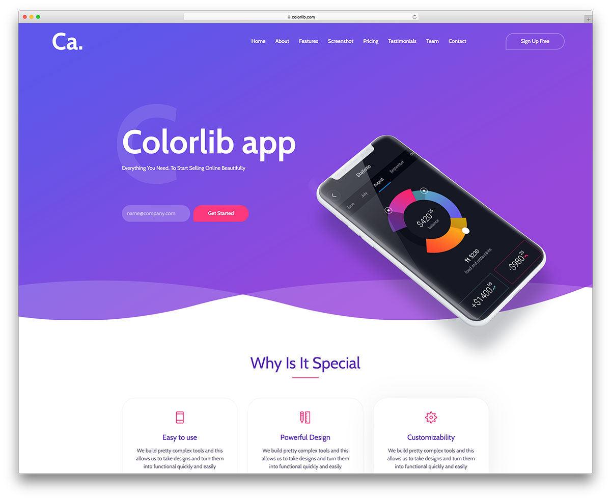
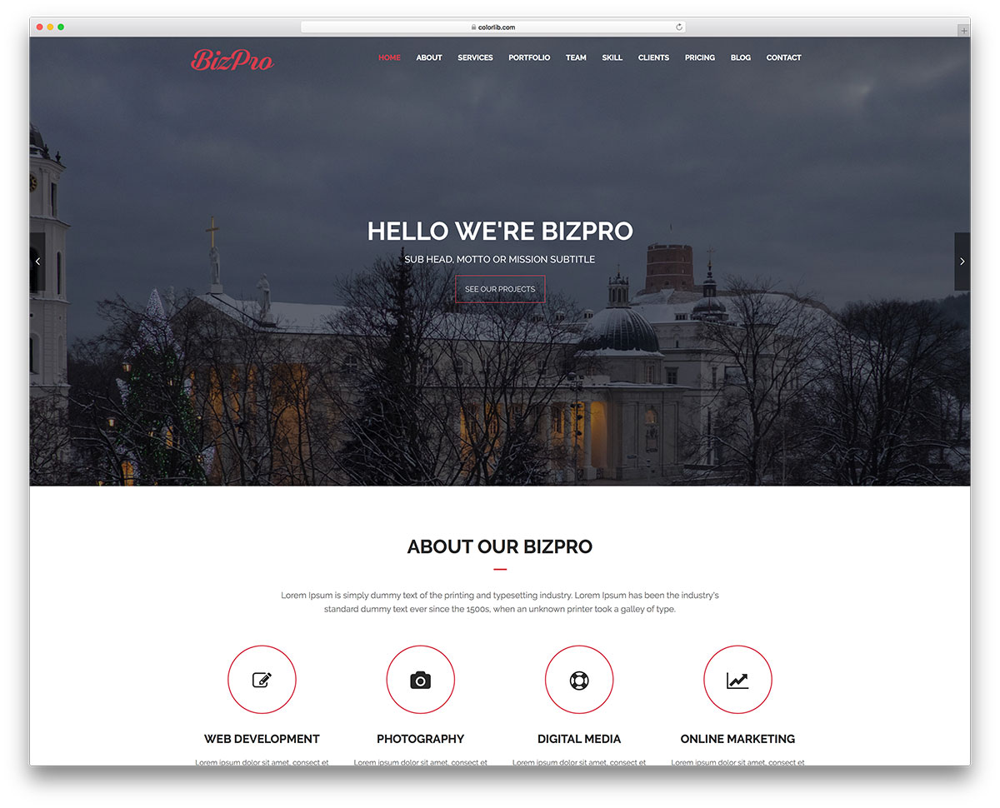
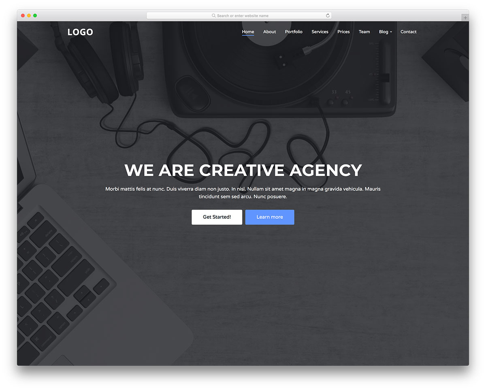
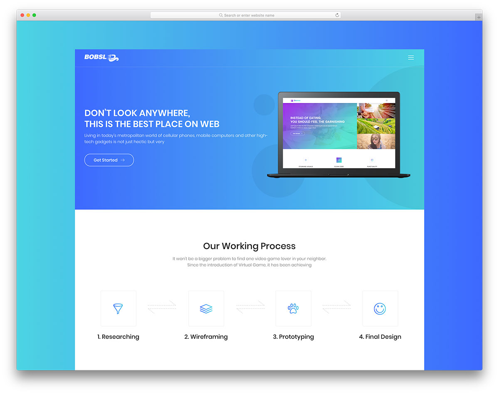
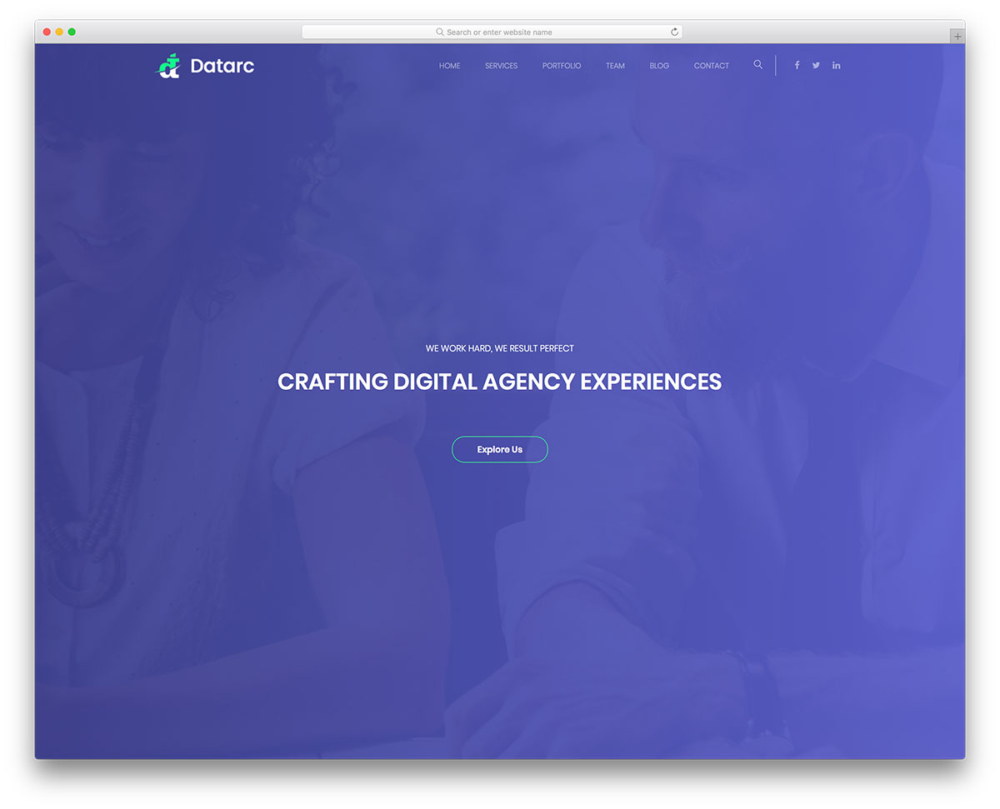
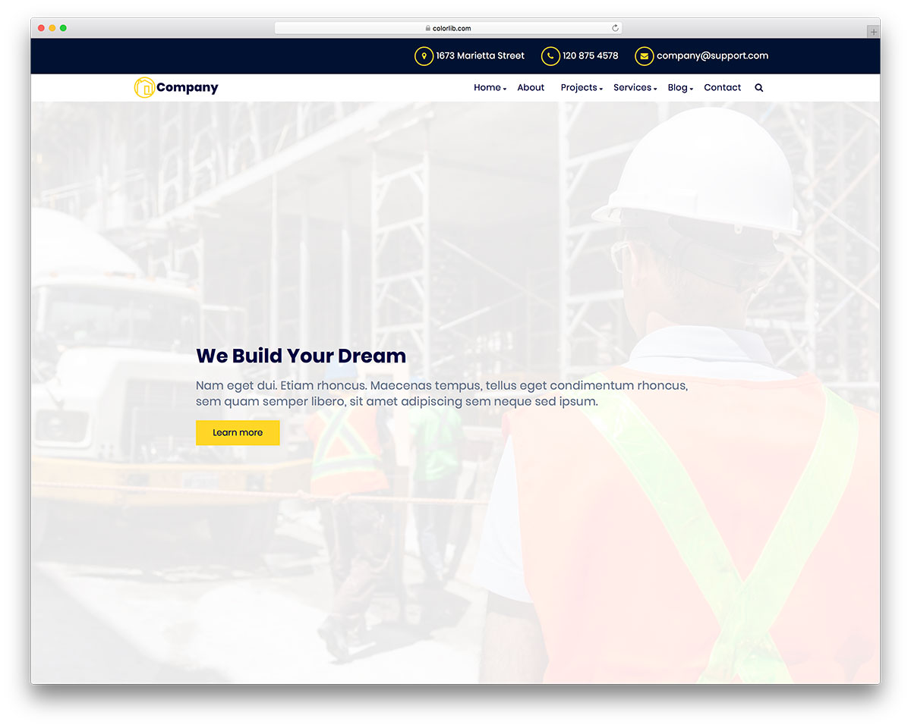

# 1. Создание веб-сайта на основе макета

## Общая информация

В этой лабораторной работе вам предлагается создать одностраничный веб-сайт на 
основе макета, разработанного профессиональными дизайнерами.

## Макеты

Ниже представлены доступные для выбора макеты
([источник](https://colorlib.com/wp/cat/one-page)).

Макеты распространяются по лицензии
[CC BY 3.0](https://creativecommons.org/licenses/by/3.0/), согласно которой 
вы можете свободно изменять оригинальные материалы, но должны указать 
информацию об авторе в подвале страницы. Все макеты уже содержат такую 
информацию, так что вы должны просто оставить её такой, какая она есть.

Все макеты можно открыть для предпросмотра и скачать их исходный код.

### Ultim8


[Открыть предпросмотр](https://colorlib.com/wp/template/ultim8/) |
[Скачать исходный код](https://colorlib.com/download/1703/)

### Unapp


[Открыть предпросмотр](https://colorlib.com/preview/#unapp) |
[Скачать исходный код](https://colorlib.com/download/1059/)

### Glint


[Открыть предпросмотр](https://colorlib.com/demo?theme=glint) |
[Скачать исходный код](https://colorlib.com/download/81/)

### Transcend


[Открыть предпросмотр](https://colorlib.com/preview/#transcend) |
[Скачать исходный код](https://colorlib.com/download/888/)

### CVPortfolio


[Открыть предпросмотр](https://colorlib.com/preview/#cvportfolio) |
[Скачать исходный код](https://colorlib.com/download/526/)

### CA App Landing


[Открыть предпросмотр](https://colorlib.com/demo?theme=ca-app) |
[Скачать исходный код](https://colorlib.com/download/55/)

### BizPro


[Открыть предпросмотр](https://colorlib.com/demo?theme=bizpro) |
[Скачать исходный код](https://colorlib.com/download/125/)

### Boxus


[Открыть предпросмотр](https://colorlib.com/demo?theme=boxus) |
[Скачать исходный код](https://colorlib.com/download/67/)

### Creative Agency


[Открыть предпросмотр](https://colorlib.com/demo?theme=creative-agency) |
[Скачать исходный код](https://colorlib.com/download/63/)

### Bobsled


[Открыть предпросмотр](https://colorlib.com/demo?theme=Bobsled) |
[Скачать исходный код](https://colorlib.com/download/49/)

### Datarc


[Открыть предпросмотр](https://colorlib.com/demo?theme=datarc) |
[Скачать исходный код](https://colorlib.com/download/83/)

### Celt


[Открыть предпросмотр](https://colorlib.com/demo?theme=Celt) |
[Скачать исходный код](https://colorlib.com/download/23/)

## Задачи

1. **Выберите любой из предложенных макетов**, на основе которого вы бы хотели 
создать веб-сайт, и **сообщите преподавателю**, какой макет вы выбрали.
2. Скачайте и **изучите исходный код макета**.
3. **Получите ссылку от преподавателя** для автоматического создания
репозитория для первой лабораторной работы.
4. **Клонируйте репозиторий** и заполните своими данными файл `index.html`.
5. Используя материалы из исходного кода макета и применяя все полученные на
практических занятиях знания и навыки, **создайте веб-сайт**, максимально 
приближенный к тому, что представлен на макете.

## Дополнительные требования

При выполнении лабораторной работы придерживайтесь следующей структуры
каталогов веб-сайта:

```
┬Lab1-... (корневой каталог)
├─┬assets
│ ├──icon.png (иконка веб-сайта)
│ └──... (изображения, шрифты и прочие медиафайлы)
├─┬styles
│ ├──main.css (главный файл стилей)
│ └──... (прочие файлы стилей)
└──index.html (главная страница веб-сайта)
```

Требования:

1. Заглавная страница веб-сайта - файл с именем `index.html`, 
расположенный в корневом каталоге. Заполните своими данными информацию о 
странице: заголовок, иконка, имя автора, описание и список ключевых слов.
2. Главный файл стилей веб-сайта - файл с именем `main.css`, расположенный в 
каталоге `styles`. Помимо обычных правил CSS, в этом файле указывайте все 
пользовательские свойства для веб-сайта с помощью псевдокласса
[`:root`](https://webref.ru/css/root). При необходимости создать ещё 
несколько файлов CSS, помеcтите их в папку `styles`.
3. Изображения, шрифты и прочие медиафайлы поместите в папку 
`assets`.

<disqus-comments
  page-uuid="149fa661-6e05-4d4c-8525-521ec95711e8"
  page-title="1. Создание веб-сайта на основе макета | Лабораторные работы"/>