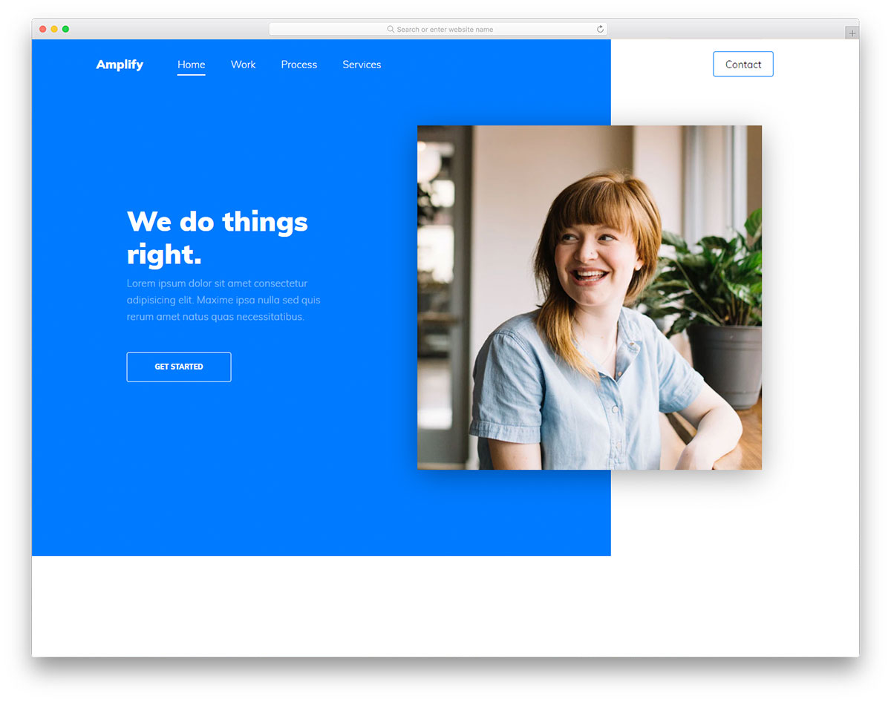
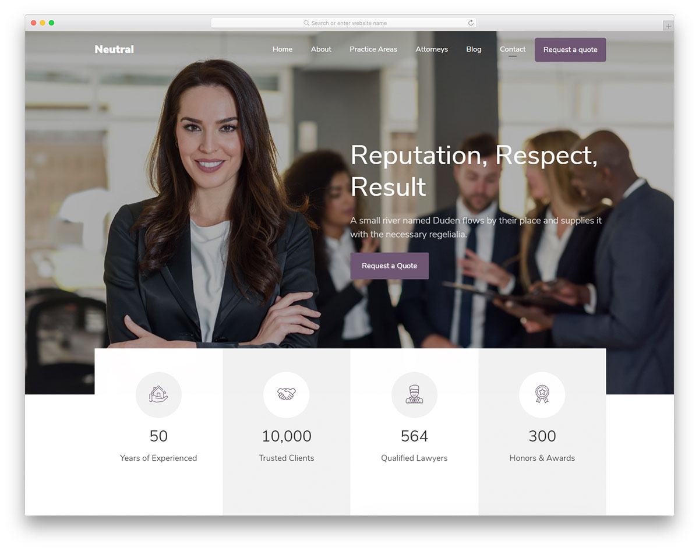
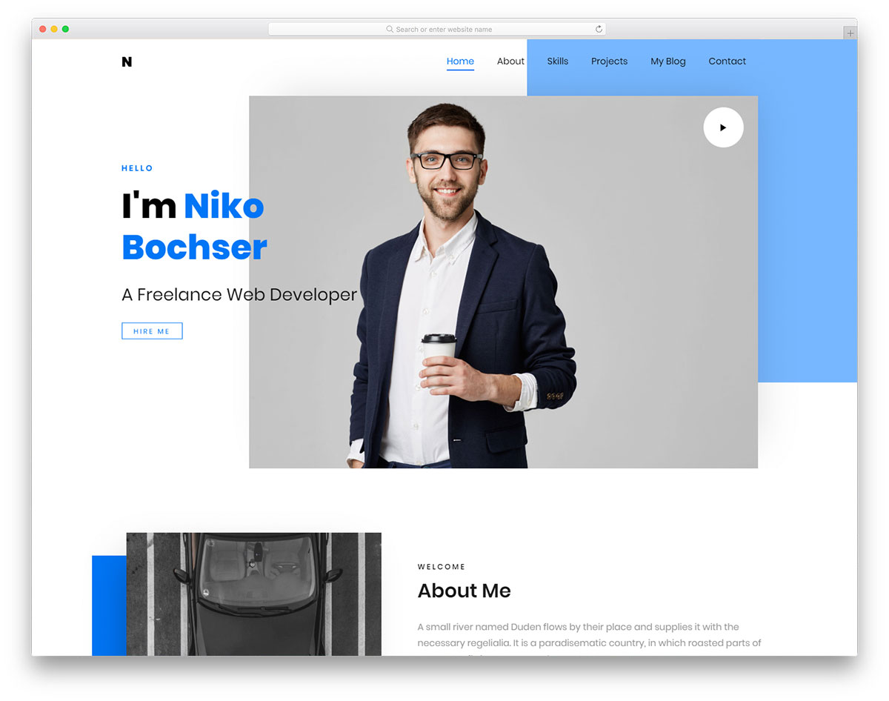
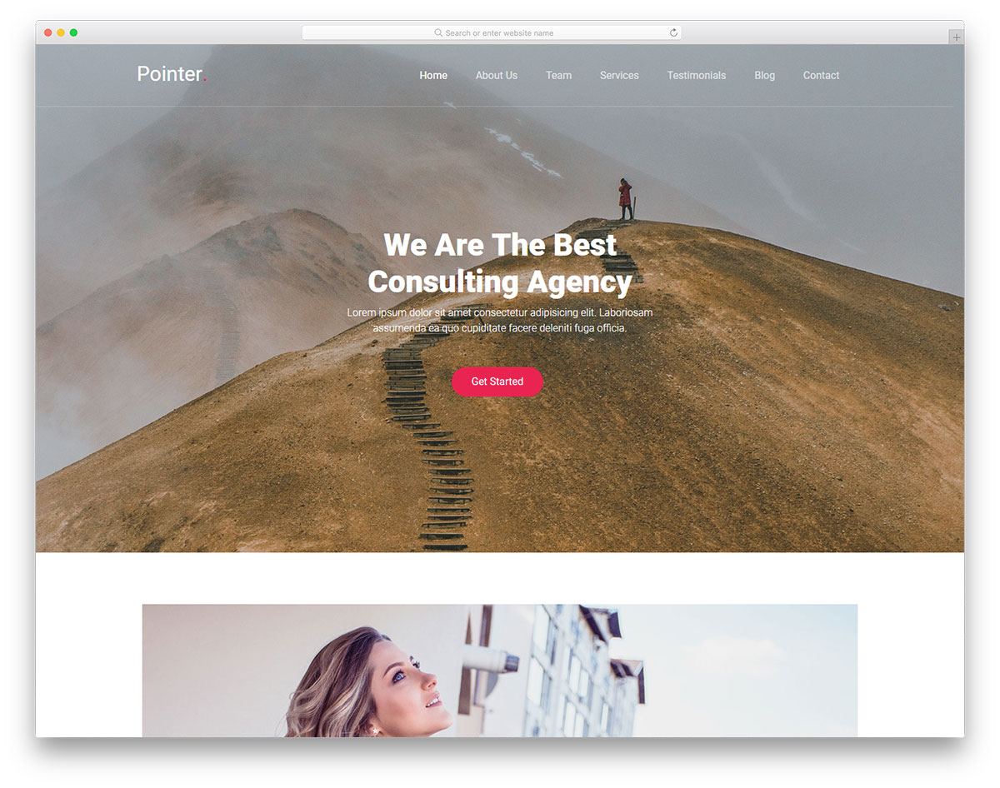
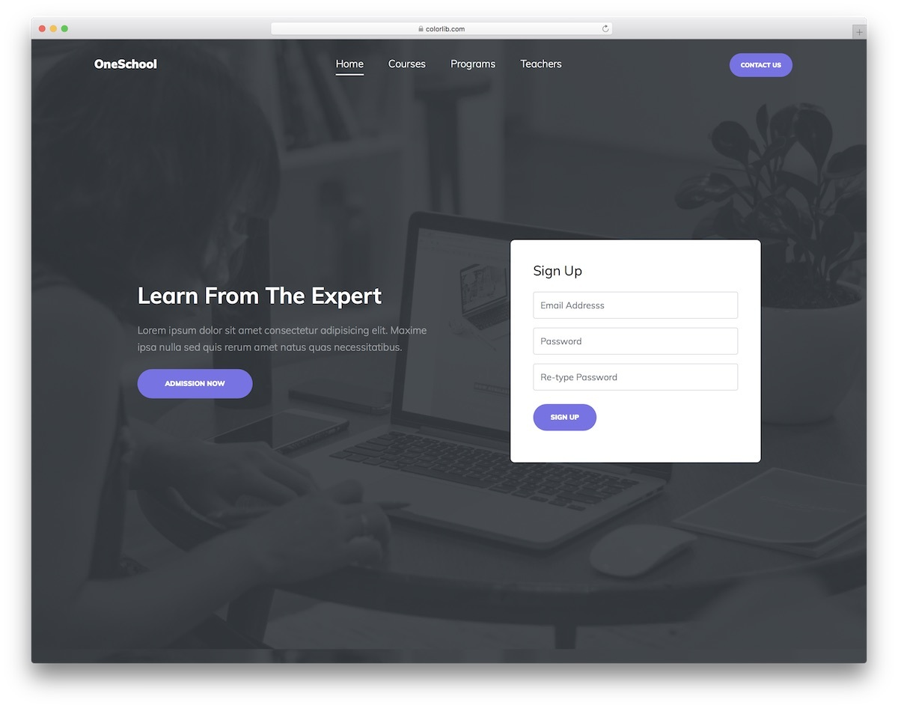
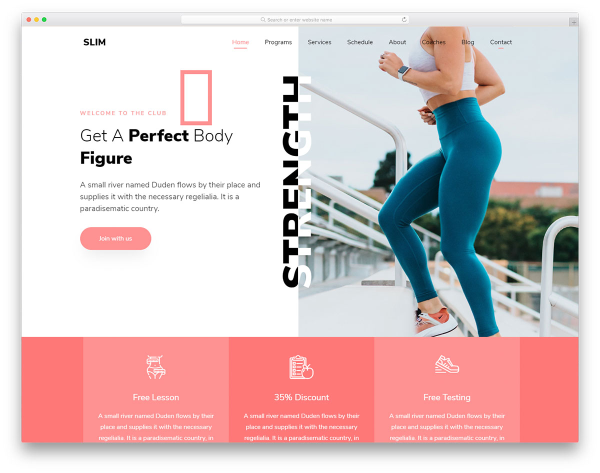
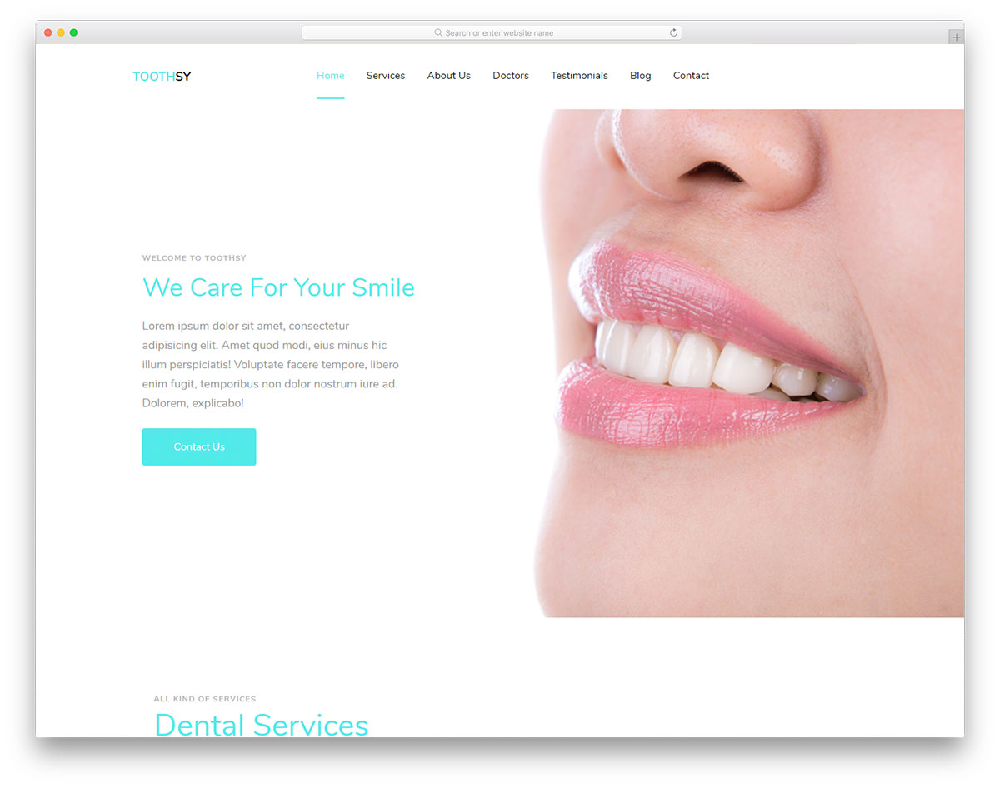

# 1. HTML и CSS

## Общая информация

В этой лабораторной работе вам предлагается создать одностраничный веб-сайт на 
основе макета, разработанного профессиональными дизайнерами.

## Задачи

1. **Выберите любой из предложенных макетов**, на основе которого вы бы хотели 
создать веб-сайт, и **сообщите преподавателю**, какой макет вы выбрали.

2. Скачайте и **изучите исходный код макета**.

3. **Получите ссылку от преподавателя** для автоматического создания
репозитория для первой лабораторной работы.

4. **Клонируйте** автоматически созданный репозиторий.

5. При выполнении лабораторной работы придерживайтесь следующей
**структуры каталогов** веб-сайта:

    ```
    Lab1/             (корневой каталог)
    ├─ assets/        (медиафайлы)
    │  ├─ icon.png    (иконка веб-сайта)
    │  └─ ...
    ├─ styles/        (стили)
    │  ├─ main.css    (главный файл стилей)
    │  └─ ...
    └─ index.html     (главная страница)
    ```
    
    В каталог `assets` помещайте изображения, шрифты и прочие медиафайлы
    (например, иконку веб-сайта).
    
    В каталог `styles` помещайте файлы стилей.

6. **Создайте веб-сайт**, максимально приближенный к тому,
что представлен на макете.

7. **Опубликуйте веб-сайт** с помощью [GitHub Pages
](https://help.github.com/articles/configuring-a-publishing-source-for-github-pages).

## Макеты

### 1. Amplify


[Страница макета](https://colorlib.com/wp/template/amplify) |
[Демонстрация](https://colorlib.com/preview/theme/amplify) |
<a :href="$withBase('/assets/labs/01/Amplify.zip')" download>Исходный код</a>

### 2. BizPro


[Страница макета](https://colorlib.com/wp/template/bizpro) |
[Демонстрация](https://colorlib.com/etc/bizpro) |
<a :href="$withBase('/assets/labs/01/BizPro.zip')" download>Исходный код</a>

### 3. Bobsled


[Страница макета](https://colorlib.com/wp/template/bobsled) |
[Демонстрация](https://colorlib.com/etc/bobsled) |
<a :href="$withBase('/assets/labs/01/Bobsled.zip')" download>Исходный код</a>

### 4. Boxus


[Страница макета](https://colorlib.com/wp/template/boxus) |
[Демонстрация](https://colorlib.com/etc/boxus) |
<a :href="$withBase('/assets/labs/01/Boxus.zip')" download>Исходный код</a>

### 5. CA App Landing


[Страница макета](https://colorlib.com/wp/template/ca-app) |
[Демонстрация](https://colorlib.com/etc/ca) |
<a :href="$withBase('/assets/labs/01/CA_App_Landing.zip')" download>Исходный код</a>

### 6. Celt


[Страница макета](https://colorlib.com/wp/template/celt) |
[Демонстрация](https://colorlib.com/etc/celt) |
<a :href="$withBase('/assets/labs/01/Celt.zip')" download>Исходный код</a>

### 7. Creative Agency


[Страница макета](https://colorlib.com/wp/template/creative-agency) |
[Демонстрация](https://colorlib.com/etc/creative-agency) |
<a :href="$withBase('/assets/labs/01/Creative_Agency.zip')" download>Исходный код</a>

### 8. CVPortfolio


[Страница макета](https://colorlib.com/wp/template/cvportfolio) |
[Демонстрация](https://colorlib.com/preview/theme/cvportfolio) |
<a :href="$withBase('/assets/labs/01/CVPortfolio.zip')" download>Исходный код</a>

### 9. Datarc


[Страница макета](https://colorlib.com/wp/template/datarc) |
[Демонстрация](https://colorlib.com/etc/datarc) |
<a :href="$withBase('/assets/labs/01/Datarc.zip')" download>Исходный код</a>

### 10. Glint


[Страница макета](https://colorlib.com/wp/template/glint) |
[Демонстрация](https://colorlib.com/etc/glint) |
<a :href="$withBase('/assets/labs/01/Glint.zip')" download>Исходный код</a>

### 11. Neutral


[Страница макета](https://colorlib.com/wp/template/neutral) |
[Демонстрация](https://colorlib.com/preview/theme/neutral) |
<a :href="$withBase('/assets/labs/01/Neutral.zip')" download>Исходный код</a>

### 12. Niko


[Страница макета](https://colorlib.com/wp/template/niko) |
[Демонстрация](https://colorlib.com/preview/theme/niko) |
<a :href="$withBase('/assets/labs/01/Niko.zip')" download>Исходный код</a>

### 13. Pointer


[Страница макета](https://colorlib.com/wp/template/pointer) |
[Демонстрация](https://colorlib.com/preview/theme/pointer) |
<a :href="$withBase('/assets/labs/01/Pointer.zip')" download>Исходный код</a>

### 14. OneSchool


[Страница макета](https://colorlib.com/wp/template/oneschool) |
[Демонстрация](https://colorlib.com/preview/theme/oneschool) |
<a :href="$withBase('/assets/labs/01/OneSchool.zip')" download>Исходный код</a>

### 15. Slim


[Страница макета](https://colorlib.com/wp/template/slim) |
[Демонстрация](https://colorlib.com/preview/theme/slim) |
<a :href="$withBase('/assets/labs/01/Slim.zip')" download>Исходный код</a>

### 16. Toothsy


[Страница макета](https://colorlib.com/wp/template/toothsy) |
[Демонстрация](https://colorlib.com/preview/theme/toothsy) |
<a :href="$withBase('/assets/labs/01/Toothsy.zip')" download>Исходный код</a>

### 17. Transcend


[Страница макета](https://colorlib.com/wp/template/transcend) |
[Демонстрация](https://colorlib.com/preview/theme/transcend) |
<a :href="$withBase('/assets/labs/01/Transcend.zip')" download>Исходный код</a>

### 18. Ultim8


[Страница макета](https://colorlib.com/wp/template/ultim8) |
[Демонстрация](https://colorlib.com/preview/theme/ultim8) |
<a :href="$withBase('/assets/labs/01/Ultim8.zip')" download>Исходный код</a>

### 19. Unapp


[Страница макета](https://colorlib.com/wp/template/unapp) |
[Демонстрация](https://colorlib.com/preview/theme/unapp) |
<a :href="$withBase('/assets/labs/01/Unapp.zip')" download>Исходный код</a>

<disqus-comments
  page-uuid="149fa661-6e05-4d4c-8525-521ec95711e8"
  page-title="1. HTML и CSS | Лабораторные работы"/>