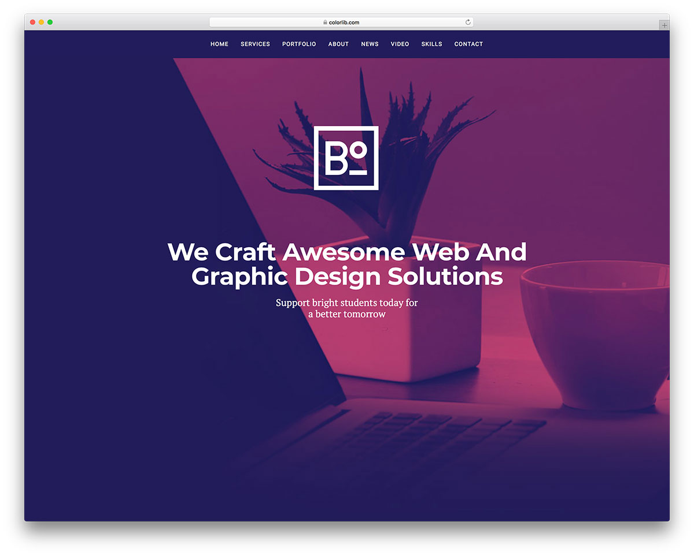

# 1. HTML и CSS

## Общая информация

В этой лабораторной работе вам предлагается создать одностраничный веб-сайт на 
основе макета, разработанного профессиональными дизайнерами.

## Задачи

1. **Выберите любой из предложенных макетов**, на основе которого вы бы хотели 
создать веб-сайт, и **сообщите преподавателю**, какой макет вы выбрали.

2. Скачайте и **изучите исходный код макета**.

3. **Получите ссылку от преподавателя** для автоматического создания
репозитория для первой лабораторной работы.

4. **Клонируйте** автоматически созданный репозиторий.

5. При выполнении лабораторной работы придерживайтесь следующей
**структуры каталогов** веб-сайта:

    ```
    Lab1/             (корневой каталог)
    ├─ assets/        (медиафайлы)
    │  ├─ icon.png    (иконка веб-сайта)
    │  └─ ...
    ├─ styles/        (стили)
    │  ├─ main.css    (главный файл стилей)
    │  └─ ...
    └─ index.html     (главная страница)
    ```
    
    В каталог `assets` помещайте изображения, шрифты и прочие медиафайлы
    (например, иконку веб-сайта).
    
    В каталог `styles` помещайте файлы стилей.

6. **Создайте веб-сайт**, максимально приближенный к тому,
что представлен на макете.

7. **Опубликуйте веб-сайт** с помощью [GitHub Pages
](https://help.github.com/articles/configuring-a-publishing-source-for-github-pages).

## Макеты

### 1. Glint


[Страница макета](https://colorlib.com/wp/template/glint) |
[Демонстрация](https://colorlib.com/demo?theme=glint) |
[Исходный код](https://colorlib.com/download/81)

### 2. Ultim8


[Страница макета](https://colorlib.com/wp/template/ultim8) |
[Демонстрация](https://colorlib.com/wp/template/ultim8) |
[Исходный код](https://colorlib.com/download/1703)

### 3. Unapp


[Страница макета](https://colorlib.com/wp/template/unapp) |
[Демонстрация](https://colorlib.com/preview/#unapp) |
[Исходный код](https://colorlib.com/download/1059)

### 4. Transcend


[Страница макета](https://colorlib.com/wp/template/transcend) |
[Демонстрация](https://colorlib.com/preview/#transcend) |
[Исходный код](https://colorlib.com/download/888)

### 5. CVPortfolio


[Страница макета](https://colorlib.com/wp/template/cvportfolio) |
[Демонстрация](https://colorlib.com/preview/#cvportfolio) |
[Исходный код](https://colorlib.com/download/526)

### 6. CA App Landing


[Страница макета](https://colorlib.com/wp/template/ca-app) |
[Демонстрация](https://colorlib.com/demo?theme=ca-app) |
[Исходный код](https://colorlib.com/download/55)

### 7. BizPro


[Страница макета](https://colorlib.com/wp/template/bizpro) |
[Демонстрация](https://colorlib.com/demo?theme=bizpro) |
[Исходный код](https://colorlib.com/download/125)

### 8. Boxus


[Страница макета](https://colorlib.com/wp/template/boxus) |
[Демонстрация](https://colorlib.com/demo?theme=boxus) |
[Исходный код](https://colorlib.com/download/67)

### 9. Creative Agency


[Страница макета](https://colorlib.com/wp/template/creative-agency) |
[Демонстрация](https://colorlib.com/demo?theme=creative-agency) |
[Исходный код](https://colorlib.com/download/63)

### 10. Bobsled


[Страница макета](https://colorlib.com/wp/template/bobsled) |
[Демонстрация](https://colorlib.com/demo?theme=bobsled) |
[Исходный код](https://colorlib.com/download/49)

### 11. Datarc


[Страница макета](https://colorlib.com/wp/template/datarc) |
[Демонстрация](https://colorlib.com/demo?theme=datarc) |
[Исходный код](https://colorlib.com/download/83)

### 12. Celt


[Страница макета](https://colorlib.com/wp/template/celt) |
[Демонстрация](https://colorlib.com/demo?theme=Celt) |
[Исходный код](https://colorlib.com/download/23)

<disqus-comments
  page-uuid="149fa661-6e05-4d4c-8525-521ec95711e8"
  page-title="1. HTML и CSS | Лабораторные работы"/>