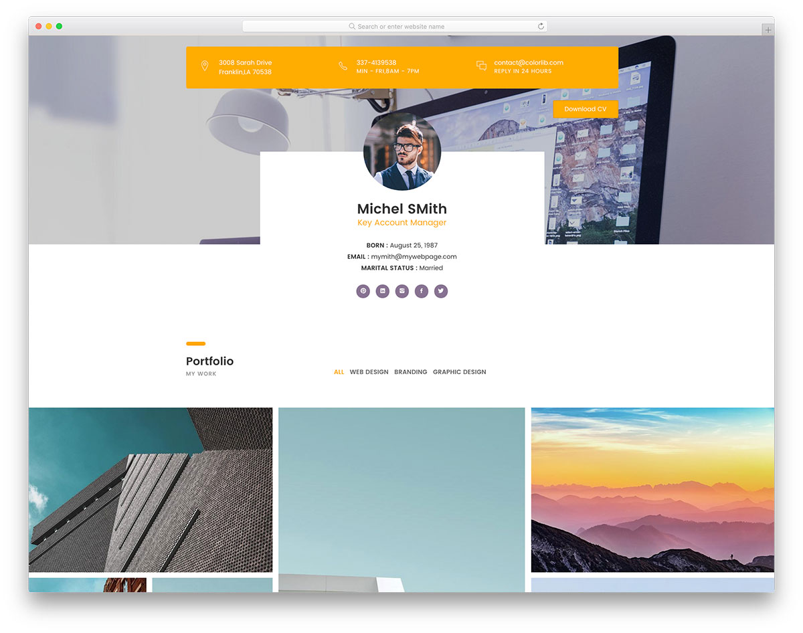

# 1. HTML и CSS

## Общая информация

В этой лабораторной работе вам предлагается создать одностраничный веб-сайт на 
основе макета, разработанного профессиональными дизайнерами.

## Макеты

Ниже представлены доступные для выбора макеты
([источник](https://colorlib.com/wp/cat/one-page)).

Макеты распространяются по лицензии
[CC BY 3.0](https://creativecommons.org/licenses/by/3.0/), согласно которой 
вы можете свободно изменять оригинальные материалы, но должны указать 
информацию об авторе в подвале страницы. Все макеты уже содержат такую 
информацию, так что вы должны просто оставить её такой, какая она есть.

Все макеты можно открыть для предпросмотра и скачать их исходный код.

### Ultim8


[Открыть предпросмотр](https://colorlib.com/wp/template/ultim8/) |
[Скачать исходный код](https://colorlib.com/download/1703/)

**Ultim8** - универсальный макет веб-сайта для агенства любого вида. Это 
очень гибкий инструмент, который отлично подойдёт к вашему проекту.

### Unapp


[Открыть предпросмотр](https://colorlib.com/preview/#unapp) |
[Скачать исходный код](https://colorlib.com/download/1059/)

Используя **Unapp**, макет веб-сайта для бизнес-приложения, вы сделаете ваш 
проект доступным онлайн для огромного количества людей. Используйте ваше 
воображение, не ограничивайте себя и создайте выдающийся веб-сайт для вашего 
продукта.

### Glint


[Открыть предпросмотр](https://colorlib.com/demo?theme=glint) |
[Скачать исходный код](https://colorlib.com/download/81/)

**Glint** - современный и стильный макет веб-сайта для digital-агенства. Он 
создан для дизайнеров, фотографов и любых других творческих профессий.

### Transcend


[Открыть предпросмотр](https://colorlib.com/preview/#transcend) |
[Скачать исходный код](https://colorlib.com/download/888/)

Продемонстрируйте ваши работы с помощью **Transcend**, макета веб-сайта для 
дизайн-студии, и помогите вашему бизнесу достичь новых успехов. Со 
стратегически и профессионально созданной страницей привлечение новых 
посетителей больше не будет проблемой.

### CVPortfolio


[Открыть предпросмотр](https://colorlib.com/preview/#cvportfolio) |
[Скачать исходный код](https://colorlib.com/download/526/)

Не будте посредственным и создайте личную страницу с помощью **CVPortfolio**,
макета веб-сайта для резюме и портфолио. Если вы хотели бы выделить себя 
среди масс, создание личного веб-сайта для этого практически необходимо.

### CA App Landing


[Открыть предпросмотр](https://colorlib.com/demo?theme=ca-app) |
[Скачать исходный код](https://colorlib.com/download/55/)

**CA** - минималистичный и современно выглядящий макет веб-сайта для 
демонстрации мобильного приложения под Android и iOS. Он может также отлично 
подойти и для целевых страниц и страниц продаж для SaaS и других 
подобных технологий. 

### BizPro


[Открыть предпросмотр](https://colorlib.com/demo?theme=bizpro) |
[Скачать исходный код](https://colorlib.com/download/125/)

**BizPro** - классически выглядящий макет одностраничного веб-сайта для 
бизнеса, который вы можете использовать для создания любого веб-сайта для 
бизнеса, начиная с небольшого локального бизнеса и заканчивая 
транснациональными корпорациями.

### Boxus


[Открыть предпросмотр](https://colorlib.com/demo?theme=boxus) |
[Скачать исходный код](https://colorlib.com/download/67/)

**Boxus** - макет веб-сайта для творческих, цифровых, СМИ, веб-дизайн и любых 
других видов агенств. Он отлично подходит для демонстрации вашего портфолио, 
услуг и компании в целом.

### Creative Agency


[Открыть предпросмотр](https://colorlib.com/demo?theme=creative-agency) |
[Скачать исходный код](https://colorlib.com/download/63/)

**Creative Agency**, как следует из названия, - макет веб-сайта для 
творческих, СМИ и цифровых агенств любого вида. Он достаточно гибкий для 
того, чтобы использовать его для любого типа целевой страницы для бизнеса.

### Bobsled


[Открыть предпросмотр](https://colorlib.com/demo?theme=bobsled) |
[Скачать исходный код](https://colorlib.com/download/49/)

**Bobsled** - чистый и минималистичный макет веб-сайта - целевой страницы для 
бизнеса. Вы можете использовать его для технологических стартапов, личных 
веб-сайтов и бизнесов любого вида. Его особенность - яркие цвета, что поможет 
выделить ваш бизнес среди конкурентов.

### Datarc


[Открыть предпросмотр](https://colorlib.com/demo?theme=datarc) |
[Скачать исходный код](https://colorlib.com/download/83/)

**Datarc** - профессионально выглядящий полноэкранный макет веб-сайта, 
идеально подходящий для творческих агенств, цифровых фирм, технологических 
стартапов и целевых страниц для продуктов типа SaaS. Дизайн макета чистый, 
элегантный и простой с большой шапкой и множеством потрясающих мелочей.

### Celt


[Открыть предпросмотр](https://colorlib.com/demo?theme=Celt) |
[Скачать исходный код](https://colorlib.com/download/23/)

**Celt** - чисто выглядящий и гибкий макет веб-сайта для строительной компании.
Продвиньте ваши услуги и продемонстрируйте завершённые проекты убедительным 
образом.

## Задачи

1. **Выберите любой из предложенных макетов**, на основе которого вы бы хотели 
создать веб-сайт, и **сообщите преподавателю**, какой макет вы выбрали.
2. Скачайте и **изучите исходный код макета**.
3. **Получите ссылку от преподавателя** для автоматического создания
репозитория для первой лабораторной работы.
4. **Клонируйте репозиторий** и заполните своими данными файл `index.html`.
5. Используя материалы из исходного кода макета и применяя все полученные на
практических занятиях знания и навыки, **создайте веб-сайт**, максимально 
приближенный к тому, что представлен на макете.

## Дополнительные требования

При выполнении лабораторной работы придерживайтесь следующей структуры
каталогов веб-сайта:

```
┬Lab1-... (корневой каталог)
├─┬assets
│ ├──icon.png (иконка веб-сайта)
│ └──... (изображения, шрифты и прочие медиафайлы)
├─┬styles
│ ├──main.css (главный файл стилей)
│ └──... (прочие файлы стилей)
└──index.html (главная страница веб-сайта)
```

Требования:

1. Заглавная страница веб-сайта - файл с именем `index.html`, 
расположенный в корневом каталоге. Заполните своими данными информацию о 
странице: заголовок, иконка, имя автора, описание и список ключевых слов.
2. Главный файл стилей веб-сайта - файл с именем `main.css`, расположенный в 
каталоге `styles`. При необходимости создать ещё несколько файлов CSS, 
помеcтите их в папку `styles`.
3. Изображения, шрифты и прочие медиафайлы поместите в папку 
`assets`.

<disqus-comments
  page-uuid="149fa661-6e05-4d4c-8525-521ec95711e8"
  page-title="1. Создание веб-сайта на основе макета | Лабораторные работы"/>