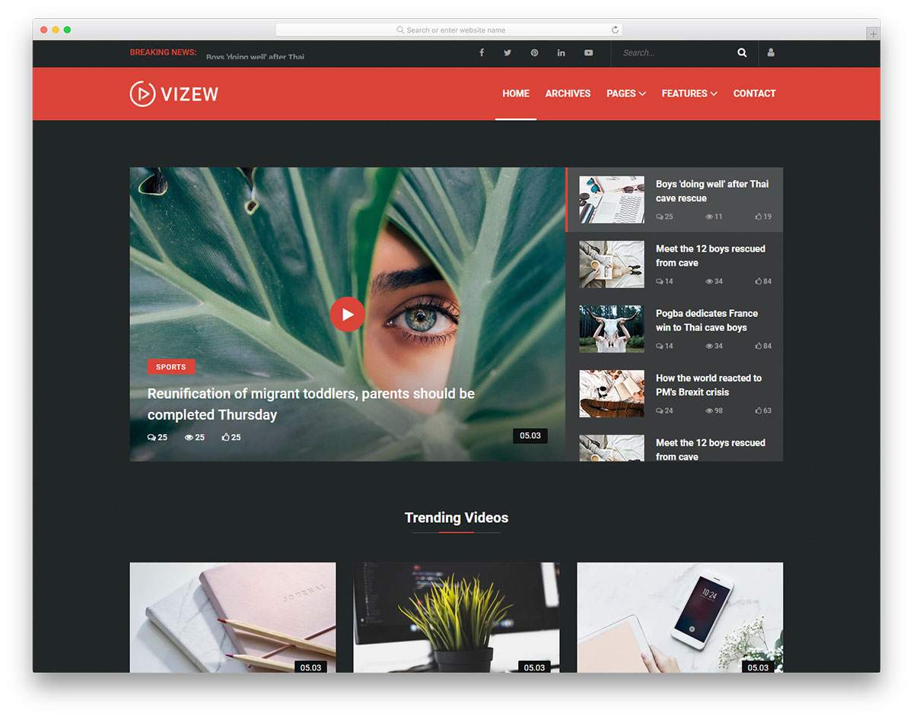
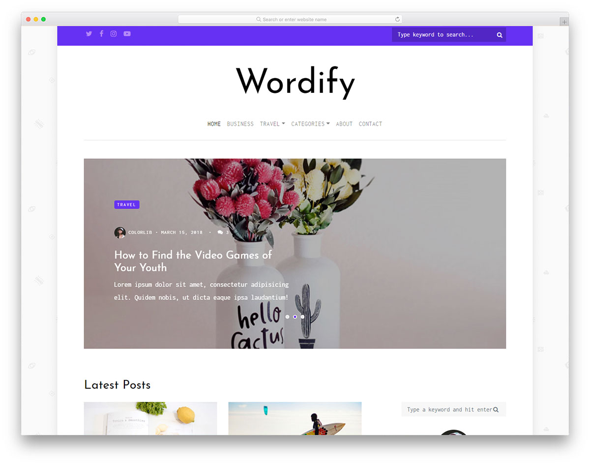
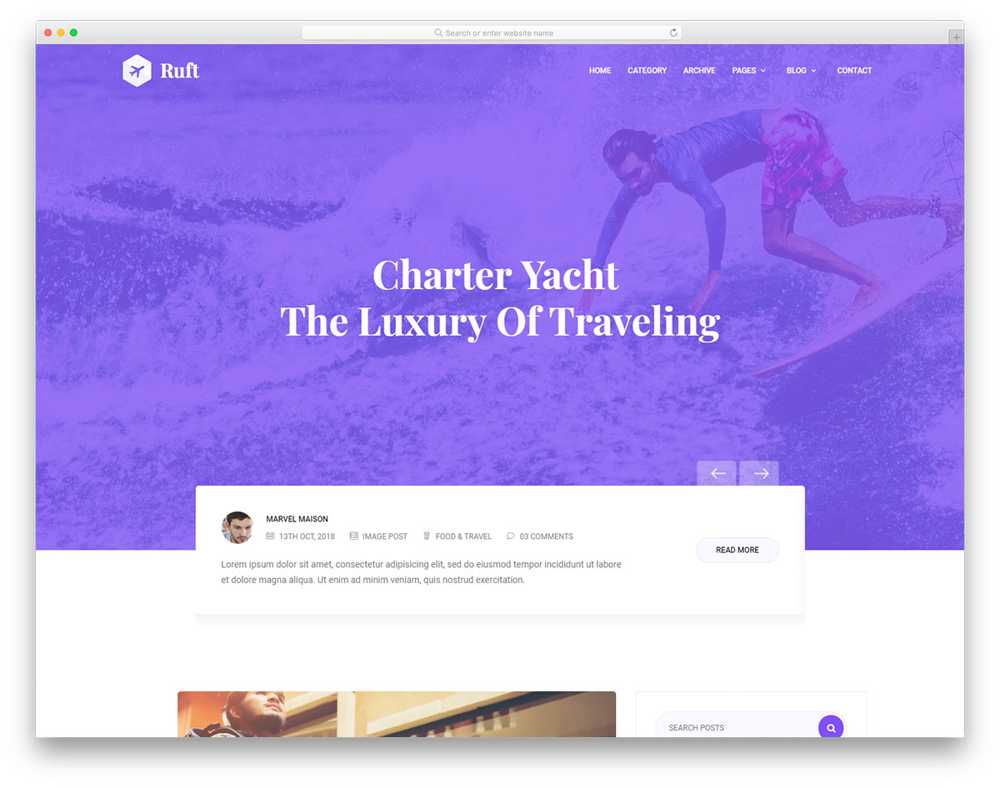
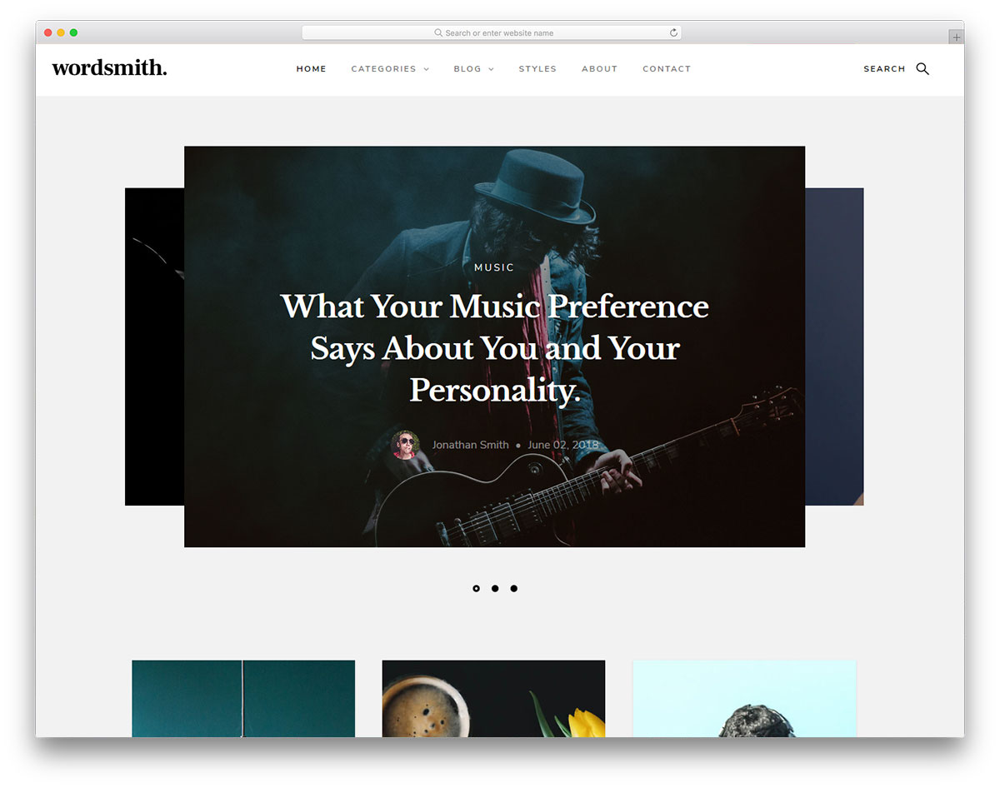
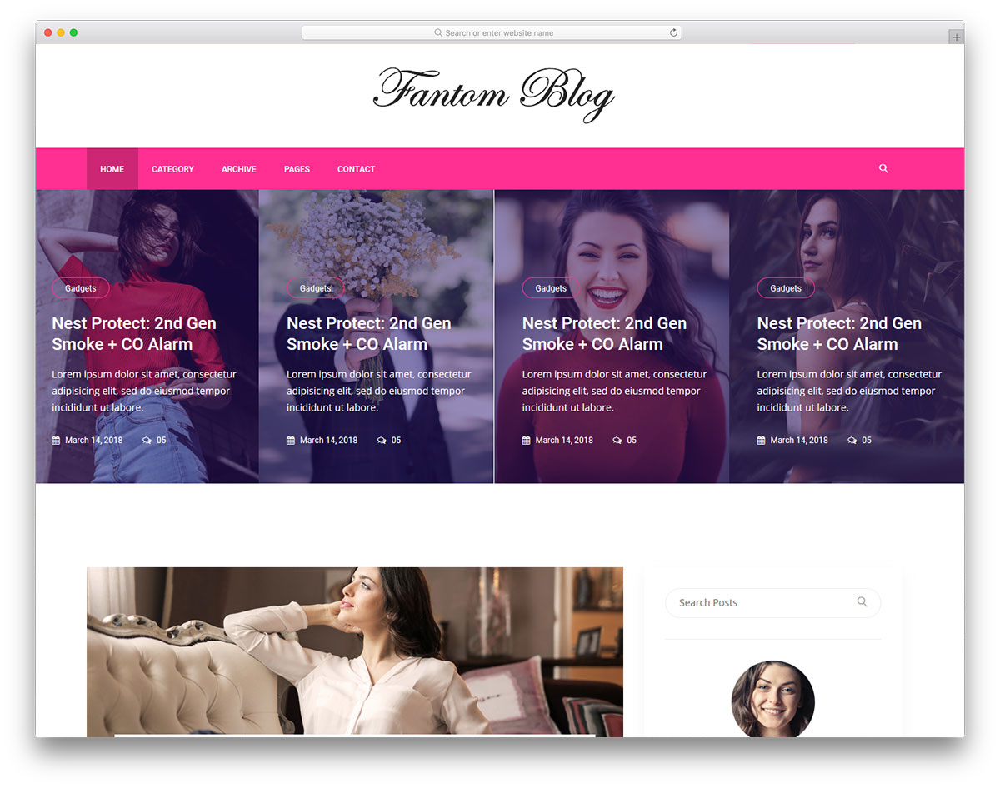
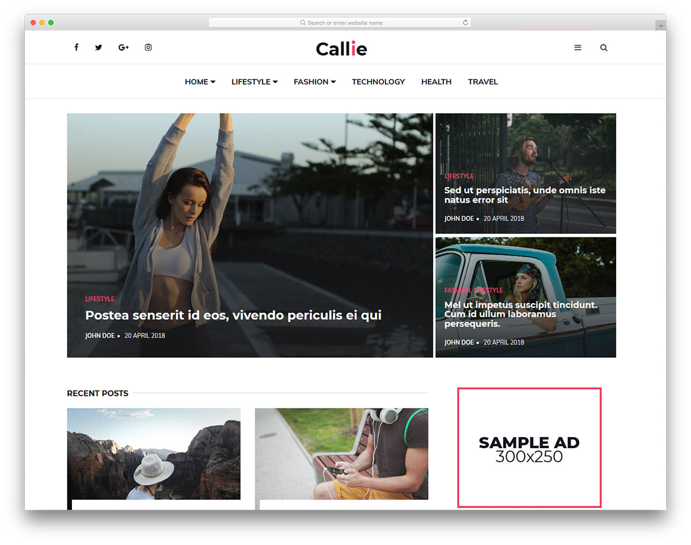
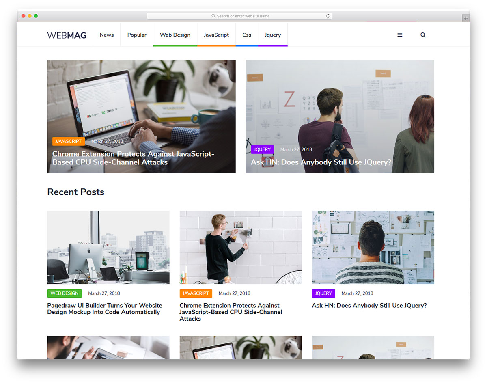
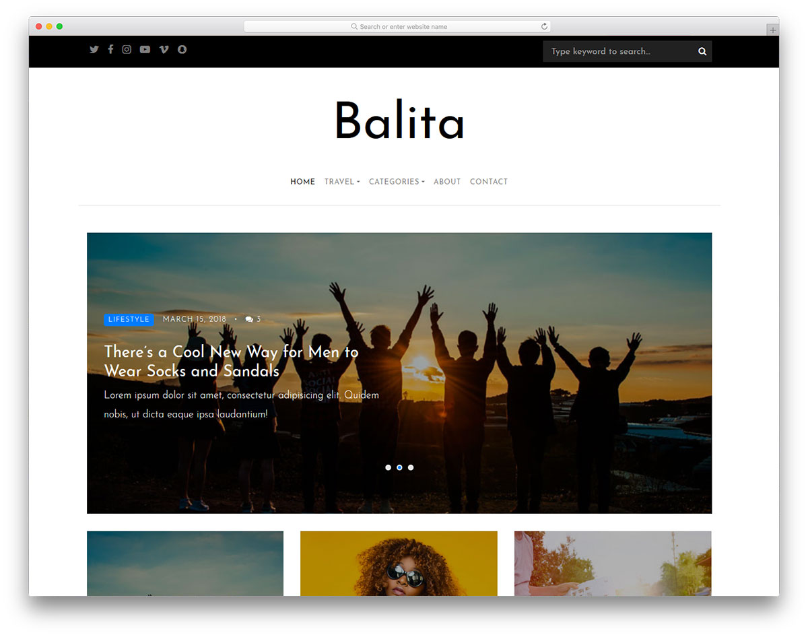
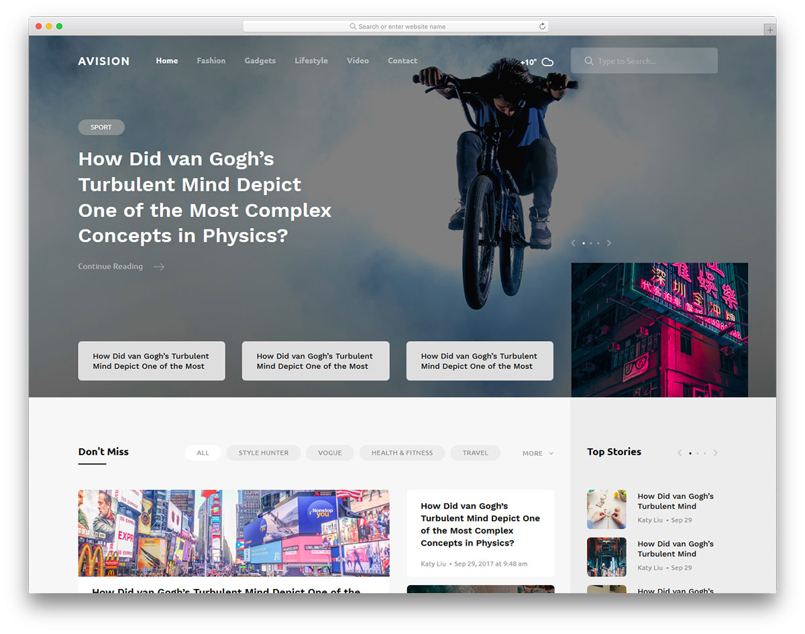

# 2. JavaScript и Node.js

## Общая информация

В этой лабораторной работе вам предлагается создать многостраничный
динамический веб-сайт - блог на основе макета, разработанного 
профессиональными дизайнерами.

## Макеты

Ниже представлены доступные для выбора макеты
([источник](https://colorlib.com/wp/cat/blog)).

Макеты распространяются по лицензии
[CC BY 3.0](https://creativecommons.org/licenses/by/3.0), согласно которой 
вы можете свободно изменять оригинальные материалы, но должны указать 
информацию об авторе в подвале страницы. Все макеты уже содержат такую 
информацию, так что вы должны просто оставить её такой, какая она есть.

Все макеты можно открыть для предпросмотра и скачать их исходный код.

### Vizew


[Страница макета](https://colorlib.com/wp/template/vizew) |
[Демонстрация](https://colorlib.com/preview/#vizew) |
[Исходный код](https://colorlib.com/download/2232)

### Wordify


[Страница макета](https://colorlib.com/wp/template/wordify) |
[Демонстрация](https://colorlib.com/preview/#wordify) |
[Исходный код](https://colorlib.com/download/2210)

### Ruft


[Страница макета](https://colorlib.com/wp/template/ruft) |
[Демонстрация](https://colorlib.com/preview/#ruft) |
[Исходный код](https://colorlib.com/download/2203)

### Wordsmith


[Страница макета](https://colorlib.com/wp/template/wordsmith) |
[Демонстрация](https://colorlib.com/preview/#wordsmith) |
[Исходный код](https://colorlib.com/download/1361)

### Fantom


[Страница макета](https://colorlib.com/wp/template/fantom) |
[Демонстрация](https://colorlib.com/preview/#fantom) |
[Исходный код](https://colorlib.com/download/1266)

### Callie


[Страница макета](https://colorlib.com/wp/template/callie) |
[Демонстрация](https://colorlib.com/preview/#callie) |
[Исходный код](https://colorlib.com/download/1020)

### WebMag


[Страница макета](https://colorlib.com/wp/template/webmag) |
[Демонстрация](https://colorlib.com/preview/#webmag) |
[Исходный код](https://colorlib.com/download/959)

### Balita


[Страница макета](https://colorlib.com/wp/template/balita) |
[Демонстрация](https://colorlib.com/preview/#balita) |
[Исходный код](https://colorlib.com/download/941)

### Avision


[Страница макета](https://colorlib.com/wp/template/avision) |
[Демонстрация](https://colorlib.com/preview/#avision) |
[Исходный код](https://colorlib.com/download/932)

### Philosophy


[Страница макета](https://colorlib.com/wp/template/philosophy) |
[Демонстрация](https://colorlib.com/demo?theme=philosophy) |
[Исходный код](https://colorlib.com/download/339)

## Задачи

1. **Выберите любой из предложенных макетов**, на основе которого вы бы хотели 
создать веб-сайт, и **сообщите преподавателю**, какой макет вы выбрали.

2. Скачайте и **изучите исходный код макета**.

3. **Получите ссылку от преподавателя** для автоматического создания
репозитория для первой лабораторной работы.

4. **Создайте страницы веб-сайта**, максимально приближенные к тому, что 
представлено на макете:

    - Главная страница.
    - Страница поста.
    
5. **Создайте веб-сервер**, который будет динамически формировать и возвращать 
страницы веб-сайта.

6. **Опубликуйте веб-сервер** с помощью
[Microsoft Azure](https://azure.microsoft.com/ru-ru).

### Клиент

Клиентская часть должна реализовывать две страницы:

1. Заглавная страница.
2. Страница поста.

Содержимое всех страниц можно разделить на два типа:

- _Статическое содержимое_ - одинаково для всех страниц веб-сайта 
(например, шапка и подвал).
- _Динамическое содержимое_ - формируется веб-сервером по запросу клиента.

Для **главной страницы** динамически формируются страницы с ссылками на посты
по шесть постов на страницу.

Для **страницы поста** динамически формируются её содержимое:

- изображение поста,
- автор,
- дата и время публикации,
- категории,
- тэги,
- заголовок,
- содержимое,
- комментарии.

### Сервер

## Дополнительные требования

1. При выполнении лабораторной работы придерживайтесь следующей структуры
каталогов веб-сайта:

    ```
    ┬Lab2-... (корневой каталог)
    │
    ├──┬client (файлы клиента)
    │  │
    │  ├──┬shared (общие ресурсы)
    |  |  |
    │  |  ├──┬assets (медиафайлы)
    │  |  │  ├─icon.png (иконка веб-сайта)
    │  |  │  └─...
    │  |  │
    │  |  ├──┬styles (стили)
    │  |  │  └─...
    │  |  │
    │  |  └──┬scripts (скрипты)
    │  |     └─...
    │  │
    │  └──┬pages (страницы веб-сайта)
    |     |
    |     ├──┬index (файлы главной страницы)
    │     |  ├─index.html
    |     |  ├─index.css
    |     |  ├─index.js
    │     |  └──┬assets
    │     |     └─...
    |     |
    |     ├──┬post (файлы страницы поста)
    │     |  ├─post.html
    |     |  ├─post.css
    |     |  ├─post.js
    │     |  └──┬assets
    │     |     └─...
    |     |
    │     └──...
    │
    └──┬server (файлы сервера)
       |
       ├──┬scripts (скрипты)
       │  ├─server.js (модуль сервера)
       │  ├─data.js (модуль получения данных)
       │  └─...
       |
       └──┬data (данные)
          ├─posts.json (посты)
          ├─comments.json (комментарии)
          ├─users.json (пользователи)
          ├─categories.json (категории)
          ├─tags.json (тэги)
          └─...
    ```
    
    - Разместите все файлы в каталогах `client` для клиента и `server` для 
    сервера соответственно.
    
    - В каталогах `client/pages/index` и `client/pages/post` разместите файлы, 
    отсносящиеся к главной странице и странице поста соответственно.
    
    - В каталогах `client/shared/assets`, `client/shared/styles` и
    `client/shared/scripts` разместите общие медиафайлы (изображения,
    шрифты и т.п.), стили и скрипты для всех страниц веб-сайта соответственно.
    
2. В каталоге `server/data` разместите данные в следующем формате:
 
    - Посты - `posts.json`:

    ```js
    [
      // Пост.
      {
        // Уникальный идентификатор.
        "id": 55,
        // Идентификатор автора.
        "author": 2,
        // Дата и время публикации в стандартном формате.
        "publication": "2019-01-26T13:51:50.417+04:00",
        // Идентификаторы категорий.
        "categories": [1, 2, 4],
        // Идентификаторы тэгов.
        "tags": [5, 7, 4],
        // Заголовок.
        "title": "Вышла новая версия Google Chrome",
        // Изображение поста.
        "image": "data:image/jpeg;base64,/9j/4AAQSkZJR0lGODlhEAAOAcGCmTIHEIUEq",
        // Содержимое в виде кода HTML. Допустимые элементы:
        // -  - изображения,
        // - <h2> - заголовки второго уровня,
        // - <ol>, <ul> и <li> - ненумерованные, нумерованные списки
        // и пункты списка соответственно.
        // - <p> - абзацы,
        // - <q> - цитаты.
        "body": "<p>Абзац</p><ul><li>Первый</li><li>Второй</li></ul>"
      },
      // {...}
    ]
    ```
 
    - Комментарии - `comments.json`:
    
    ```js
    [
      // Комментарий.
      {
        // Уникальный идентификатор.
        "id": 59,
        // Идентификатор поста.
        "post": 3,
        // Идентификатор автора.
        "author": 4,
        // Идентификатор исходного комментария,
        // если этот комментарий является ответом на него, иначе - null.
        "reply": 5 | null,
        // Дата и время публикации.
        "publication": "2019-02-05T10:00:59.014+04:00",
        // Содержимое.
        "body": "Спасибо, с удовольствием прочитал ваш пост!"
      },
      // {...}
    ]
    ```
 
    - Пользователи - `users.json`:
    
    ```js
    [
      // Пользователь.
      {
        // Уникальный идентификатор.
        "id": 3,
        // Имя.
        "name": "Иванов Иван",
        // Изображение, закодированное в Base64.
        "picture": "data:image/jpeg;base64,/9j/4AAQSkZJR0lGODlhEAAOAcGCmTIUEq"
      },
      // {...}
    ]
    ```
 
    - Категории - `categories.json`:
    
    ```js
    [
      // Категория.
      {
        // Уникальный идентификатор.
        "id": 3,
        // Имя.
        "name": "Программирование",
      },
      // {...}
    ]
    ```
 
    - Тэги - `categories.json`:
    
    ```js
    [
      // Тэг.
      {
        // Уникальный идентификатор.
        "id": 3,
        // Имя.
        "name": "GitHub",
      },
      // {...}
    ]
    ```

4. Все изображения в данных храните в кодировке
[Base64](https://ru.wikipedia.org/wiki/Data:_URL).

5. Создайте стили для элементов, допустимых в свойстве `body`.
    
6. Укажите заголовок, иконку, имя автора, описание и список ключевых слов у
всех страниц веб-сайта.

7. Укажите кодировку у всех файлов HTML и CSS.

<disqus-comments
  page-uuid="73464fea-046b-4dad-ac0d-a2e973598a45"
  page-title="2. JavaScript и Node.js | Лабораторные работы"/>