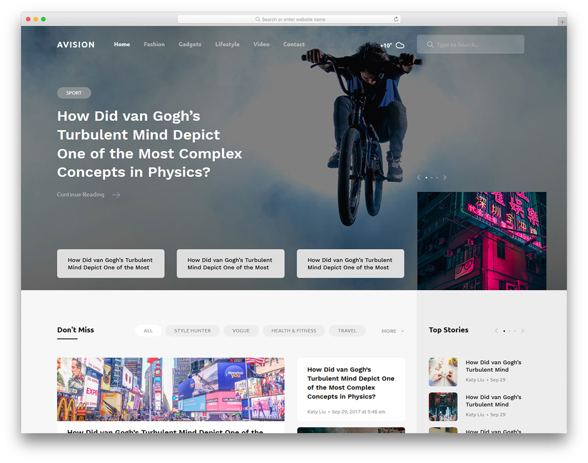
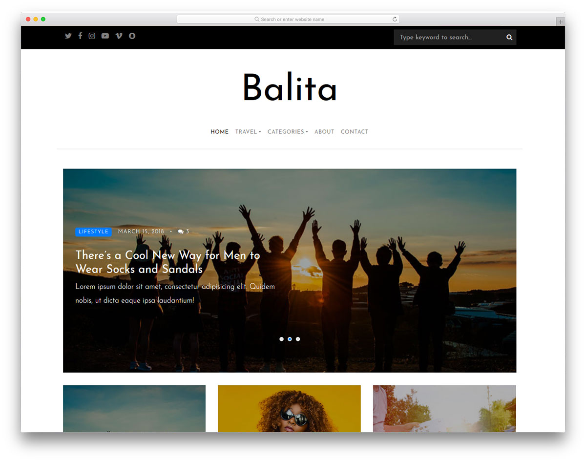
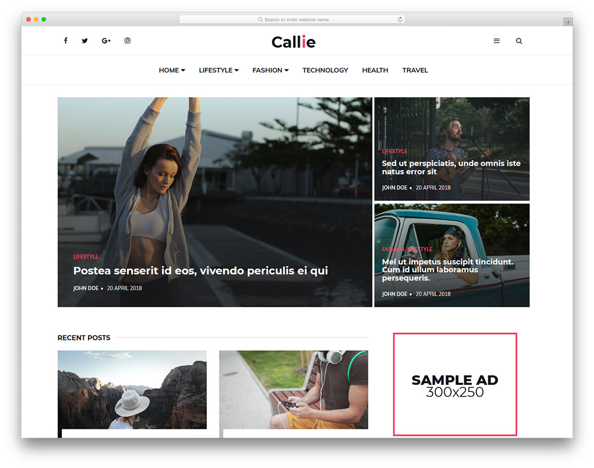
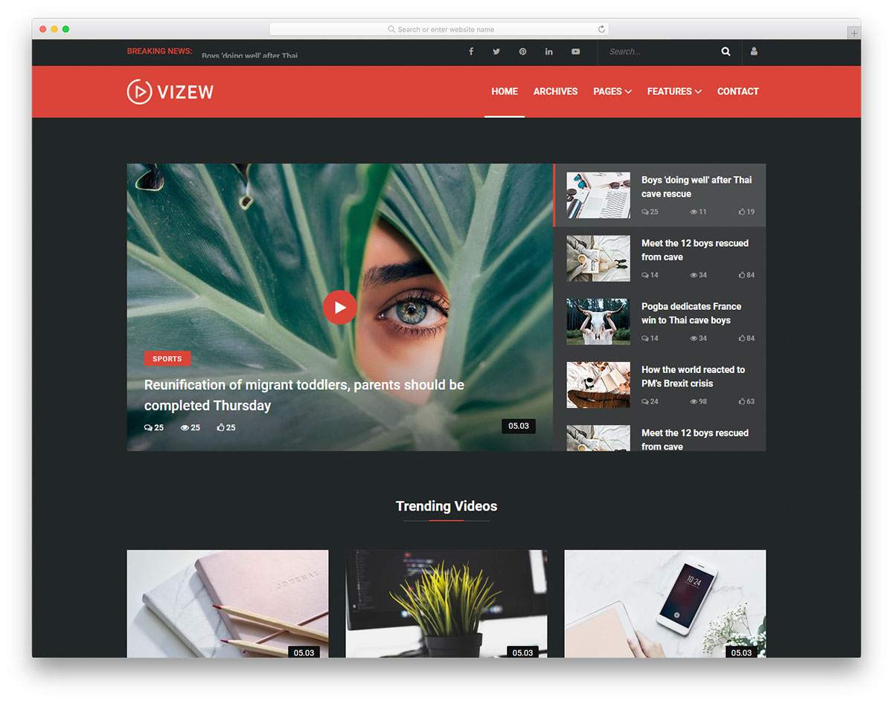
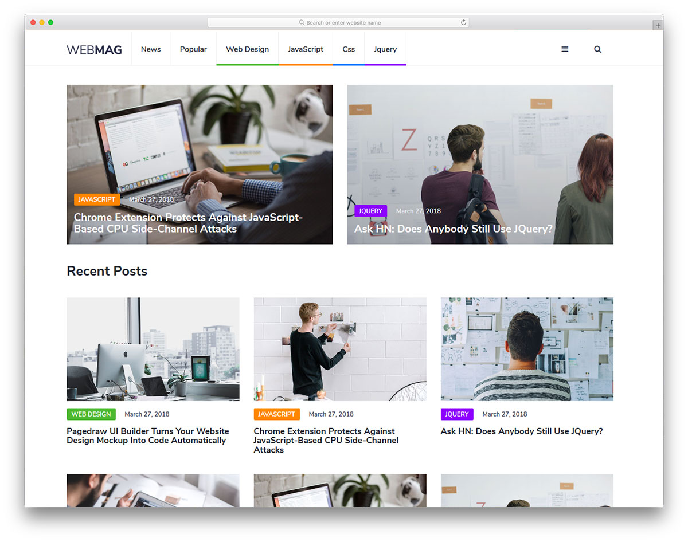
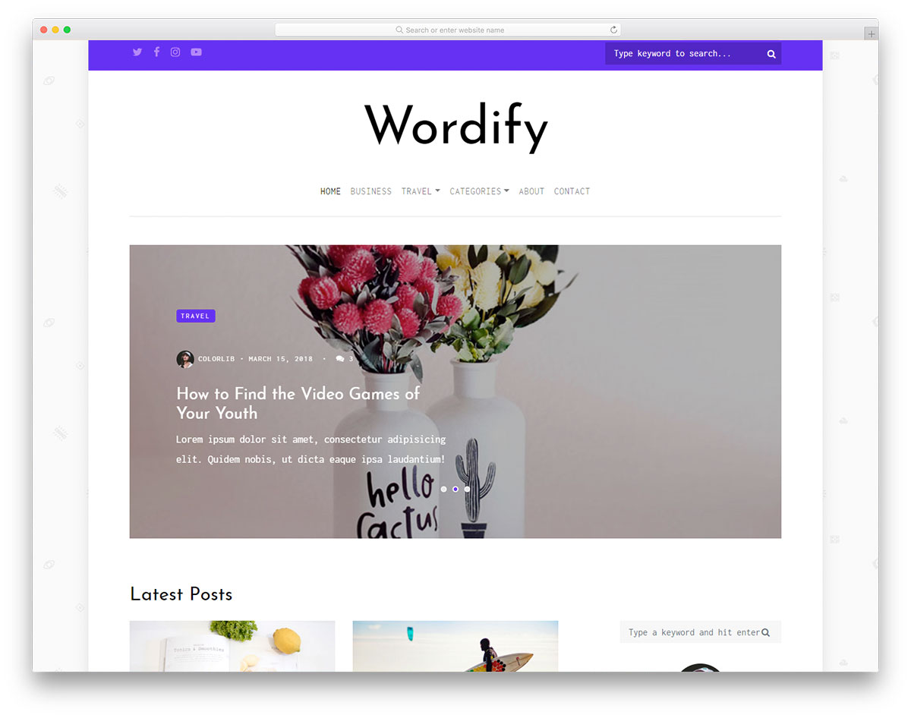
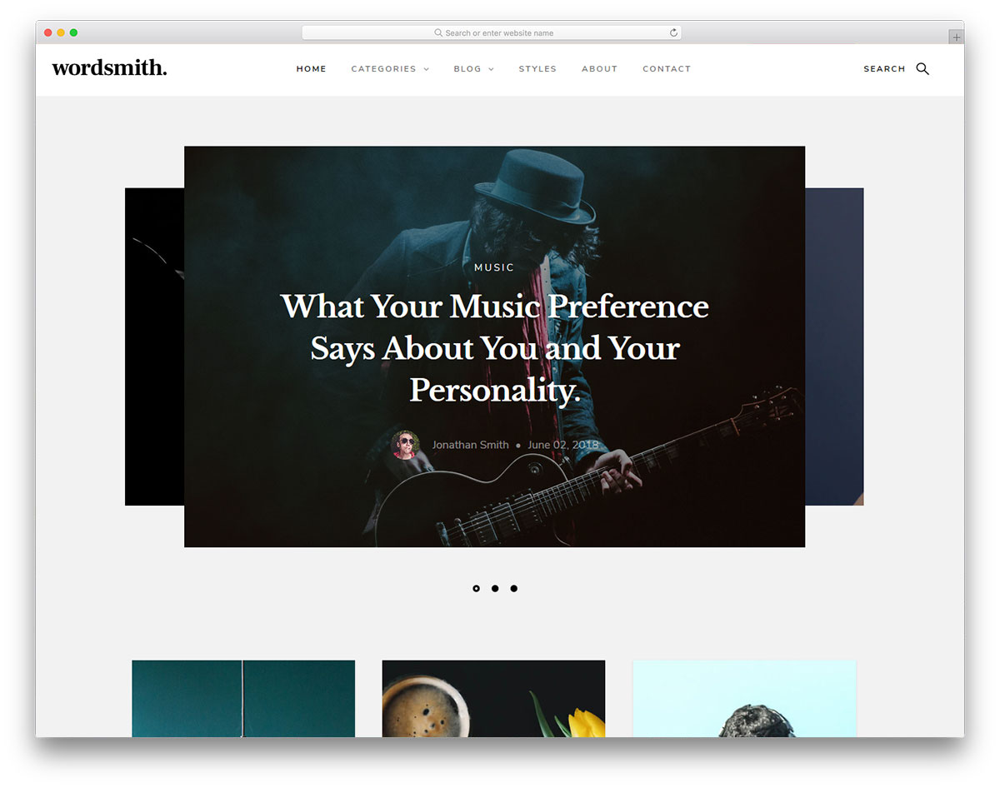

# 2. JavaScript и Node.js

## Общая информация

В этой лабораторной работе вам предлагается создать многостраничный
динамический веб-сайт - блог на основе макета, разработанного 
профессиональными дизайнерами.

## Задачи

1. **Выберите любой из предложенных макетов**, на основе которого вы бы хотели 
создать веб-сайт, и **сообщите преподавателю**, какой макет вы выбрали.

2. Скачайте и **изучите исходный код макета**.

3. **Получите ссылку от преподавателя** для автоматического создания
репозитория для второй лабораторной работы.

4. **Клонируйте** автоматически созданный репозиторий.

5. При выполнении лабораторной работы придерживайтесь следующей
**структуры каталогов** веб-сайта:
   
    ```
    Lab2/         (корневой каталог)
    ├─ client/    (файлы клиентской части)
    │  └─ ...
    └─ server/    (файлы серверной части)
       └─ ...
    ```

6. **Создайте страницы веб-сайта**, максимально приближенные к тому,
что представлены на макете, а также создайте стили для элементов,
допустимых в [содержимом поста](#posts-json).
    
7. **Создайте веб-сервер**, который будет
[динамически формировать](#статическое-и-динамическое-содержимое-страниц)
и возвращать страницы веб-сайта.

8. **Опубликуйте веб-сервер** с помощью
[Microsoft Azure](https://azure.microsoft.com/ru-ru).

## Макеты

### 1. Avision


[Страница макета](https://colorlib.com/wp/template/avision) |
[Демонстрация](https://colorlib.com/preview/theme/avision) |
<a :href="$withBase('/assets/labs/02/Avision.zip')" download>Исходный код</a>

### 2. Balita


[Страница макета](https://colorlib.com/wp/template/balita) |
[Демонстрация](https://colorlib.com/preview/theme/balita) |
<a :href="$withBase('/assets/labs/02/Balita.zip')" download>Исходный код</a>

### 3. Callie


[Страница макета](https://colorlib.com/wp/template/callie) |
[Демонстрация](https://colorlib.com/preview/theme/callie) |
<a :href="$withBase('/assets/labs/02/Callie.zip')" download>Исходный код</a>

### 4. Fantom


[Страница макета](https://colorlib.com/wp/template/fantom) |
[Демонстрация](https://colorlib.com/preview/theme/fantom) |
<a :href="$withBase('/assets/labs/02/Fantom.zip')" download>Исходный код</a>

### 5. Philosophy


[Страница макета](https://colorlib.com/wp/template/philosophy) |
[Демонстрация](https://colorlib.com/etc/philosophy/index.html) |
<a :href="$withBase('/assets/labs/02/Philosophy.zip')" download>Исходный код</a>

### 6. Ruft


[Страница макета](https://colorlib.com/wp/template/ruft) |
[Демонстрация](https://colorlib.com/preview/theme/ruft) |
<a :href="$withBase('/assets/labs/02/Ruft.zip')" download>Исходный код</a>

### 7. Vizew


[Страница макета](https://colorlib.com/wp/template/vizew) |
[Демонстрация](https://colorlib.com/preview/theme/vizew) |
<a :href="$withBase('/assets/labs/02/Vizew.zip')" download>Исходный код</a>

### 8. WebMag


[Страница макета](https://colorlib.com/wp/template/webmag) |
[Демонстрация](https://colorlib.com/preview/theme/webmag) |
<a :href="$withBase('/assets/labs/02/WebMag.zip')" download>Исходный код</a>

### 9. Wordify


[Страница макета](https://colorlib.com/wp/template/wordify) |
[Демонстрация](https://colorlib.com/preview/theme/wordify) |
<a :href="$withBase('/assets/labs/02/Wordify.zip')" download>Исходный код</a>

### 10. Wordsmith


[Страница макета](https://colorlib.com/wp/template/wordsmith) |
[Демонстрация](https://colorlib.com/preview/theme/wordsmith) |
<a :href="$withBase('/assets/labs/02/Wordsmith.zip')" download>Исходный код</a>

## Клиентская часть

Клиентская часть должна отображать две страницы веб-сайта:

1. Главная страница.
2. Страница поста.

Для получения страниц веб-сайта клиентская часть должна обращаться по
[заранее установленным URL](#конечные-точки).

### Описание файлов

Все файлы, относящиеся к клиентской части, разместите в каталоге `client` со 
следующей структурой:

```
client/                (файлы клиентской части)
├─ shared/             (общие ресурсы)
│  ├─ assets/          (медиафайлы)
│  │  ├─ icon.png      (иконка веб-сайта)
│  │  └─ ...
│  ├─ styles/          (стили)
│  │  ├─ main.css      (общий файл стилей)
│  │  └─ ...
│  └─ scripts/         (скрипты)
│     ├─ main.js       (общий скрипт)
│     └─ ...
└─ pages/              (страницы веб-сайта)
   ├─ index/           (файлы главной страницы)
   │  ├─ index.html    (главная страница)
   │  ├─ index.css     (стили главной страницы)
   │  ├─ index.js      (скрипт главной страницы)
   │  └─ assets/       (медиафайлы главной страницы)
   │     └─ ... 
   └─ post/            (файлы страницы поста)
      ├─ post.html     (страница поста)
      ├─ post.css      (стили страницы поста)
      ├─ post.js       (скрипт страницы поста)
      └─ assets/       (медиафайлы страницы поста)
         └─ ...
```

В каталог `shared` помещайте те ресурсы, которые являются общими
для всех страниц сайта:

1. `shared/assets` - изображения, шрифты и прочие медиафайлы
(например, иконку веб-сайта).
2. `shared/styles` - файлы стилей.
3. `shared/scripts` - скрипты.

Файлы, специфичные для страниц, помещайте в отдельные каталоги:

1. `pages/index` - файлы главной страницы,
2. `pages/post` - файлы страницы поста.

## Серверная часть

Серверная часть должна обрабатывать запросы клиентской части по заранее 
установленным URL и возвращать статические ресурсы (изображения, 
скрипты и др.) и динамически формируемые страницы веб-сайта.

### Статическое и динамическое содержимое страниц

Содержимое всех страниц можно разделить на два типа:

1. _Статическое содержимое_ - одинаково для всех страниц веб-сайта:

    - части самой страницы (шапка, подвал и др.),
    - ссылки на внешние ресурсы (скрипты, стили и др.).

2. _Динамическое содержимое_ - формируется веб-сервером по запросу клиента:

    - На **главной странице** динамически формируется список доступных постов.
    У каждого поста в списке в зависимости от макета могут отображаться:
    
      - изображение поста,
      - автор поста,    
      - дата и время публикации,
      - категории,
      - тэги,
      - заголовок поста,
      - количество комментариев.
    
    - На **странице поста** динамически формируется её содержимое.
    У каждого поста в зависимости от макета могут отображаться:
    
      - изображение поста,
      - автор поста,
      - дата и время публикации,
      - категории,
      - тэги,
      - заголовок поста,
      - содержимое поста,
      - комментарии.
    
Для указания динамически формируемых мест на странице рекомендуется 
указывать _опорные точки_ следующего вида:

```
{{ опорная-точка }}
```

Опорные точки можно указывать в любом месте HTML-документа, например:

- в содержимом элемента:

  ```html
  <h1>{{ post-title }}</h1>
  ```

- в значении атрибута элемента:

  ```html
  
  ```

В дальнейшем при запросе пользователя эти опорные точки можно будет заменить 
на реальные данные. Для этого файл HTML надо интерпретировать как строку,
опорные точки - как подстроки, и производить замену этих подстрок.

### Конечные точки

В этой лабораторной работы мы будем использовать только метод HTTP `GET`.

Пусть `/` - это часть URL, на котором расположена серверная часть,
до указания пути (протокол, доменное имя и номер порта), например:

```
https://lab2.github.io/
```

Тогда ресуры серверной части должны быть доступны по следующим
_конечным точкам_:
  
1. `/` или `/index.html` - **главная страница**, например:
  
    ```    
    https://lab2.github.io/
    https://lab2.github.io/index.html
    ```
  
2. `/post/:id` - **страница поста**, где `:id` - идентификатор поста, например:
  
    ```
    https://lab2.github.io/post/5
    https://lab2.github.io/post/27
    ```
 
3. `/client/{path}` - [файлы клиентской части](#описание-файnов),
где `{path}` - путь к файлу относительно директории `client`, например:

    - файлы общих ресурсов:

      ```
      https://lab2.github.io/client/shared/assets/icon.png
      https://lab2.github.io/client/shared/styles/main.css
      https://lab2.github.io/client/shared/scripts/main.js
      ```
    
    - файлы гланой страницы:
    
      ```
      https://lab2.github.io/client/pages/index/index.css
      https://lab2.github.io/client/pages/index/index.js
      https://lab2.github.io/client/pages/index/assets/image.png
      ```
      
    - файлы страницы поста:
    
      ```
      https://lab2.github.io/client/pages/post/post.css
      https://lab2.github.io/client/pages/post/post.js
      https://lab2.github.io/client/pages/post/assets/image.png
      ```
  
4. По всем остальным адресам серверная часть должна возвращать
код ошибки HTTP `404 Not Found`.

### Описание файлов

Все файлы, относящиеся к серверной части, разместите в каталоге `server` со 
следующей структурой:

```
server/                  (файлы серверной части)
├─ scripts/              (скрипты)
│  ├─ server.js          (модуль сервера)
│  ├─ data.js            (модуль получения данных)
│  └─ ...
└─ data/                 (данные)
   ├─ posts.json         (посты)
   ├─ comments.json      (комментарии)
   ├─ users.json         (пользователи)
   ├─ categories.json    (категории)
   └─ tags.json          (тэги)
```

#### Скрипты

В каталоге `scripts` разместите исходный код серверной части:

- `server.js` - главный модуль серверной части, отвечает за обработку 
клиентских запросов.

- `data.js` - вспомогательный модуль, отвечает за получение данных из файлов 
в каталоге `data`.

При необходимости в этом каталоге вы можете дополнительно создать 
неограниченное число вспомогательных модулей.

#### Данные

В каталоге `data` разместите данные в нескольких файлах:
 
1. `posts.json` - данные постов,
2. `comments.json` - данные комментариев,
3. `users.json` - данные пользователей,
4. `categories.json` - данные категорий,
5. `tags.json` - данные тэгов.

Данные должны быть представлены в формате JSON в виде массива объектов. 

Все изображения сохраняйте в кодировке
[Base64](https://ru.wikipedia.org/wiki/Data:_URL).

##### posts.json
    
Описание данных:

Свойство | Тип | Описание
:-------:|:---:| --------
`id` | `Number` | Уникальный идентификатор.
`author` | `Number` | Идентификатор автора.
`publication` | `String` | Дата и время публикации в стандартном формате.
`categories` | `Array` | Идентификаторы категорий.
`tags` | `Array` | Идентификаторы тэгов.
`title` | `String` | Заголовок поста.
`image` | `String` | Изображение поста.
`body` | `String` | Содержимое поста в виде кода HTML. Допустимые элементы: [``](https://webref.ru/html/img), [`<h2>`](https://webref.ru/html/h2), [`<ul>`](https://webref.ru/html/ul), [`<ol>`](https://webref.ru/html/ol), [`<li>`](https://webref.ru/html/li), [`<p>`](https://webref.ru/html/p) и [`<q>`](https://webref.ru/html/q).
    
Пример:

```json
[
  {
    "id": 55,
    "author": 2,
    "publication": "2019-01-26T13:51:50.417+04:00",
    "categories": [1, 2, 4],
    "tags": [5, 7, 4],
    "title": "Вышла новая версия Google Chrome",
    "image": "data:image/jpeg;base64,/9j/4AAQSkZJR0lGODlhEAAOAcGCmTIHEIUEq",
    "body": "<p>Абзац</p><ul><li>Первый</li><li>Второй</li></ul>"
  }
]
```

##### comments.json
    
Описание данных:
  
Свойство | Тип | Описание
:-------:|:---:| --------
`id` | `Number` | Уникальный идентификатор.
`post` | `Number` | Идентификатор поста.
`author` | `Number` | Идентификатор автора.
`reply` | `Number` `null` | Идентификатор исходного комментария, если этот комментарий является ответом на него, иначе - [`null`](https://developer.mozilla.org/ru/docs/Web/JavaScript/Reference/Global_Objects/null).
`publication` | `String` | Дата и время публикации в стандартном формате.
`body` | `String` | Содержимое комментария.
    
Пример:

```json
[
  {
    "id": 59,
    "post": 3,
    "author": 4,
    "reply": null,
    "publication": "2019-02-05T10:00:59.014+04:00",
    "body": "Спасибо, с удовольствием прочитал ваш пост!"
  },
  {
    "id": 62,
    "post": 3,
    "author": 6,
    "reply": 59,
    "publication": "2019-02-05T14:02:23.014+04:00",
    "body": "Всегда пожалуйста!"
  }
]
```

##### users.json

Описание данных:
  
Свойство | Тип | Описание
:-------:|:---:| --------
`id` | `Number` | Уникальный идентификатор.
`name` | `String` | Имя пользователя.
`picture` | `String` | Изображение пользователя.
    
Пример:

```json
[
  {
    "id": 3,
    "name": "Иванов Иван",
    "picture": "data:image/jpeg;base64,/9j/4AAQSkZJR0lGODlhEAAOAcGCmTIUEq"
  }
]
```

##### categories.json
    
Описание данных:
  
Свойство | Тип | Описание
:-------:|:---:| --------
`id` | `Number` | Уникальный идентификатор.
`name` | `String` | Имя категории.
    
Пример:

```json
[
  { "id": 3, "name": "Программирование" },
  { "id": 6, "name": "Интернет" },
  { "id": 7, "name": "Образование" }
]
```

##### tags.json
    
Описание данных:
  
Свойство | Тип | Описание
:-------:|:---:| --------
`id` | `Number` | Уникальный идентификатор.
`name` | `String` | Имя тэга.
    
Пример:

```json
[
  { "id": 3, "name": "HTML" },
  { "id": 5, "name": "CSS" },
  { "id": 6, "name": "JavaScript" }
]
```

<disqus-comments
  page-uuid="73464fea-046b-4dad-ac0d-a2e973598a45"
  page-title="2. JavaScript и Node.js | Лабораторные работы"/>