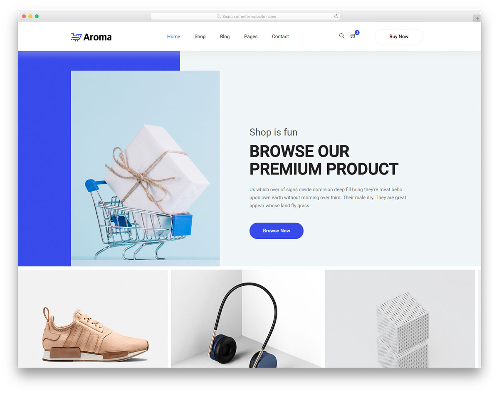
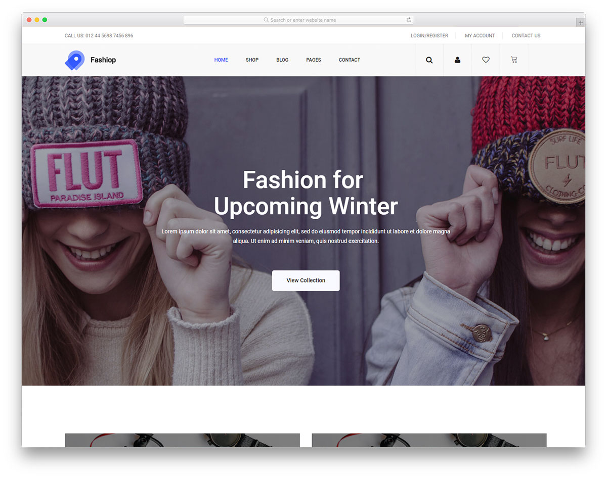
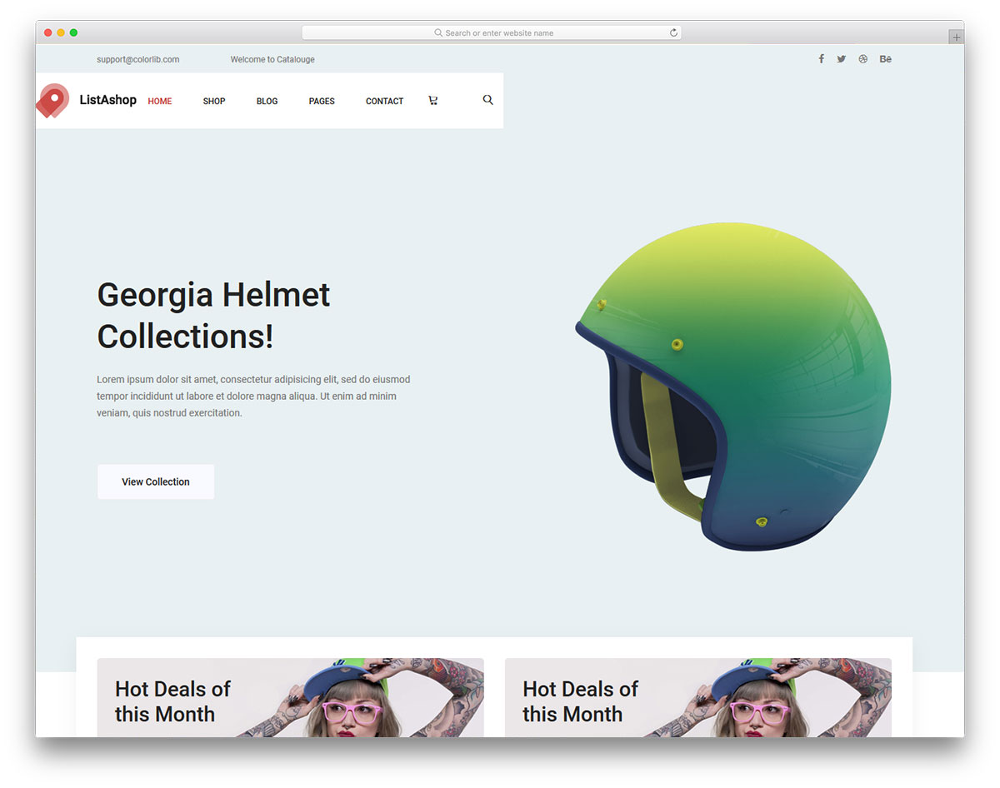

# 3. Стек технологий MEVN

## Общая информация

В этой лабораторной работе вам предлагается создать одностраничное
веб-приложение (SPA, Single Page Application) - интернет-магазин на основе
макета, разработанного профессиональными дизайнерами.

## Задачи

1. **Выберите любой из предложенных макетов**, на основе которого вы бы хотели 
создать веб-сайт, и **сообщите преподавателю**, какой макет вы выбрали.

2. Скачайте и **изучите исходный код макета**.

## Макеты

### 1. Aroma

[Страница макета](https://colorlib.com/wp/template/aroma) |
[Демонстрация](https://colorlib.com/preview/#aroma) |
[Исходный код](https://colorlib.com/download/2585)

### 2. Fashiop

[Страница макета](https://colorlib.com/wp/template/aroma) |
[Демонстрация](https://colorlib.com/preview/#fashiop) |
[Исходный код](https://colorlib.com/download/1529)

### 3. Listashop

[Страница макета](https://colorlib.com/wp/template/listashop) |
[Демонстрация](https://colorlib.com/preview/#listashop) |
[Исходный код](https://colorlib.com/download/1268)

<disqus-comments
  page-uuid="d1f8203c-bafd-4e17-a9b8-be32d1c53373"
  page-title="3. Стек технологий MEVN | Лабораторные работы"/>