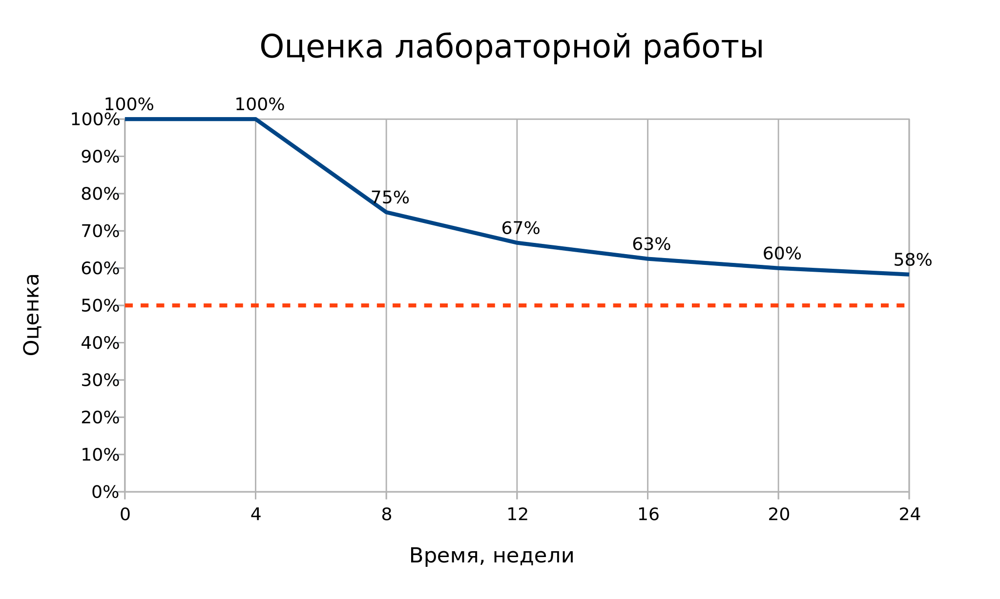
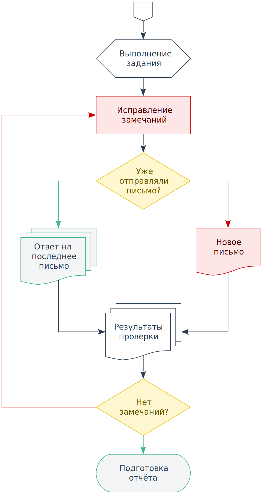

# Лабораторные работы

## Общая информация

На выполнение каждой из лабораторных работ даётся **4 недели**.

Если лабораторная работа была сдана в течение этого срока, то оценка за неё 
остаётся максимальной.

Если лабораторная работа была сдана после этого строка, то её оценка будет 
уменьшаться, с течением времени постепенно приближаясь к половине 
максимального значения:



## Общие требования

### Стиль кодирования

Для наиболее простого соблюдения требований к стилю кодирования вам будет 
нужно установить несколько расширений для
[Visual Studio Code](https://code.visualstudio.com) и дополнить файл 
настроек `settings.json`, который можно открыть через меню
`Файл → Параметры → Параметры → ... → Открыть файл settings.json`:

- Расширение [Beautify
](https://marketplace.visualstudio.com/items?itemName=HookyQR.beautify) 
будет автоматически форматировать ваш HTML, CSS и JavaScript код. Описание 
настроек расширения можно посмотреть
[здесь](https://github.com/HookyQR/VSCodeBeautify/blob/master/Settings.md).
Настройки:

<details>
<summary>Настройки Beautify</summary>

```json
{
  "beautify.config": {
    "break_chained_methods": true,
    "extra_liners": ["head", "body", "html", "/html"],
    "indent_size": 2,
    "max_preserve_newlines": 1,
    "newline_between_rules": true,
    "selector_separator_newline": false,
    "space_around_combinator": true,
    "tab_size": 2,
    "wrap_attributes": "aligned-multiple",
    "wrap_line_length": 80
  },
  "editor.formatOnSave": true,
  "html.format.enable": false
}
```

</details>

- Расширение [HTMLHint
](https://marketplace.visualstudio.com/items?itemName=mkaufman.HTMLHint) 
будет проверять ваш HTML код. Описание настроек расширения можно посмотреть
[здесь](https://github.com/htmlhint/HTMLHint/wiki). Настройки:

<details>
<summary>Настройки HTMLHint</summary>

```json
{
  "htmlhint.options": {
    "alt-require": true,
    "attr-lowercase": true,
    "attr-no-duplication": true,
    "attr-unsafe-chars": true,
    "attr-value-double-quotes": true,
    "doctype-first": true,
    "doctype-html5": true,
    "id-unique": true,
    "inline-script-disabled": true,
    "inline-style-disabled": true,
    "space-tab-mixed-disabled": "space",
    "spec-char-escape": true,
    "src-not-empty": true,
    "style-disabled": true,
    "tagname-lowercase": true,
    "tag-pair": true,
    "title-require": true
  }
}
```

</details>

- Расширение [stylelint
](https://marketplace.visualstudio.com/items?itemName=shinnn.stylelint) 
будет проверять ваш CSS код. Описание настроек расширения можно посмотреть 
[здесь](https://stylelint.io/user-guide/rules). Настройки:

<details>
<summary>Настройки stylelint</summary>

```json
{
  "css.validate": false,
  "stylelint.config": {
    "defaultSeverity": "warning",
    "rules": {
      "at-rule-name-case": "lower",
      "at-rule-name-space-after": "always",
      "at-rule-no-unknown": [true, {
        "severity": "error"
      }],
      "at-rule-no-vendor-prefix": [true, {
        "severity": "error"
      }],
      "at-rule-semicolon-newline-after": "always",
      "at-rule-semicolon-space-before": "never",
      "block-closing-brace-empty-line-before": "never",
      "block-closing-brace-newline-after": "always",
      "block-closing-brace-newline-before": "always",
      "block-no-empty": true,
      "block-opening-brace-newline-after": "always",
      "block-opening-brace-space-before": "always",
      "color-hex-case": "lower",
      "color-hex-length": "short",
      "color-named": "always-where-possible",
      "color-no-invalid-hex": [true, {
        "severity": "error"
      }],
      "comment-no-empty": true,
      "comment-whitespace-inside": "always",
      "comment-empty-line-before": ["always", {
        "except": "first-nested"
      }],
      "custom-property-empty-line-before": ["never", {
        "except": "after-comment"
      }],
      "declaration-block-no-duplicate-properties": [true, {
        "severity": "error"
      }],
      "declaration-block-no-redundant-longhand-properties": [true, {
        "severity": "error"
      }],
      "declaration-block-no-shorthand-property-overrides": [true, {
        "severity": "error"
      }],
      "declaration-block-semicolon-newline-after": "always",
      "declaration-block-semicolon-newline-before": "never-multi-line",
      "declaration-block-semicolon-space-before": "never",
      "declaration-block-trailing-semicolon": "always",
      "declaration-colon-newline-after": "always-multi-line",
      "declaration-colon-space-after": "always-single-line",
      "declaration-colon-space-before": "never",
      "declaration-empty-line-before": "never",
      "declaration-no-important": [true, {
        "severity": "error"
      }],
      "font-family-name-quotes": ["always-where-recommended", {
        "severity": "error"
      }],
      "font-family-no-duplicate-names": [true, {
        "severity": "error"
      }],
      "font-family-no-missing-generic-family-keyword": [true, {
        "severity": "error"
      }],
      "font-weight-notation": "named-where-possible",
      "function-calc-no-unspaced-operator": true,
      "function-comma-newline-after": "always-multi-line",
      "function-comma-newline-before": "never-multi-line",
      "function-comma-space-after": "always-single-line",
      "function-comma-space-before": "never",
      "function-linear-gradient-no-nonstandard-direction": [true, {
        "severity": "error"
      }],
      "function-max-empty-lines": 0,
      "function-name-case": "lower",
      "function-parentheses-newline-inside": "always-multi-line",
      "function-parentheses-space-inside": "never",
      "function-url-no-scheme-relative": [true, {
        "severity": "error"
      }],
      "function-url-quotes": ["always", {
        "severity": "error",
        "except": "empty"
      }],
      "function-whitespace-after": "always",
      "indentation": 2,
      "keyframe-declaration-no-important": [true, {
        "severity": "error"
      }],
      "length-zero-no-unit": true,
      "max-empty-lines": 1,
      "max-line-length": 80,
      "media-feature-colon-space-after": "always",
      "media-feature-colon-space-before": "never",
      "media-feature-name-case": "lower",
      "media-feature-name-no-unknown": [true, {
        "severity": "error"
      }],
      "media-feature-name-no-vendor-prefix": [true, {
        "severity": "error"
      }],
      "media-feature-parentheses-space-inside": "never",
      "media-feature-range-operator-space-after": "always",
      "media-feature-range-operator-space-before": "always",
      "media-query-list-comma-newline-after": "always-multi-line",
      "media-query-list-comma-newline-before": "never-multi-line",
      "media-query-list-comma-space-after": "always-single-line",
      "media-query-list-comma-space-before": "never",
      "no-descending-specificity": [true, {
        "severity": "error"
      }],
      "no-duplicate-at-import-rules": [true, {
        "severity": "error"
      }],
      "no-duplicate-selectors": [true, {
        "severity": "error"
      }],
      "no-empty-source": true,
      "no-empty-first-line": true,
      "no-eol-whitespace": true,
      "no-extra-semicolons": true,
      "no-invalid-double-slash-comments": [true, {
        "severity": "error"
      }],
      "no-unknown-animations": [true, {
        "severity": "error"
      }],
      "number-leading-zero": "always",
      "number-max-precision": 2,
      "number-no-trailing-zeros": true,
      "property-case": "lower",
      "property-no-unknown": [true, {
        "severity": "error"
      }],
      "property-no-vendor-prefix": [true, {
        "severity": "error"
      }],
      "rule-empty-line-before": ["always", {
        "except": ["after-single-line-comment", "first-nested"]
      }],
      "selector-attribute-brackets-space-inside": "never",
      "selector-attribute-operator-space-after": "never",
      "selector-attribute-operator-space-before": "never",
      "selector-attribute-quotes": "always",
      "selector-combinator-space-after": "always",
      "selector-combinator-space-before": "always",
      "selector-descendant-combinator-no-non-space": true,
      "selector-list-comma-newline-after": "always-multi-line",
      "selector-list-comma-newline-before": "never-multi-line",
      "selector-list-comma-space-after": "always-single-line",
      "selector-list-comma-space-before": "never",
      "selector-max-attribute": [1, {
        "severity": "error"
      }],
      "selector-max-class": [3, {
        "severity": "error"
      }],
      "selector-max-combinators": [1, {
        "severity": "error"
      }],
      "selector-max-compound-selectors": [2, {
        "severity": "error"
      }],
      "selector-max-empty-lines": 0,
      "selector-max-id": [1, {
        "severity": "error"
      }],
      "selector-max-pseudo-class": [2, {
        "severity": "error"
      }],
      "selector-max-specificity": ["1,3,2", {
        "severity": "error"
      }],
      "selector-max-type": [2, {
        "severity": "error"
      }],
      "selector-max-universal": [1, {
        "severity": "error"
      }],
      "selector-no-qualifying-type": [true, {
        "severity": "error",
        "ignore": ["attribute"]
      }],
      "selector-no-vendor-prefix": [true, {
        "severity": "error"
      }],
      "selector-pseudo-class-case": "lower",
      "selector-pseudo-class-no-unknown": [true, {
        "severity": "error"
      }],
      "selector-pseudo-class-parentheses-space-inside": "never",
      "selector-pseudo-element-case": "lower",
      "selector-pseudo-element-colon-notation": ["double", {
        "severity": "error"
      }],
      "selector-pseudo-element-no-unknown": [true, {
        "severity": "error"
      }],
      "selector-type-case": "lower",
      "selector-type-no-unknown": [true, {
        "severity": "error"
      }],
      "shorthand-property-no-redundant-values": [true, {
        "severity": "error"
      }],
      "string-no-newline": [true, {
        "severity": "error"
      }],
      "string-quotes": "double",
      "time-min-milliseconds": 100,
      "unit-case": "lower",
      "unit-no-unknown": [true, {
        "severity": "error"
      }],
      "value-keyword-case": "lower",
      "value-list-comma-newline-after": "always-multi-line",
      "value-list-comma-newline-before": "never-multi-line",
      "value-list-comma-space-after": "always-single-line",
      "value-list-comma-space-before": "never",
      "value-list-max-empty-lines": 0,
      "value-no-vendor-prefix": [true, {
        "severity": "error"
      }]
    }
  }
}
```

</details>

- Расширение [ESLint
](https://marketplace.visualstudio.com/items?itemName=dbaeumer.vscode-eslint)
будет проверять ваш JavaScript код. Настройки:

<details>
<summary>Настройки ESLint</summary>

```json
{
}
```

</details>

Результаты работы расширений вы можете посмотреть в панели `Проблемы`, 
которую можно открыть через меню `Вид → Проблемы`. На этой панели будут 
отображены сообщения об ошибках и предупреждения для всех открытых в данный 
момент файлов.

Ваша задача - добиться результата **без единой ошибки или предупреждения**.

### Оформление кода

Ко всем лабораторным работам применяются требования к структуре каталогов. 
Подробное описание структуры каталогов смотрите в разделе **Дополнительные 
требования** на страницах лабораторных работ.

Прочее:

1. Называйте все файлы веб-сайта **человекочитаемыми именами**.
2. Для стилизации элементов используйте преимущественно
[селекторы класса](https://webref.ru/css/selector/class).
3. При создании веб-сайта обязательно используйте **семантические элементы** в 
тех местах, где они подходят по смыслу.

### Хранение кода

Код ваших лабораторных работ должен храниться в виде _репозитория_ на
[GitHub](https://github.com). Для работы с этим сайтом вам надо будет пройти
регистрацию. После регистрации в настройках профиля в поле **Name** укажите
ваши Ф.И.О.

Для наиболее удобной работы с вашими репозиториями установите приложение
[GitHub Desktop](https://desktop.github.com).

Репозиторий для каждой лабораторной работы будет создаваться автоматически из
шаблона. Для этого нужно перейти по ссылке, которую даст вам преподаватель. 
Ссылка будет уникальной для каждой лабораторной работы.

После этого вам надо будет _клонировать_ репозиторий с сайта на локальный 
компьютер. Для этого в программе [GitHub Desktop](https://desktop.github.com)
через меню `File → Clone repository...` откройте диалоговое окно 
клонирования и в этом окне выберите из списка только что созданный репозиторий.

При создании _коммита_ в ваш репозиторий **указывайте понятное описание
изменений**, которые он приносит. Также вместо редких, но больших коммитов с 
большим описанием изменений лучше делать множество мелких (_атомарных_) 
коммитов.

### Отчётность

Работа через Google Docs, пример титульного листа и содержание отчёта.

## Регламент сдачи

Процесс сдачи лабораторных работ ведётся через электронную почту:

1. **Присылаете письмо** на почту
<a href='mailto:Vladislav.Lyuminarskiy@gmail.com
?subject=Web-программирование,%20группа%203-19-1од,%20Иванов%20Иван%20Иванович'
target='_blank'>Vladislav.Lyuminarskiy@gmail.com</a> в рамках переписки:

    - **Новое письмо**, если вы отправляете письмо в первый раз.
    - **Ответ на последнее письмо**, если вы уже ведёте переписку, для 
    сохранения цепочки писем.

2. **В теме письма** указываете название курса, группу и Ф.И.О., например:
`Web-программирование, группа 3-19-1од, Иванов Иван Иванович`.

3. **В самом письме** прописываете ваши вопросы и указываете ссылку на
[GitHub](https://github.com) репозиторий с кодом вашей работы.

4. В течение `1-2 рабочих дней` получаете **письмо с результатами проверки**
вашей работы:

    - **Список замечаний**, если в работе были найдены ошибки.
    - **Предложение подготовить отчёт**, если замечания к работе были вами 
    исправлены или отсутствуют.

В виде диаграммы:



::: warning Обратите внимание!
Ответ присылается только для писем, которые были отправлены **в рамках 
переписки**, и у которых правильно указана **тема письма**.

Все остальные письма останутся **без ответа**.
:::

<disqus-comments
  page-uuid="d4d7fa6d-6685-4d1e-99fa-ed6e6c857d43"
  page-title="Лабораторные работы"/>