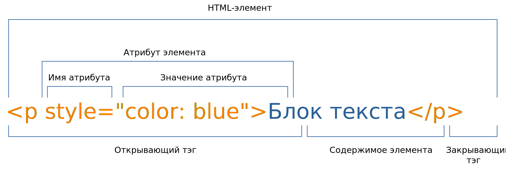

# 1. Введение

## Общая информация

::: warning Обратите внимание!
Перенести описание [валидатора](https://validator.w3.org) и атрибута
[lang](https://webref.ru/html/attr/lang) из третьего занятия в первое.
:::

Затраты времени (из доступных **180 минут**):

- **30-50 минут** - объяснение материала.
- **50-150 минут** - выполнение заданий студентами.

## Сценарий

### Вступление

Представиться студентам. Попросить их не шуметь, переговариваться шёпотом, 
не ругаться и уважать друг друга. Если у них возникнут вопросы в ходе 
лекции, можно сразу же их задавать.

Дать ссылку на этот веб-сайт. Кратко описать содержимое ссылок на главной 
странице.

### Инструменты разработчика Chrome

Открываем в браузере любой сайт и [открываем инструменты разработчика 
Chrome](https://developers.google.com/web/tools/chrome-devtools). 
Демонстрируем, как выглядят HTML и CSS в современном сайте.

Показываем [список элементов HTML](https://webref.ru/html) и
[свойств CSS](https://webref.ru/css). Их довольно много, при случае лучше 
обращаться к этому справочнику.

Показываем структуру HTML-элемента.



Обратить внимание, что все угловые скобки должны быть закрыты, в закрывающем
тэге должна быть косая черта перед именем элемента. Атрибут и его значение 
разделяются знаком `=`, значение атрибута обрамляется двойными кавычками.

### Базовые элементы HTML и атрибуты

Показываем, как правильно настроить [Visual Studio
Code](https://code.visualstudio.com), чтобы можно было повторять действия за 
преподавателем:

1. Установить расширение [Live Server
](https://marketplace.visualstudio.com/items?itemName=ritwickdey.LiveServer).
2. Открыть папку через редактор.
3. Создать файл `index.html`.
4. Нажать на кнопку `Go Live`.

Показываем базовую структуру страницы.
[`<!DOCTYPE>`](https://webref.ru/html/!doctype) обозначает тип документа.

```html
<!DOCTYPE html>

<html>
  <head></head>
  <body></body>
</html>
```

Добавляем в [`<head>`](https://webref.ru/html/head) заголовок страницы и 
указание кодировки содержимого. Здесь у
[`<meta>`](https://webref.ru/html/meta) появляется атрибут, к тому же этот 
элемент не требует наличие закрывающего тэга.

```html
<!DOCTYPE html>

<html>

<head>
  <meta charset="utf-8">
  <title>Заголовок страницы</title>
</head>

<body>Содержимое страницы</body>

</html>
```

Заполняем элементами [`<body>`](https://webref.ru/html/body). Появляется 
абзац [`<p>`](https://webref.ru/html/p), заголовки шести уровней
[`<h1>`](https://webref.ru/html/h1), [`<h2>`](https://webref.ru/html/h2), 
[`<h3>`](https://webref.ru/html/h3), [`<h4>`](https://webref.ru/html/h4), 
[`<h5>`](https://webref.ru/html/h5), [`<h6>`](https://webref.ru/html/h6) и 
горизонтальная линия [`<hr>`](https://webref.ru/html/hr). Показываем, что в 
HTML можно добавлять комментарии в виде
[`<!-- -->`](https://webref.ru/html/!--). Указываем у любого элемента 
универсальный атрибут [`title`](https://webref.ru/html/attr/title) - 
всплывающую подсказку.

```html
<!DOCTYPE html>

<html>

<head>
  <meta charset="utf-8">
  <title>Базовые элементы</title>
</head>

<body>
  <!-- Блок текста -->
  <p>Абзац</p>

  <!-- Заголовки -->
  <h1>Заголовок первого уровня</h1>
  <h2>Заголовок второго уровня</h2>
  <h3>Заголовок третьего уровня</h3>
  <h4>Заголовок четвёртого уровня</h4>
  <h5>Заголовок пятого уровня</h5>
  <h6>Заголовок шестого уровня</h6>

  <!-- Горизонтальная линия -->
  <hr title="Горизонтальная линия">
</body>

</html>
```

Выбирать уровень заголовка следует исходя из текущего контекста, а не его 
внешнего вида. Внешний вид заголовка (размер шрифта и т.п.) следует 
устанавливать с помощью CSS.

### Свойства CSS для установки цвета текста и фона

Оформляем текст с помощью универсального атрибута
[`style`](https://webref.ru/html/attr/style). Устанавливаем цвет текста и 
фона с помощью свойств [`color`](https://webref.ru/css/color) и 
[`background-color`](https://webref.ru/css/background-color) соответственно.
Свойства CSS записываются с помощью *объявлений* вида `свойство: значение`. 
Несколько *объявлений* разделяются точкой с запятой. С помощью элемента 
[`<span>`](https://webref.ru/html/span) можно применять стили к отдельным 
участкам текста внутри элемента [`<p>`](https://webref.ru/html/p).

Цвет можно записать по названию, либо по его шестнадцатеричному значению. 
Подробнее можно прочитать [в статье](https://webref.ru/html/value/color).

```html
<!DOCTYPE html>

<html>

<head>
  <meta charset="utf-8">
  <title>Цвет текста и фона</title>
</head>

<body>
  <p style="color: blue">Синий текст</p>
  <p style="background-color: yellow">Текст на жёлтом фоне</p>
  <p style="color: #fff; background-color: #f00">
    Белый текст на красном фоне
  </p>

  <p>
    Lorem ipsum dolor sit amet, consectetuer adipiscing elit,
    sed diam nonummy nibh euismod tincidunt ut laoreet dolore
    magna aliquam erat volutpat.
    <span title="Зелёный текст" style="color: green">
        Ut wisi enim ad minim veniam, quis nostrud exerci tation
        ullamcorper suscipit lobortis nisl ut aliquip ex ea
        commodo consequat.
      </span>
    Duis autem vel eum iriure dolor in hendrerit in vulputate
    velit esse molestie consequat, vel illum dolore eu feugiat
    nulla facilisis at vero eros et accumsan et iusto odio
    dignissim qui blandit praesent luptatum zzril delenit augue
    duis dolore te feugait nulla facilisi.
  </p>
</body>
</html>
```

### Заключение

Кратко повторить пройденный материал.

Студенты переходят к выполнению самостоятельных заданий. Кратко описать, что
нужно сделать в заданиях. Обратить внимание на раздел `Теоретические 
сведения`, а также на подсказки к заданиям.