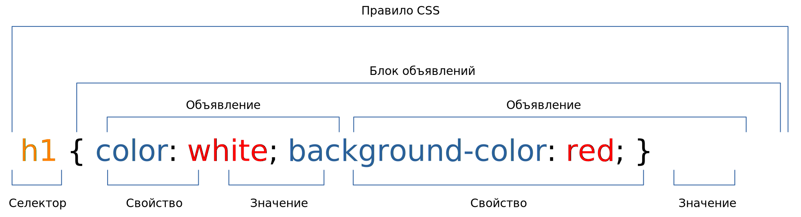

# 2. Таблицы стилей. Списки

Темы занятия:

- Элемент [`<style>`](https://webref.ru/html/style).
- Универсальные атрибуты [`id`](https://webref.ru/html/attr/id) и [`class`](https://webref.ru/html/attr/class).
- Универсальный селектор, cелекторы элементов, идентификаторов и классов.
- Свойства CSS для стилизации текста.
- Элементы для создания списков.
- Свойства CSS для стилизации списков.

### Теоретические сведения

На этом занятии мы рассмотрели следующее:

- HTML:

  - Таблицы стилей для всего документа [`<style>`](https://webref.ru/html/style).
  - Идентификатор элемента - универсальный атрибут [`id`](https://webref.ru/html/attr/id).
  - Класс элемента - универсальный атрибут [`class`](https://webref.ru/html/attr/class).

  - Элементы списков:

    - Маркированный список [`<ul>`](https://webref.ru/html/ul).
    - Нумерованный список [`<ol>`](https://webref.ru/html/ol) и его атрибуты [`reversed`](https://webref.ru/html/ol/reversed) и [`start`](https://webref.ru/html/ol/start).
    - Пункт списка [`<li>`](https://webref.ru/html/li).

- CSS:

  - Селекторы:

    - [Селектор элементов](https://webref.ru/css/selector/tag).
    - [Универсальный селектор](https://webref.ru/css/selector/universal).
    - [Селектор идентификаторов](https://webref.ru/css/selector/id).
    - [Селектор классов](https://webref.ru/css/selector/class).

  - Характеристики шрифта:

    - Начертание шрифта [`font-style`](https://webref.ru/css/font-style).
    - Способ отображения строчных букв [`font-variant`](https://webref.ru/css/font-variant).
    - Насыщенность шрифта [`font-weight`](https://webref.ru/css/font-weight).
    - Размер шрифта [`font-size`](https://webref.ru/css/font-size).
    - Минимальная высота строки текста [`line-height`](https://webref.ru/css/line-height).
    - Семейство шрифта [`font-family`](https://webref.ru/css/font-family).
    - Универсальное свойство для установки различных характеристик шрифта и текста [`font`](https://webref.ru/css/font).

  - Отображения текста:

    - Горизонтальное выравнивание текста [`text-align`](https://webref.ru/css/text-align).
    - Величина отступа первой строки блока текста [`text-indent`](https://webref.ru/css/text-indent).
    - Интервал между словами [`word-spacing`](https://webref.ru/css/word-spacing).
    - Интервал между символами [`letter-spacing`](https://webref.ru/css/letter-spacing).
    - Преобразование регистра символов текста [`text-transform`](https://webref.ru/css/text-transform).

  - Оформление текста:

    - Тень текста [`text-shadow`](https://webref.ru/css/text-shadow).
    - Добавление декоративной линии к тексту [`text-decoration-line`](https://webref.ru/css/text-decoration-line).
    - Стиль декоративной линии [`text-decoration-style`](https://webref.ru/css/text-decoration-style).
    - Цвет декоративной линии [`text-decoration-color`](https://webref.ru/css/text-decoration-color).
    - Универсальное свойство для добавления декоративной линии [`text-decoration`](https://webref.ru/css/text-decoration).

  - Оформление списков:

    - Вид маркеров элементов списка [`list-style-type`](https://webref.ru/css/list-style-type).
    - Положение маркеров элементов списка относительно текста [`list-style-position`](https://webref.ru/css/list-style-position).
    - Изображение вместо стандартных маркеров элементов списка [`list-style-image`](https://webref.ru/css/list-style-image).
    - Универсальное свойство для оформления списков [`list-style`](https://webref.ru/css/list-style).

Cтруктура правила CSS:

## 2.1. Селектор классов

Доработайте веб-страницу, созданную в задании [`1.3. Стилизация текста`](../../practice/01/#_1-3-стиnизация-текста), выполнив следующие задачи:

1. Добавьте класс `direct-speech` у всех элементов, содержимым которых является прямая речь.
2. Замените стилизацию, установленную ранее с помощью универсального атрибута [`style`](https://webref.ru/html/attr/style), создав новое правило CSS, которое будет устанавливать цвет и/или фон текста у всех элементов класса `direct-speech`, а также менять начертание шрифта на курсивное.

## 2.2. Стилизация текста

Доработайте веб-страницу, созданную в предыдущем задании, выполнив следующие задачи:

1. Укажите идентификаторы `header`, `part1`, `part2` и `part3` у заголовка рассказа и трёх частей рассказа соответственно.
2. Преобразуйте все символы элемента с идентификатором `header` к верхнему регистру, добавьте к нему декоративную двойную линию красного цвета под текстом и выровняйте текст по центру.
3. Добавьте тень к элементам с идентификаторами `part1`, `part2` и `part3` и выровняйте их текст по центру.
4. Для каждого блока текста добавьте отступ первой строки произвольного размера и установите выравнивание текста по ширине.
5. Для всего текста на веб-странице установите шрифт `Arial`.

::: tip На заметку
Если вы испытываете трудности с выбором правильного свойства при выполнении задания, обратите внимание на раздел [`Теоретические сведения`](../../practice/01/#теоретические-сведения)
:::

## 2.3. Стилизация списков

Задачи:

1. После заголовка рассказа добавьте **блок текста** и **ненумерованный список** следующего вида:

> Содержание:
>
> - Часть первая
> - Часть вторая
> - Часть третья

2. У элемента ненумерованного списка установите идентификатор `contents`.
3. Поменяйте вид маркеров списка на квадраты.
4. Преобразуйте все символы элементов списка к верхнему регистру.