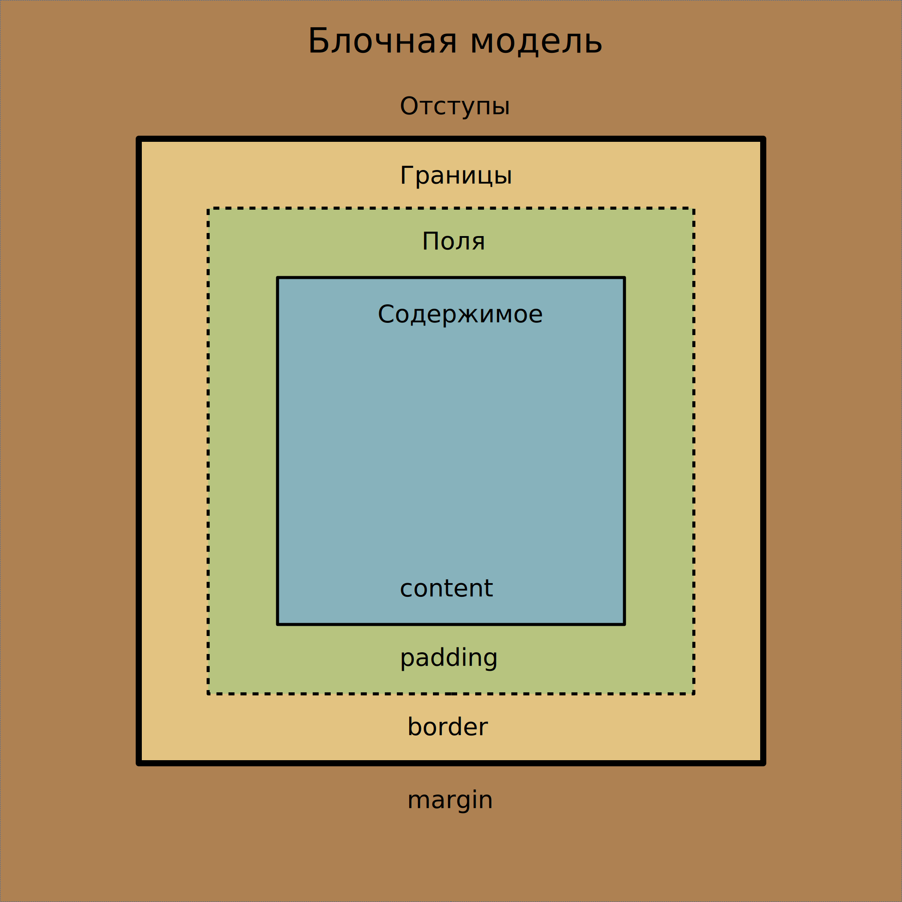

# 4. Блочная модель. Псевдоэлементы. Emmet

Темы занятия:

- Связь с внешними документами с помощью элемента [`<link>`](https://webref.ru/html/link).
- Блочная модель и относящиеся к ней свойства CSS.
- [Блочные](https://webref.ru/course/block-inline/block), [строчные](https://webref.ru/course/block-inline/inline) и [строчно-блочные](https://webref.ru/course/block-inline/inline-block) элементы, свойство [`display`](https://webref.ru/css/display).
- Прочие виды селекторов.
- Псевдоэлементы.
- [Emmet](https://emmet.io).

### Теоретические сведения

На этом занятии мы рассмотрели следующее:

- HTML:

  - Связь с внешним документом [`<link>`](https://webref.ru/html/link) и его атрибуты [`href`](https://webref.ru/html/link/href) и [`rel`](https://webref.ru/html/link/rel).

  - Виды элементов:

    - [Блочные](https://webref.ru/course/block-inline/block).
    - [Строчные](https://webref.ru/course/block-inline/inline).
    - [Строчно-блочные](https://webref.ru/course/block-inline/inline-block)

  - Универсальный блочный элемент [`<div>`](https://webref.ru/html/div).

- CSS:

  - Блочная модель (вместо `*` подставить одно из следующих значений: `top`, `bottom`, `left`, `right`):

    - Величина полей [`padding`](https://webref.ru/css/padding) и `padding-*`.
    - Величина отступа [`margin`](https://webref.ru/css/padding) и `margin-*`.

  - Алгоритм расчёта ширины и высоты элемента [`box-sizing`](https://webref.ru/css/box-sizing).
  - Способ отображения элемента [`display`](https://webref.ru/css/display).

  - Селекторы:

    - [Вложенный селектор](https://webref.ru/css/selector/descendant).
    - [Дочерний селектор](https://webref.ru/css/selector/child).
    - [Соседний селектор](https://webref.ru/css/selector/adjacent).
    - [Родственный селектор](https://webref.ru/css/selector/sibling).
    - [Селектор атрибута](https://webref.ru/css/selector/attr).

  - Псевдоэлементы:

    - Первый символ в тексте [`::first-letter`](https://webref.ru/css/first-letter).
    - Первая строка текста [`::first-line`](https://webref.ru/css/first-line).
    - Отображения контента до содержимого элемента [`::before`](https://webref.ru/css/before), после содержимого элемента [`::after`](https://webref.ru/css/after) и свойство [`content`](https://webref.ru/css/content).
    - Выделенный текст [`::selection`](https://webref.ru/css/first-line).

Блочная модель:



## 4.1. Псевдоэлементы

Доработайте веб-страницу, созданную в задании [`3.3. Стилизация списков`](../../practice/03/#_3-3-иnnюстрации), выполнив следующие задачи:

1. Найдите портрет А. И. Куприна и установите его в качестве иконки веб-страницы.
2. Вынесите весь код CSS в отдельный файл под названием `style.css`.
3. Установите одинаковый верхний и нижний отступы у заголовков и изображений.
4. При наведении на любой заголовок добавлять перед ним символ `#` произвольного цвета.
5. Установите произвольный цвет текста и размер шрифта для первого символа первого абзаца каждой из частей.
6. Установите произвольные цвет и фон для выделенного текста.

::: tip На заметку
При выполнении этого задания вам потребуется использовать псевдоэлементы. Если вы испытываете трудности с выбором правильного псевдоэлемента, обратите внимание на раздел [Теоретические сведения](../../practice/04/#теоретические-сведения).
:::

## 4.2. Типы элементов

Создайте веб-страницу следующего вида:

<practice-04-task-02/>

Подзадачи:

- Используйте следующую структуру элементов:

```html
<div class="card">
  <div class="card-image"></div>
  <div class="card-content">
    <div class="card-header"></div>
    <div class="card-text narrow"></div>
    <div class="card-text wide"></div>
    <div class="card-text wide"></div>
    <div class="card-text narrow"></div>
  </div>
</div>
```

- Используйте только [селекторы класса](https://webref.ru/css/selector/class).
- Установите у элементов с классом:

  1. `card-image` ширину `30%` и высоту `100%`.
  2. `card-content` ширину `60%` и высоту `100%`, а также свойство [`vertical-align`](https://webref.ru/css/vertical-align).
  3. `narrow` ширину `30%`.
  4. `wide` ширину `60%`.

- Используйте следующую палитру цветов:

  1. `#333`,
  2. `#555`,
  3. `#eee`,
  4. `black`.

::: tip На заметку
Для выполнения этого задания вам понадобится изменять значение свойства [`display`](https://webref.ru/css/display) у элементов.
:::

::: warning Обратите внимание!
В этом задании потребовалось использовать ранее неизвестное для вас свойство [`vertical-align`](https://webref.ru/css/vertical-align). Изучите его смысл и значения **самостоятельно**.
:::

## 4.3. Селекторы

Задачи:

1. Создайте новый документ с именем `index.html` со следующим содержимым:

```html
<!DOCTYPE html>

<html lang="ru">

<head>
  <meta charset="utf-8">
  <title>Селекторы</title>
</head>

<body>
  <div class="card">
    
    <div class="card-content">
      <h2 class="card-header">Заголовок карточки</h2>
      <p class="card-datetime">01 сентября 2005 г.</p>
      <p class="card-text">Текст карточки</p>
    </div>
  </div>
</body>

</html>
```

2. В том же каталоге создайте файл `style.css` и подключите его к `index.html`.
3. Используя различные виды селекторов, напишите и продемонстрируйте преподавателю пять различных способов применить к элементу `<p>` с классом `card-datetime` следующий блок определений:

```css
p.card-datetime {
  color: white;
  background-color: red;
}
```

::: tip На заметку
При выполнении этого задания вам потребуется использовать различные виды селекторов. Если вы испытываете трудности с выбором правильного вида селектора, обратите внимание на раздел [`Теоретические сведения`](../../practice/04/#теоретические-сведения)
:::

::: warning Обратите внимание!
Так как у элементов в примере **указаны классы**, то использование **селекторов класса** является более предпочтительным, чем использование селекторов типа.
:::

## 4.4. Emmet

Напишите и продемонстрируйте преподавателю сокращение [Emmet](https://emmet.io) для создания следующей структуры элементов:

```html
<div id="items-list">
  <p class="list-header">Список:</p>
  <ol reversed start="8">
    <li class="list-item">Пункт 08</li>
    <li class="list-item">Пункт 07</li>
    <li class="list-item">Пункт 06</li>
    <li class="list-item">Пункт 05</li>
    <li class="list-item">Пункт 04</li>
  </ol>
</div>
```

::: tip На заметку
Синтаксис сокращений [Emmet](https://emmet.io) схож с синтаксисом селекторов. Подробное описание можно посмотреть в [официальной документации](https://docs.emmet.io/abbreviations/syntax/).
:::

::: warning Обратите внимание!
Так как вы только знакомитесь с [Emmet](https://emmet.io), то не стремитесь написать правильное сокращение с первого раза. Более продуктивно будет сначала создать сокращение для базовой структуры элементов, и затем постепенно усложнять его до тех пор, пока вы не получите требуемый результат.
:::