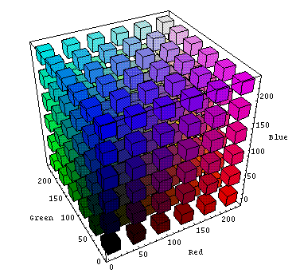
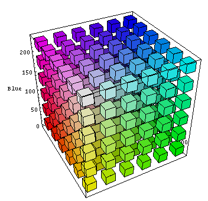
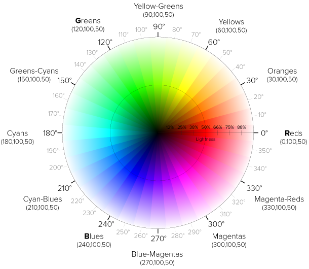

# 5. Наследование и каскадность стилей. Позиционирование и CSS Grid

## Темы занятия

- Псевдокласс [`:not()`](https://webref.ru/css/not).
- [Наследование](https://metanit.com/web/html5/5.9.php) и
[каскадность](https://metanit.com/web/html5/5.10.php) стилей,
[специфичность](https://www.w3.org/TR/selectors/#specificity) и значение
[`!important`](https://webref.ru/css/%21important).
- Способы задания [цвета](https://webref.ru/css/value/color).
- Единицы измерения CSS для задания
[размеров](https://webref.ru/css/value/size).
- Свойства CSS для указания позиции элементов.
- [CSS Grid Layout](https://metanit.com/web/html5/13.1.php).
- Элементы, формирующие структуру документа и прочие семантические элементы.

## Теоретические сведения

### HTML

- Семантические элементы, формирующие структуру документа:

  - [`<main>`](https://webref.ru/html/main) - основное содержимое документа.
  - [`<header>`](https://webref.ru/html/header) - шапка документа.
  - [`<footer>`](https://webref.ru/html/footer) - подвал документа.
  - [`<aside>`](https://webref.ru/html/aside) - боковая панель документа.
  - Панель навигации [`<nav>`](https://webref.ru/html/nav).
  - [`<article>`](https://webref.ru/html/article) -
  независимый фрагмент веб-страницы.
  - [`<section>`](https://webref.ru/html/section) - блок информации.

- Прочие семантические элементы:

  - [`<address>`](https://webref.ru/html/address) - информация об авторе.
  - [`<time>`](https://webref.ru/html/time) - указание даты и времени,
  и его атрибут [`datetime`](https://webref.ru/html/time/datetime).

### CSS

- [`:not()`](https://webref.ru/css/not) - ограничение границ действия 
селектора, _псевдокласс_.

- Механизм работы CSS:

  - [Наследование](https://metanit.com/web/html5/5.9.php).
  - [Каскадность](https://metanit.com/web/html5/5.10.php).
  - [Специфичность](https://www.w3.org/TR/selectors/#specificity).
  - [`!important`](https://webref.ru/css/%21important) - повышение приоритета
  объявления CSS.

- Способы задания [цвета](https://webref.ru/css/value/color).
- [`opacity`](https://webref.ru/css/opacity) - уровень прозрачности элемента.
- Единицы измерения для задания [размеров](https://webref.ru/css/value/size).

- Позиция элементов:

  - [`position`](https://webref.ru/css/position) - способ позиционирования 
  элемента.
  - [`top`](https://webref.ru/css/top), [`right`](https://webref.ru/css/right),
  [`bottom`](https://webref.ru/css/bottom) и
  [`left`](https://webref.ru/css/left) - расстояние от верхнего, правого, 
  нижнего и левого краёв родительского элемента до соответствующего края 
  дочернего элемента соответственно.
  - [`z-index`](https://webref.ru/css/z-index) - порядок наложения элементов 
  друг на друга.

- CSS Grid Layout:

  - [`grid-template-rows`
  ](https://developer.mozilla.org/ru/docs/Web/CSS/grid-template-rows),
  [`grid-template-columns`
  ](https://developer.mozilla.org/ru/docs/Web/CSS/grid-template-columns) и
  [`grid-template`
  ](https://developer.mozilla.org/ru/docs/Web/CSS/grid-template) - 
  количество и размер строк и столбцов сетки и комбинированное свойство 
  соответственно.
  - Функция [`repeat()`
  ](https://developer.mozilla.org/ru/docs/Web/CSS/CSS_Grid_Layout) и
  единица [`fr`](https://developer.mozilla.org/ru/docs/Web/CSS/flex_value).
  - [`grid-template-areas`
  ](https://developer.mozilla.org/ru/docs/Web/CSS/grid-template-areas) -
  макет сетки.
  - [`grid-area`
  ](https://developer.mozilla.org/ru/docs/Web/CSS/grid-area) -
  привязка элемента в области сетки.
  - [`grid-row-gap`](https://developer.mozilla.org/ru/docs/Web/CSS/row-gap),
  [`grid-column-gap`
  ](https://developer.mozilla.org/ru/docs/Web/CSS/column-gap) и
  [`grid-gap`](https://developer.mozilla.org/ru/docs/Web/CSS/gap) -
  промежуток между строками и столбцами сетки и комбинированное свойство 
  соответственно.

Цветовая модель `RGB`
([источник](https://engineering.purdue.edu/~abe305/HTMLS/rgbspace.htm)):

- Фронтальный вид:



- Вид с обратной стороны:



Пространство цветов `HSL`
([источник](http://www.erinsowards.com/articles/2011/01/colors.php)):



Таблица для расчёта специфичности:

| Специфичность | Применимость |
| :-----------: | ------------ |
| `0`           | [Универсальный](https://webref.ru/css/selector/universal), [вложенный](https://webref.ru/css/selector/descendant), [дочерний](https://webref.ru/css/selector/child), [соседний](https://webref.ru/css/selector/adjacent), [родственный](https://webref.ru/css/selector/sibling) селекторы и псевдокласс [`:not()`](https://webref.ru/css/not). |
| `1`           | [Селектор типа](https://webref.ru/css/selector/tag) и [псевдоэлементы](https://webref.ru/css/type/pseudoelement). |
| `10`          | Селекторы [класса](https://webref.ru/css/selector/class), [атрибута](https://webref.ru/css/selector/attr) и [псевдоклассы](https://webref.ru/css/type/pseudoclass). |
| `100`         | [Селектор идентификатора](https://webref.ru/css/selector/id). |
| `1000`        | Объявления, указанные с помощью универсального атрибута [`style`](https://webref.ru/html/attr/style). |

Пример использования CSS Grid Layout:

<style>
  .embed {
    width: 100%;
    height: 600px;
    border: none;
  }
</style>
<iframe class="embed" src="//jsfiddle.net/Vladislav_Lyuminarskiy/zdt086p1/embedded/html,css,result/dark">
</iframe>

## 5.1. Специфичность

Задачи:

1. Создайте новый документ с именем `index.html` со следующим содержимым:

```html
<!DOCTYPE html>

<html lang="ru">

<head>
  <meta charset="utf-8">
  <title>Расчёт специфичности</title>
  <style>
    *.list > li > a {
      color: red;
    }

    a.link:not(#newlink) {
      color: orange;
    }

    #block > ul li a {
      color: purple;
    }

    #block a[href$=".ru"] {
      color: blue;
    }

    .list .link {
      color: green;
    }
  </style>
</head>

<body>
  <div id="block">
    <ul class="list">
      <li><a class="link">Текст ссылки</a></li>
    </ul>
  </div>
</body>

</html>
```

2. Дайте объяснение значениям селекторов и рассчитайте их специфичность.
3. По результатам расчётов определите, какой цвет текста ссылки будет
установлен.
4. Откройте страницу в браузере и проверьте своё решение.

## 5.2. Позиционирование

Доработайте веб-страницу, созданную в задании
[`4.1. Псевдоэлементы`](/practice/04/#_4-1-псевдоэnементы), так, чтобы она
приняла примерно следующий вид:

<practice-05-task-02/>

Подзадачи:

1. Добавьте в конец документа указания об авторе и времени публикации
рассказа, как показано в примере, используя соответствующие семантические
элементы.
2. У всех абзацев без класса `direct-speech` установить курсивное начертание
шрифта для первой строки.
3. Для каждой части рассказа создайте элемент, задающий блок информации, и
поместите их внутрь этих элементов.
4. Создайте элемент, задающий основное содержимое документа, с
идентификатором `story` и поместите в него всё содержимое веб-страницы. С
помощью отступа добавьте свободное пространство слева от содержимого.
5. Создайте элемент, задающий панель навигации, с идентификатором
`contents-block` и поместите в него содержание рассказа.
6. Расположите панель навигации на веб-странице так, чтобы она располагалась
слева и примерно посередине видимой части страницы, была на переднем плане и
оставалась неподвижной при прокрутке страницы.
7. Сделайте так, чтобы при прокрутке страницы заголовок текущей части
рассказа оставался в верхней части страницы.
8. Установите для заголовков частей белый цвет фона, непрозрачный на `80%`.
9. Добавьте пунктирные границы произвольного цвета и толщины и добейтесь
того, чтобы концы границ сливались с друг другом, как показано в примере.

## 5.3. CSS Grid Layout

Используя CSS Grid Layout, создайте веб-страницу следующего вида:

<practice-05-task-03/>

Подзадачи:

1. Растяните сетку по высоте на `100%` высоты видимой области.
2. Края сетки должны прилегать вплотную к краям видимой области.
3. Назовите области следующими именами:

    - `header`,
    - `side1`,
    - `side2`,
    - `content`,
    - `footer`.

4. Размеры столбцов должны находиться в соотношении `1:3:1`.
5. Установите у строк одинаковую высоту.
6. Добавьте промежуток между ячейками.
7. В качестве цветов областей используйте следующие значения:

    - `rgb(60, 186, 84)` - зелёный,
    - `rgb(244, 194, 13)` - жёлтый,
    - `rgb(219, 50, 54)` - красный,
    - `rgb(72, 133, 237)` - синий.

8. Установите уровень непрозрачности `60%` у элемента, расположенного в
области `side2`.
9. Используйте подходящие семантические элементы.
10. Используйте преимущественно
[селекторы класса](https://webref.ru/css/selector/class).

::: warning Обратите внимание!
Чтобы использовать свойства CSS Grid Layout, создайте **элемент-контейнер**
с помощью объявления `display: grid`. Все элементы, которые планируется
размещать на сетке, поместите внутрь этого элемента-контейнера.
:::

<disqus-comments
  page-uuid="4d519cee-a0db-4708-8978-1de79cdde5ef"
  page-title="5. Наследование и каскадность стилей.
    Позиционирование и CSS Grid | Практические занятия"/>