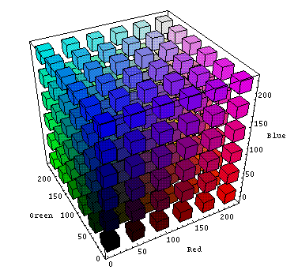
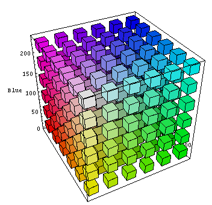

# 5. Наследование и каскадность стилей. Позиционирование и CSS Grid Layout

Темы занятия:

- Псевдокласс [`:not()`](https://webref.ru/css/not).
- [Наследование](https://metanit.com/web/html5/5.9.php) и [каскадность](https://metanit.com/web/html5/5.10.php) стилей, специфичность и значение [`!important`](https://webref.ru/css/%21important).
- Способы задания [цвета](https://webref.ru/css/value/color).
- Единицы измерения CSS для задания [размеров](https://webref.ru/css/value/size).
- Свойства CSS для указания позиции элементов.
- [CSS Grid Layout](https://metanit.com/web/html5/13.1.php).
- Элементы, формирующие структуру документа и прочие семантические элементы.

### Теоретические сведения

На этом занятии мы рассмотрели следующее:

- HTML:

  - Семантические элементы, формирующие структуру документа:

    - Основное содержимое документа [`<main>`](https://webref.ru/html/main).
    - Шапка документа [`<header>`](https://webref.ru/html/header).
    - Подвал документа [`<footer>`](https://webref.ru/html/footer).
    - Боковая панель документа [`<aside>`](https://webref.ru/html/aside).
    - Панель навигации [`<nav>`](https://webref.ru/html/nav).
    - Независимый фрагмент веб-страницы [`<article>`](https://webref.ru/html/article).
    - Блок информации [`<section>`](https://webref.ru/html/section).

  - Прочие семантические элементы:

    - Информация об авторе [`<address>`](https://webref.ru/html/address).
    - Указание даты и времени [`<time>`](https://webref.ru/html/time) и его атрибут [`datetime`](https://webref.ru/html/time/datetime).

- CSS:

  - Ограничение границ действия селектора - псевдокласс [`:not()`](https://webref.ru/css/not).
  - Способы задания [цвета](https://webref.ru/css/value/color).
  - Уровень прозрачности элемента [`opacity`](https://webref.ru/css/opacity).
  - Единицы измерения для задания [размеров](https://webref.ru/css/value/size).

  - Позиция элементов:

    - Способ позиционирования элемента [`position`](https://webref.ru/css/position).
    - Расстояние от верхнего [`top`](https://webref.ru/css/top), правого [`right`](https://webref.ru/css/right), нижнего [`bottom`](https://webref.ru/css/bottom), левого [`left`](https://webref.ru/css/left) краёв родительского элемента до соответствующего края дочернего элемента.
    - Порядок наложения элементов друг на друга [`z-index`](https://webref.ru/css/z-index).

  - CSS Grid Layout:

    - Количество и размер строк [`grid-template-rows`](https://developer.mozilla.org/en-US/docs/Web/CSS/grid-template-rows), столбцов [`grid-template-columns`](https://developer.mozilla.org/en-US/docs/Web/CSS/grid-template-columns) и комбинированное свойство [`grid-template`](https://developer.mozilla.org/en-US/docs/Web/CSS/grid-template).
    - Функция [`repeat()`](https://developer.mozilla.org/en-US/docs/Web/CSS/CSS_Grid_Layout) и единица [`fr`](https://developer.mozilla.org/en-US/docs/Web/CSS/flex_value).
    - Макет сетки [`grid-template-areas`](https://developer.mozilla.org/en-US/docs/Web/CSS/grid-template-areas).
    - Привязка элемента в области сетки [`grid-area`](https://developer.mozilla.org/en-US/docs/Web/CSS/grid-area).
    - Промежуток между строками [`grid-row-gap`](https://developer.mozilla.org/en-US/docs/Web/CSS/row-gap), столбцами [`grid-column-gap`](https://developer.mozilla.org/en-US/docs/Web/CSS/column-gap) и комбинированное свойство [`grid-gap`](https://developer.mozilla.org/en-US/docs/Web/CSS/gap).

Цветовая модель `RGB` ([источник](https://engineering.purdue.edu/~abe305/HTMLS/rgbspace.htm)):

- Фронтальный вид:



- Вид с обратной стороны:



Пространство цветов `HSL` ([источник](http://www.erinsowards.com/articles/2011/01/colors.php)):


Таблица для расчёта специфичности:

| Специфичность | Применимость                                                                                                                                                                                                                                                                                                                                   |
| :-----------: | ---------------------------------------------------------------------------------------------------------------------------------------------------------------------------------------------------------------------------------------------------------------------------------------------------------------------------------------------- |
| 0             | [Универсальный](https://webref.ru/css/selector/universal), [вложенный](https://webref.ru/css/selector/descendant), [дочерний](https://webref.ru/css/selector/child), [соседний](https://webref.ru/css/selector/adjacent), [родственный](https://webref.ru/css/selector/sibling) селекторы и псевдокласс [`:not()`](https://webref.ru/css/not). |
| 1             | [Селектор типа](https://webref.ru/css/selector/tag) и [псевдоэлементы](https://webref.ru/css/type/pseudoelement).                                                                                                                                                                                                                              |
| 10            | Селекторы [класса](https://webref.ru/css/selector/class), [атрибута](https://webref.ru/css/selector/attr) и [псевдоклассы](https://webref.ru/css/type/pseudoclass).                                                                                                                                                                            |
| 100           | [Селектор идентификатора](https://webref.ru/css/selector/id).                                                                                                                                                                                                                                                                                  |
| 1000          | Объявления, указанные с помощью универсального атрибута [`style`](https://webref.ru/html/attr/style).                                                                                                                                                                                                                                          |

Пример использования CSS Grid Layout:

<iframe src="//jsfiddle.net/Vladislav_Lyuminarskiy/zdt086p1/embedded/html,css,result/dark/" width="100%" height="400" frameborder="0"></iframe>

## 5.1. Расчёт специфичности

Задачи:

1. Создайте новый документ с именем `index.html` со следующим содержимым:

```html
<!DOCTYPE html>

<html lang="ru">

<head>
  <meta charset="utf-8">
  <title>Расчёт специфичности</title>
  <style>
    *.list > li > a {
      color: red;
    }

    a.link:not(#newlink) {
      color: orange;
    }

    .block > ul li a {
      color: purple;
    }

    #block a {
      color: blue;
    }

    .list .link {
      color: green;
    }
  </style>
</head>

<body>
  <div id="block">
    <ul class="list">
      <li><a class="link">Текст ссылки</a></li>
    </ul>
  </div>
</body>

</html>
```

2. Дайте объяснение значениям селекторов и рассчитайте их специфичность.
3. По результатам расчётов определите, какой цвет текста ссылки будет установлен.
4. Откройте страницу в браузере и проверьте своё решение.

::: tip На заметку
Если вы испытываете трудности с расчётом специфичности, обратите внимание на раздел [`Теоретические сведения`](../../practice/05/#теоретические-сведения).
:::

## 5.2. Позиционирование элементов

Доработайте веб-страницу, созданную в задании [`4.1. Псевдоэлементы`](../../practice/04/#_4-1-псевдоэnементы), так, чтобы она приняла примерно следующий вид:

<practice-05-task-02/>
Подзадачи:

1. Добавьте в конец документа указания об авторе и времени публикации рассказа, как показано в примере, используя соответствующие семантические элементы.
2. У всех абзацев без класса `direct-speech` установить курсивное начертание шрифта для первой строки.
3. Для каждой части рассказа создайте элемент, задающий блок информации, и поместите их внутрь этих элементов.
4. Создайте элемент, задающий основное содержимое документа, с идентификатором `story` и поместите в него всё содержимое веб-страницы. С помощью отступа добавьте свободное пространство слева от содержимого.
5. Создайте элемент, задающий панель навигации, с идентификатором `contents-block` и поместите в него содержание рассказа.
6. Расположите панель навигации на веб-странице так, чтобы она располагалась слева и примерно посередине видимой части страницы, была на переднем плане и оставалась неподвижной при прокрутке страницы.
7. Сделайте так, чтобы при прокрутке страницы заголовок текущей части рассказа оставался в верхней части страницы.
8. Установите для заголовков частей белый цвет фона, непрозрачный на `80%`.
9. Добавьте пунктирные границы произвольного цвета и толщины и добейтесь того, чтобы концы границ сливались с друг другом, как показано в примере.

::: tip На заметку
В этом задании активно используются новые семантические элементы, единицы измерения для задания размеров, способы задания цвета и псевдоклассы. Если у вас возникли какие-либо трудности, обратите внимание на раздел [`Теоретические сведения`](../../practice/05/#теоретические-сведения).
:::

## 5.3. CSS Grid Layout

Используя CSS Grid Layout, создайте веб-страницу следующего вида:

<practice-05-task-03/>

Подзадачи:

1. Растяните сетку по высоте на `100%` высоты видимой области.
2. Края сетки должны прилегать вплотную к краям видимой области.
3. Назовите области следующими именами:

    1. `header`,
    2. `side1`,
    3. `side2`,
    4. `content`,
    5. `footer`.

4. Размеры столбцов должны находиться в соотношении `1:3:1`.
5. Установите у строк одинаковую высоту.
6. Добавьте промежуток между ячейками.
7. В качестве цветов областей используйте следующие значения:

    1. `rgb(60, 186, 84)`,
    2. `rgb(244, 194, 13)`,
    3. `rgb(219, 50, 54)`,
    4. `rgb(72, 133, 237)`.

8. Установите уровень непрозрачности `60%` у элемента, расположенного в области `side2`.
9. Используйте подходящие семантические элементы.
10. Используйте только [селекторы класса](https://webref.ru/css/selector/class).

::: warning Обратите внимание!
Чтобы использовать свойства CSS Grid Layout, создайте **элемент-контейнер** с помощью объявления `display: grid`. Все элементы, которые планируется размещать на сетке, поместите внутрь этого элемента-контейнера.
:::

<disqus-comments/>