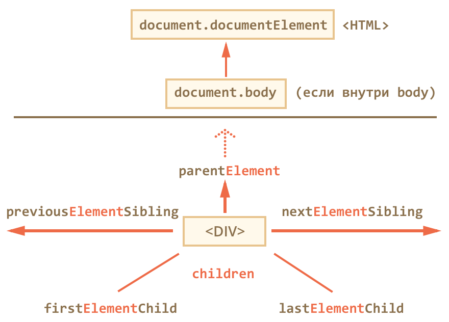

# 12. Объектная модель документа. Программные модули

## Темы занятия

- [Объектная модель документа (DOM)
](https://developer.mozilla.org/ru/docs/DOM/DOM_Reference).
- [Навигация по элементам документа
](https://learn.javascript.ru/traversing-dom).
- [Поиск элементов в документе
](https://learn.javascript.ru/searching-elements-dom).
- [Вспомогательые методы для проверки элементов
](https://learn.javascript.ru/compare-document-position).
- [Создание и удаление элементов
](https://learn.javascript.ru/modifying-document).
- [Вставка элементов в документ
](https://learn.javascript.ru/multi-insert).
- [Основные свойства объектного представления элементов
](https://learn.javascript.ru/basic-dom-node-properties).
- [Работа с атрибутами элементов через DOM
](https://learn.javascript.ru/attributes-and-custom-properties) и универсальный
атрибут [`data-*`](https://webref.ru/html/attr/data).
- [Работа со свойствами CSS элементов через DOM
](https://learn.javascript.ru/attributes-and-custom-properties).
- Организация кода на JavaScript в виде
[программных модулей](https://learn.javascript.ru/modules).
- Инструкции [`export`
](https://developer.mozilla.org/ru/docs/Web/JavaScript/Reference/Statements/export)
и [`import`
](https://developer.mozilla.org/ru/docs/Web/JavaScript/Reference/Statements/import).

## Теоретические сведения

### HTML

Универсальный атрибут [`data-*`](https://webref.ru/html/attr/data).

### JavaScript

- [Объектная модель документа (DOM)
](https://developer.mozilla.org/ru/docs/DOM/DOM_Reference):

  - Объект [`document`](https://developer.mozilla.org/ru/docs/Web/API/Document):
    
    - [`document.documentElement`
    ](https://developer.mozilla.org/ru/docs/Web/API/Document/documentElement) -
    элемент [`<html>`](https://webref.ru/html/html).
    - [`document.body`
    ](https://developer.mozilla.org/ru/docs/Web/API/Document/body) -
    элемент [`<body>`](https://webref.ru/html/body).
    - [`document.head`
    ](https://developer.mozilla.org/ru/docs/Web/API/Document/head) -
    элемент [`<head>`](https://webref.ru/html/head).
    
  - Навигация по дереву элементов документа относительно элемента, 
  представленного объектом `element`:
  
    - [`element.parentElement`
    ](https://developer.mozilla.org/ru/docs/Web/API/Node/parentElement) -
    родительский элемент.
    - [`element.previousElementSibling`
    ](https://developer.mozilla.org/ru/docs/Web/API/NonDocumentTypeChildNode/previousElementSibling) - 
    предшествующий соседний элемент.
    - [`element.nextElementSibling`
    ](https://developer.mozilla.org/ru/docs/Web/API/NonDocumentTypeChildNode/nextElementSibling) - 
    последующий соседний элемент.
    - [`element.children`
    ](https://developer.mozilla.org/ru/docs/Web/API/ParentNode/children) - 
    коллекция дочерних элементов.
    - [`element.firstElementChild`
    ](https://developer.mozilla.org/ru/docs/Web/API/ParentNode/firstElementChild) -
    первый дочерний элемент.
    - [`element.lastElementChild`
    ](https://developer.mozilla.org/ru/docs/Web/API/ParentNode/lastElementChild) -
    последний дочерний элемент.
    
  - Навигация по элементам таблиц:
   
    - [`table.caption`
    ](https://developer.mozilla.org/en-US/docs/Web/API/HTMLTableElement/caption) -
    элемент [`<caption>`](https://webref.ru/html/caption) внутри таблицы.
    - [`table.tHead`
    ](https://developer.mozilla.org/en-US/docs/Web/API/HTMLTableElement/tHead) -
    элемент [`<thead>`](https://webref.ru/html/thead) внутри таблицы.
    - [`table.tFoot`
    ](https://developer.mozilla.org/en-US/docs/Web/API/HTMLTableElement/tFoot) -
    элемент [`<tfoot>`](https://webref.ru/html/tfoot) внутри таблицы.
    
  - Поиск по дереву элементов:
  
    - Функция [`document.getElementById(id)`
    ](https://developer.mozilla.org/ru/docs/Web/API/Document/getElementById)
    выполняет поиск элемента по его идентификатору `id` по всему документу.
    - Функция [`element.getElementsByTagName(tag)`
    ](https://developer.mozilla.org/en-US/docs/Web/API/Document/getElementsByName) -
    возвращает коллекцию всех элементов с заданным тэгом `tag` внутри элемента 
    `element`.
    - Функция [`element.getElementsByClassName(className)`
    ](https://developer.mozilla.org/ru/docs/Web/API/Element/getElementsByClassName) -
    возвращает коллекцию всех элементов с заданным классом `className` внутри 
    элемента `element`.
    
- [Программные модули](https://learn.javascript.ru/modules):

  - Атрибут [`type`
  ](https://developer.mozilla.org/ru/docs/Web/HTML/Element/script) элемента
  [`<script>`](https://webref.ru/html/script).
  - Инструкция [`export`
  ](https://developer.mozilla.org/ru/docs/Web/JavaScript/Reference/Statements/export)
  для экспорта содержимого из модуля.
  - Инструкция [`import`
  ](https://developer.mozilla.org/ru/docs/Web/JavaScript/Reference/Statements/import)
  для импорта содержимого из внешнего модуля.

Совокупость объектов, доступных из JavaScript
([источник](https://learn.javascript.ru/browser-environment)):

На иллюстрации представлены три группы объектов:

- **JavaScript** - стандартные встроенные объекты языка JavaScript.

- **BOM (Browser Object Model)** - объектная модель браузера, даёт возможность 
взаимодействовать с браузером.

- **DOM (Document Object Model)** - объектная модель документа, даёт 
возможность взаимодействовать с содержимым страницы.

Навигация по дереву элементов документа
([источник](https://learn.javascript.ru/traversing-dom)):

<script-button/>

<disqus-comments
  page-uuid="4d519cee-a0db-4708-8978-1de79cdde5ef"
  page-title="12. Объектная модель документа. Программные модули
    | Практические занятия"/>