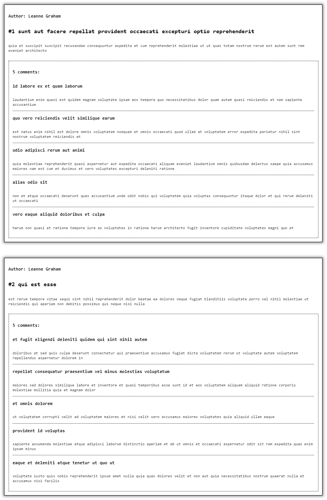

[Назад к описанию курса](../../README.md)

> **По всем вопросам, возникшим в процессе выполнения лабораторной работы, можно получить ответ, отправив письмо на почту Vladislav.Lyuminarskiy@gmail.com. В теме письма написать `Web-3` и указать инициалы.**

# Взаимодействие с REST API

Содержание:
- [Описание лабораторной работы](#Описание-лабораторной-работы)
- [Взаимодействие с сервером](#Взаимодействие-с-сервером)
  - [Получение списка постов](#Получение-списка-постов)
  - [Получение списка комментариев к постам](#Получение-списка-комментариев-к-постам)
  - [Получение списка пользователей](#Получение-списка-пользователей)
- [Ссылки](#Ссылки)

## Описание лабораторной работы

В рамках данной лабораторной работы предлагается создать веб-страницу, получающую данные с сервера по адресу https://jsonplaceholder.typicode.com.

Будучи открытой, веб-страница должна получить данные с сервера и отобразить их в виде списка элементов следующего вида:

1. идентификатор, заголовок и имя автора поста,
2. текст поста,
3. количество комментариев к посту,
4. список комментариев:
    1. заголовок комментария,
    2. текст комментария.

Пример выполнения лабораторной работы можно посмотреть в папке [example](example), а также на рисунке, представленном ниже:



Ниже представлены примеры получения данных с сервера. Выполните лабораторную работу на их основе, самостоятельно реализовав логику обработки данных и вывода данных на страницу.

## Взаимодействие с сервером

С сервера могут быть получены данные следующего типа:
- список постов,
- список комментариев к постам,
- список пользователей.

Данные возвращаются в формате `JSON`.

### Получение списка постов

Для получения списка всех постов необходимо запустить следующий скрипт:

```js
fetch('https://jsonplaceholder.typicode.com/posts')
  .then(response => response.json())
  .then(posts => {
    // Вывод в консоль posts - массива постов.
    console.log(posts);
    
    // Обработка полученных данных.
    // ...

    // Вывод данных на страницу.
    // ...
  });
```

Ответ сервера будет выглядеть следующим образом:

```js
// Массив постов.
[
  {
    // Идентификатор пользователя.
    "userId": 1,
    // Идентификатор поста.
    "id": 1,
    // Заголовок поста.
    "title": "sunt aut facere repellat provident occaecati excepturi optio reprehenderit",
    // Текст поста.
    "body": "quia et suscipit\nsuscipit recusandae consequuntur expedita et cum\nreprehenderit molestiae ut ut quas totam\nnostrum rerum est autem sunt rem eveniet architecto"
  },
  // {...}
]
```

### Получение списка комментариев к постам

Для получения списка всех комментариев ко всем постам необходимо запустить следующий скрипт:

```js
fetch('https://jsonplaceholder.typicode.com/comments')
  .then(response => response.json())
  .then(comments => {
    // Вывод в консоль comments - массива комментариев.
    console.log(comments);
    
    // Обработка полученных данных.
    // ...

    // Вывод данных на страницу.
    // ...
  });
```

Для получения списка всех комментариев к посту с идентификатором `id` необходимо запустить следующий скрипт:

```js
// Идентификатор поста.
const postId = 42;

fetch(`https://jsonplaceholder.typicode.com/comments?postId=${postId}`)
  .then(response => response.json())
  .then(comments => {
    // Вывод в консоль comments - массива комментариев.
    console.log(comments);
    
    // Обработка полученных данных.
    // ...

    // Вывод данных на страницу.
    // ...
  });
```

Ответ сервера будет выглядеть следующим образом:

```js
// Массив комментариев к постам.
[
  {
    // Идентификатор поста.
    "postId": 1,
    // Идентификатор комментария.
    "id": 1,
    // Заголовок комментария.
    "name": "id labore ex et quam laborum",
    // Электронная почта автора комментария.
    "email": "Eliseo@gardner.biz",
    // Текст комментария.
    "body": "laudantium enim quasi est quidem magnam voluptate ipsam eos\ntempora quo necessitatibus\ndolor quam autem quasi\nreiciendis et nam sapiente accusantium"
  },
  // {...}
]
```

### Получение списка пользователей

Для получения списка всех пользователей необходимо запустить следующий скрипт:

```js
fetch('https://jsonplaceholder.typicode.com/users')
  .then(response => response.json())
  .then(users => {
    // Вывод в консоль users - массива пользователей.
    console.log(users);
    
    // Обработка полученных данных.
    // ...

    // Вывод данных на страницу.
    // ...
  });
```

Ответ сервера будет выглядеть следующим образом:

```js
// Массив пользователей.
[
  {
    // Идентификатор пользователя.
    "id": 1,
    // Имя пользователя.
    "name": "Leanne Graham",
    // Логин пользователя.
    "username": "Bret",
    // Электронная почта пользователя.
    "email": "Sincere@april.biz",
    // Адрес пользователя
    "address": {
      "street": "Kulas Light",
      "suite": "Apt. 556",
      "city": "Gwenborough",
      "zipcode": "92998-3874",
      "geo": {
        "lat": "-37.3159",
        "lng": "81.1496"
      }
    },
    // Номер телефона пользователя.
    "phone": "1-770-736-8031 x56442",
    // Веб-сайт пользователя.
    "website": "hildegard.org",
    // Компания, в которой работает пользователь.
    "company": {
      "name": "Romaguera-Crona",
      "catchPhrase": "Multi-layered client-server neural-net",
      "bs": "harness real-time e-markets"
    }
  },
  // {...}
]
```

## Ссылки

- [JSONPlaceholder](https://jsonplaceholder.typicode.com)
- [Working with `JSON`](https://developer.mozilla.org/ru/docs/Learn/JavaScript/Objects/JSON)
- [Использование `Fetch`](https://developer.mozilla.org/ru/docs/Web/API/Fetch_API/Using_Fetch)
