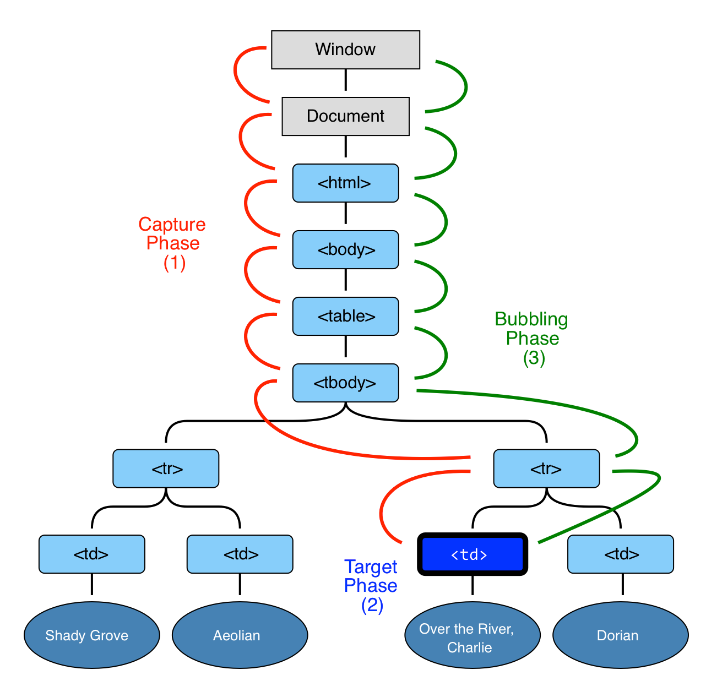

[Назад к описанию курса](../../README.md)

# Работа с событиями

Содержание:
- [1. Методы `setTimeout()` и `setInterval()`](#1-Методы-setTimeout-и-setInterval)
  - [1.1. Ссылки](#11-Ссылки)
  - [1.2. Задачи](#12-Задачи)
    - [1.2.1. Вывод чисел с помощью `setInterval()`](#121-Вывод-чисел-с-помощью-setInterval)
    - [1.2.2. Вывод чисел с помощью `setTimeout()`](#122-Вывод-чисел-с-помощью-setTimeout)
    - [1.2.3. Отображение времени](#123-Отображение-времени)
- [2. Основы работы с событиями](#2-Основы-работы-с-событиями)
  - [2.1. Ссылки](#21-Ссылки)
  - [2.2. Задачи](#22-Задачи)
    - [2.2.1. Скрыть элемент при нажатии](#221-Скрыть-элемент-при-нажатии)
    - [2.2.2. Раскрывающийся список](#222-Раскрывающийся-список)
    - [2.2.3. Перемещение элемента по клику](#223-Перемещение-элемента-по-клику)
- [3. Делегирование событий](#3-Делегирование-событий)
  - [3.1. Ссылки](#31-Ссылки)
  - [3.2. Задачи](#32-Задачи)
    - [3.2.1. Раскрывающееся дерево](#321-Раскрывающееся-дерево)
    - [3.2.2. Сортировка таблицы](#322-Сортировка-таблицы)
    - [3.2.3. Переход по ссылке](#323-Переход-по-ссылке)

## 1. Методы `setTimeout()` и `setInterval()`

Методы `setTimeout(func, delay[, arg1, arg2...])` позволяет вызвать функцию `func` через `delay` миллисекунд с аргументами `arg1`, `arg2` и т.д.:

```js
// Функция вызовется через одну секунду.
setTimeout(() => console.log('Привет'), 1000);
```

Отменить исполнение можно с помощью функции `clearTimeout(timerId)`, на вход которой нужно передать числовой идентификатор таймера, возвращаемый функцией `setTimeout`:

```js
var timerId = setTimeout(...);
clearTimeout(timerId);
```

Синтаксис метода `setInterval()` аналогичен `setTimeout()`. Разница заключается в том, что метод `setInterval()` запускает выполнение функции не один раз, а регулярно повторяет её через указанный интервал времени. Остановить исполнение можно вызовом `clearInterval(timerId)`.

### 1.1. Ссылки

- [Метод `WindowTimers.setTimeout()`](https://developer.mozilla.org/ru/docs/Web/API/WindowTimers/setTimeout)
- [Метод `WindowOrWorkerGlobalScope.setInterval()`](https://developer.mozilla.org/en-US/docs/Web/API/WindowOrWorkerGlobalScope/setInterval)

### 1.2. Задачи

#### 1.2.1. Вывод чисел с помощью `setInterval()`

Задание:
1. написать функцию `printNumbersInterval()`, которая последовательно выводит в консоль числа от `1` до `20`, с интервалом между числами `100 мс`,
2. проверить работу функции.

Функция должна использовать метод `setInterval()`.

<details>
<summary>Посмотреть решение</summary>
<hr>

Возможное решение:

```js
function printNumbersInterval() {
  var i = 1;
  var interval = 100;

  var timerId = setInterval(function() {
    console.log(i);

    // Останавливаем повторение.
    if (i == 20) {
      clearInterval(timerId);
    }

    i++;
  }, interval);
}
```

<hr>
</details>

#### 1.2.2. Вывод чисел с помощью `setTimeout()`

Задание:
1. написать функцию `printNumbersTimeout()`, которая последовательно выводит в консоль числа от `1` до `20`, с интервалом между числами `100 мс`,
2. проверить работу функции.

Функция должна использовать метод `setTimeout()` (потребуется рекурсивный вызов).

<details>
<summary>Посмотреть решение</summary>
<hr>

Возможное решение:

```js
function printNumbersTimeout() {
  var i = 1;
  var interval = 100;

  setTimeout(function next() {
    console.log(i);

    // Рекурсивно вызываем setTimeout().
    if (i < 20) {
      setTimeout(next, interval);
    }

    i++;
  }, interval);
}
```

<hr>
</details>

#### 1.2.3. Отображение времени

Создать страницу `index.html` со следующим содержимым:

```html
<!DOCTYPE HTML>
<html>

<head>
  <meta charset="utf-8">
  <style>
    .hour {
      color: red;
    }

    .min {
      color: green;
    }

    .sec {
      color: blue;
    }
  </style>
</head>

<body>
  <div id="clock">
    <span class="hour">hh</span>:<span class="min">mm</span>:<span class="sec">ss</span>
  </div>
</body>

</html>
```

Написать скрипт, который будет устанавливать в элементе с идентификатором `clock` текущее время и обновлять его каждую секунду.

<details>
<summary>Посмотреть решение</summary>
<hr>

Возможное решение:

```js
// Функция установки времени.
function update() {
  var clock = document.getElementById('clock');

  var date = new Date(); // (*)

  var hours = date.getHours();
  if (hours < 10) hours = '0' + hours;
  clock.children[0].innerHTML = hours;

  var minutes = date.getMinutes();
  if (minutes < 10) minutes = '0' + minutes;
  clock.children[1].innerHTML = minutes;

  var seconds = date.getSeconds();
  if (seconds < 10) seconds = '0' + seconds;
  clock.children[2].innerHTML = seconds;
}

update();
setInterval(update, 1000);
```

<hr>
</details>

## 2. Основы работы с событиями

*Событие* – это сигнал от браузера о том, что что-то произошло. Существует много видов событий. Вот некоторые из них:

- события мыши:
  - `click` - на элемент кликнули левой кнопкой мыши,
  - `contextmenu` - на элемент кликнули правой кнопкой мыши,
  - `mouseover` - на элемент наводится мышь,
  - `mousedown` - кнопку мыши нажали,
  - `mouseup` - кнопку мыши отжали,
  - `mousemove` – машь передвинулась,
- события клавиатуры:
  - `keydown` - клавиша нажата,
  - `keyup` - клавиша отжата,
- события на элементах управления:
  - `submit` - отправлено содержимое формы `<form>`,
  - `focus` - фокус установлен на элементе,
- события документа:
  - `DOMContentLoaded` - `HTML`-документ загружен и обработан, `DOM` документа полностью построен и доступен,
- события `CSS`:
  - `transitioned` - `CSS`-анимация завершена.

Событию можно назначить *обработчик*, то есть функцию, которая сработает, как только событие произошло.

Обработчик события можно установить с использованием атрибута HTML с названием `on + <имя события>`:

```html
<input type="button" value="HTML-атрибут" onclick="console.log('HTML-атрибут')">
```

Также можно использовать одноимённое свойство `DOM`:

```html
<input id="button" type="button" value="DOM-свойство">
<script>
  button.onclick = () => console.log('DOM-свойство');
</script>
```

У вышеприведённых способов есть недостаток - невозможность назначить *несколько* обработчиков на одно событие:

```js
elem.onclick = () => console.log('Старый обработчик');
// Заменит предыдущий обработчик.
elem.onclick = () => console.log('Новый обработчик');
```

Чтобы обойти этот недостаток, необходимо использовать функции `addEventListener(event, handler[, phase])` и `removeEventListener(event, handler[, phase])`, где:

- `event` - имя события,
- `handler` - обработчик события,
- `phase` - фаза события (перехват или всплытие).

Пример:

```js
elem.onclick = () => console.log('Обработчик №1');
elem.addEventListener('click', () => console.log('Обработчик №2'));
elem.addEventListener('click', () => console.log('Обработчик №3'));
```

Также стоит отметить, что не на все события можно назначить обработчик через `DOM`-свойство.

Этапы обработки события:
1. событие распространяется сверху вниз (этап перехвата),
2. событие достигло целевого элемента (этап цели),
3. событие распространяется снизу вверх (этап всплытия).



Основной принцип всплытия:
> При наступлении события обработчики сначала срабатывают на самом вложенном элементе, затем на его родителе, затем выше и так далее, вверх по цепочке вложенности.

Всплывают *почти* все события. Например, событие `focus` не всплывает.

Подробную информацию о событии можно получить с помощью *объекта события*, которое передаётся в обработчик первым аргументом:

```js
elem.onclick = function(event) {
  // Вывести тип события, элемент и координаты клика.
  alert(event.type + " на " + event.currentTarget);
  alert(event.clientX + ":" + event.clientY);
}
```

Некоторые свойства объекта `event`:

| Свойство              | Описание                                 |
| --------------------- | ---------------------------------------- |
| `event.type`          | Тип события.                             |
| `event.eventPhase`    | Текущий этап обработки события.          |
| `event.target`        | Элемент, на котором произошло событие.   |
| `event.currentTarget` | Элемент, на котором сработал обработчик. |

Свойства `event.clientX` и `event.clientY` специфичны для события `click` и обозначают координаты курсора в момент клика.

Некоторые методы объекта `event`:

| Свойство                  | Описание                                                    |
| ------------------------- | ----------------------------------------------------------- |
| `event.stopPropagation()` | Прекращает дальнейшую передачу текущего события.            |
| `event.preventDefault()`  | Отменяет действия браузера по умолчанию на текущее событие. |

Если обработчик события назначен через свойство `on + <имя события>`, то действие браузера по умолчанию также можно отменить, вернув `false` из обработчика:

```html
<a href="https://ru.wikipedia.org" onclick="return false">Ссылка</a>
<a href="https://ru.wikipedia.org" onclick="event.preventDefault()">Ссылка</a>
```

### 2.1. Ссылки

- [Метод `EventTarget.addEventListener()`](https://developer.mozilla.org/ru/docs/Web/API/EventTarget/addEventListener)
- [Метод `EventTarget.removeEventListener()`](https://developer.mozilla.org/ru/docs/Web/API/EventTarget/removeEventListener)
- [Объект `Event`](https://developer.mozilla.org/ru/docs/Web/API/Event)
- [Метод `Event.stopPropagation()`](https://developer.mozilla.org/ru/docs/Web/API/Event/stopPropagation)
- [Метод `Event.preventDefault()`](https://developer.mozilla.org/ru/docs/Web/API/Event/preventDefault)

### 2.2. Задачи

#### 2.2.1. Скрыть элемент при нажатии

Создать страницу `index.html` со следующим содержимым:

```html
<!DOCTYPE HTML>
<html>

<head>
  <meta charset="utf-8">
  <style>
    .hour {
      color: red;
    }

    .min {
      color: green;
    }

    .sec {
      color: blue;
    }
  </style>
</head>

<body>
  <input type="button" id="button" value="Нажмите, чтобы спрятать текст" />
  <div id="text">Текст</div>
</body>

</html>
```

Написать скрипт, который при клике на кнопку c идентификатором `button` будет скрывать элемент с идентификатором `text`.

<details>
<summary>Посмотреть решение</summary>
<hr>

Возможное решение:

```js
var button = document.getElementById('button');
var text = document.getElementById('text');

button.onclick = () => text.style.display = 'none';
}
```

<hr>
</details>

#### 2.2.2. Раскрывающийся список

Создать страницу `index.html` со следующим содержимым:

```html
<!DOCTYPE HTML>
<html>

<head>
  <meta charset="utf-8">
</head>

<body>
  <div class="list">
  <span class="title">Цвета:</span>
  <ul>
    <li>Красный</li>
    <li>Зелёный</li>
    <li>Синий</li>
  </ul>

  <script>
    // ...
  </script>
</div>
</body>

</html>
```

Написать скрипт, который при клике на элемент c классом `list` будет скрывать или отображать внутренний список.

<details>
<summary>Посмотреть решение</summary>
<hr>

Возможное решение:

```html
<!DOCTYPE HTML>
<html>

<head>
  <meta charset="utf-8">
  <style>
    /* По умолчанию список скрыт. */
    .list ul {
      display: none;
    }

    /* Но при добавлении класса open список отображается. */
    .list.open ul {
      display: block;
    }

    .list .title::before {
      content: '▶ ';
    }

    .list.open .title::before {
      content: '▼ ';
    }
  </style>
</head>

<body>
  <div class="list">
  <span class="title">Цвета:</span>
  <ul>
    <li>Красный</li>
    <li>Зелёный</li>
    <li>Синий</li>
  </ul>

  <script>
    var list = document.body.querySelector('.list');
    var title = list.querySelector('.title');

    title.onclick = () => list.classList.toggle('open');
  </script>
</div>
</body>

</html>
```

<hr>
</details>

#### 2.2.3. Перемещение элемента по клику

Создать страницу `index.html` со следующим содержимым:

```html
<!DOCTYPE HTML>
<html>

<head>
  <meta charset="utf-8">
  <style>
    #circle {
      position: absolute;
      width: 100px;
      height: 100px;
      background: yellow;
      border: 3px solid red;
      border-radius: 60px;
    }

    body {
      width: 100vw;
      height: 100vh;
      margin: 0;
    }
  </style>
</head>

<body>
  <div id="circle"></div>
</body>

</html>
```

Написать скрипт, который при клике на странице поместит элемент с идентификатором `circle` на место клика.

Также должны выполняться следующие условия:
- центр элемента должен совпадать с местом клика.
- элемент не должен выходить за границы страницы, а располагаться у границы.

<details>
<summary>Посмотреть решение</summary>
<hr>

Возможное решение:

```js
var circle = document.getElementById('circle');

document.body.onclick = function (event) {
  // Координаты центра элемента.
  var top = event.clientY - circle.offsetHeight / 2;
  var left = event.clientX - circle.offsetWidth / 2;

  // Элемент вылезает за верхнюю границу.
  if (top < 0) {
    top = 0;
  }

  // Элемент вылезает за левую границу.
  if (left < 0) {
    left = 0;
  }

  // Элемент вылезает за правую границу.
  if (left + circle.offsetWidth > document.body.offsetWidth) {
    left = document.body.offsetWidth - circle.offsetWidth;
  }

  // Элемент вылезает за нижнюю границу.
  if (top + circle.offsetHeight > document.body.offsetHeight) {
    top = document.body.offsetHeight - circle.offsetHeight;
  }

  circle.style.left = left + 'px';
  circle.style.top = top + 'px';
}
```

<hr>
</details>

## 3. Делегирование событий

Делегирование событий основано на механизме всплытия событий. Он заключается в том, что если у нас есть много элементов, события на которых нужно обрабатывать похожим образом, то вместо того, чтобы назначать обработчик каждому – мы ставим один обработчик на их общего предка.

Например, делегируем событие нажатия на ячейку таблицы `<td>` элементу таблицы `<table>`:

```html
<!DOCTYPE HTML>
<html>

<head>
  <meta charset="utf-8">
  <style>
    .highlight {
      background: red;
      color: white;
    }
  </style>
</head>

<body>
  <table id="delegate">
    <caption>Заголовок таблицы</caption>

    <thead>
      <tr>
        <th>Столбец 1</th>
        <th>Столбец 2</th>
      </tr>
    </thead>

    <tbody>
      <tr>
        <td>1.1</td>
        <td>1.2</td>
      </tr>
      <tr>
        <td>2.1</td>
        <td>2.2</td>
      </tr>
    </tbody>

    <tfoot>
      <tr>
        <td>3.1</td>
        <td>3.2</td>
      </tr>
    </tfoot>
  </table>

  <script>
    var selectedTd;
    var table = document.getElementById('delegate');

    table.onclick = function (event) {
      // Проверяем, действительно мы нажали на ячейку таблицы.
      var target = event.target;
      if (target.tagName != 'TD') return;

      if (selectedTd) {
        selectedTd.classList.remove('highlight');
      }

      selectedTd = target;
      selectedTd.classList.add('highlight');
    };
  </script>
</body>

</html>
```

### 3.1. Ссылки

- [Объект `Event`](https://developer.mozilla.org/ru/docs/Web/API/Event)

### 3.2. Задачи

#### 3.2.1. Раскрывающееся дерево

Создать страницу `index.html` со следующим содержимым:

```html
<!DOCTYPE HTML>
<html>

<head>
  <meta charset="utf-8">
  <style>
    #tree span {
      cursor: pointer;
    }

    #tree span:hover {
      font-weight: bold;
    }
  </style>
</head>

<body>
  <ul id="tree">
    <li>
      <span>Животные</span>
      <ul>
        <li>
          <span>Млекопитающие</span>
          <ul>
            <li>
              <span>Коровы</span>
            </li>
            <li>
              <span>Ослы</span>
            </li>
            <li>
              <span>Собаки</span>
            </li>
            <li>
              <span>Тигры</span>
            </li>
          </ul>
        </li>
        <li>
          <span></span>Другие
          <ul>
            <li>
              <span>Змеи</span>
            </li>
            <li>
              <span>Птицы</span>
            </li>
            <li>
              <span>Ящерицы</span>
            </li>
          </ul>
        </li>
      </ul>
    </li>
    <li>
      <span>Рыбы</span>
      <ul>
        <li>
          <span>Аквариумные</span>
          <ul>
            <li>
              <span>Гуппи</span>
            </li>
            <li>
              <span>Скалярии</span>
            </li>
          </ul>

        </li>
        <li>
          <span>Морские</span>
          <ul>
            <li>
              <span>Морская форель</span>
            </li>
          </ul>
        </li>
      </ul>
    </li>
  </ul>
</body>

</html>
```

Написать скрипт, который по клику на заголовок списка (`Животные`, `Млекопитающие`, `Рыбы` и др.) скрывает (если видимы) или показывает (если скрыты) его потомков.

<details>
<summary>Посмотреть решение</summary>
<hr>

Возможное решение:

```js
// Делегируем событие клика корневому элементу дерева.
var tree = document.getElementById('tree');
tree.onclick = function (event) {
  // Проверяем, действительно ли мы нажали на элемент span.
  var target = event.target;
  if (target.tagName != 'SPAN') {
    return;
  }

  // Находим ближайший вложенный список.
  var childrenContainer = target.parentNode.querySelector('ul');
  if (!childrenContainer) {
    return;
  }

  childrenContainer.hidden = !childrenContainer.hidden;
}
```

<hr>
</details>

#### 3.2.2. Сортировка таблицы

Создать страницу `index.html` со следующим содержимым:

```html
<!DOCTYPE HTML>
<html>

<head>
  <meta charset="utf-8">
  <style>
    th {
      cursor: pointer;
    }

    th:hover {
      background: gray;
    }
  </style>
</head>

<body>
  <table id="grid">
    <thead>
      <tr>
        <th data-type="number">Возраст</th>
        <th data-type="string">Имя</th>
      </tr>
    </thead>
    <tbody>
      <tr>
        <td>5</td>
        <td>Вася</td>
      </tr>
      <tr>
        <td>2</td>
        <td>Петя</td>
      </tr>
      <tr>
        <td>12</td>
        <td>Женя</td>
      </tr>
      <tr>
        <td>9</td>
        <td>Маша</td>
      </tr>
      <tr>
        <td>1</td>
        <td>Илья</td>
      </tr>
    </tbody>
  </table>
</body>

</html>
```

Написать скрипт, который по клику на заголовок таблицы будет сортировать её по столбцу.

Тип данных столбца указан в атрибуте `data-type` у заголовка столбца таблицы.

<details>
<summary>Посмотреть решение</summary>
<hr>

Возможное решение:

```js
// Делегируем событие клика элементу таблицы.
var grid = document.getElementById('grid');
grid.onclick = function (event) {
  // Проверяем, действительно ли мы нажали на элемент th.
  if (event.target.tagName != 'TH') {
    return;
  }

  sortGrid(event.target.cellIndex, event.target.dataset.type);
};

function sortGrid(colNum, type) {
  var tbody = grid.tBodies[0];

  // Создадим функцию сравнения в зависимости от типа столбца.
  var compare;
  switch (type) {
    case 'number':
      compare = function (rowA, rowB) {
        return rowA.cells[colNum].innerHTML - rowB.cells[colNum].innerHTML;
      };
      break;
    case 'string':
      compare = function (rowA, rowB) {
        return rowA.cells[colNum].innerHTML > rowB.cells[colNum].innerHTML;
      };
      break;
  }

  // Преобразуем коллекцию строк таблицы в массив.
  var rowsArray = [];
  for (var row of tbody.rows) {
    rowsArray.push(row);
  }

  // Сортируем строки таблицы.
  rowsArray.sort(compare);

  // Переставляем строки с таблице.
  for (var row of rowsArray) {
    tbody.appendChild(row);
  }
}
```

<hr>
</details>

#### 3.2.3. Переход по ссылке

Создать страницу `index.html` со следующим содержимым:

```html
<!DOCTYPE HTML>
<html>

<head>
  <meta charset="utf-8">
</head>

<body>
  <ul>
    <li><a href="https://ru.wikipedia.org">Открыть Wikipedia</a></li>
    <li><a href="https://www.google.ru">Открыть Google</a></li>
  </ul>
</body>

</html>
```

Написать скрипт, который при клике на ссылки на странице пользователю выводился вопрос о том, действительно ли он хочет покинуть страницу. Если он не хочет, то прерывать переход по ссылке.

<details>
<summary>Посмотреть решение</summary>
<hr>

Возможное решение:

```js
document.body.onclick = function (event) {
  // Проверяем, действительно ли мы нажали на ссылку.
  if (event.target.tagName != 'A') {
    return;
  }

  if (!confirm('Перейти по адресу ' + event.target.href + '?')) {
    return event.stopPropagation();
  }
};
```

<hr>
</details>