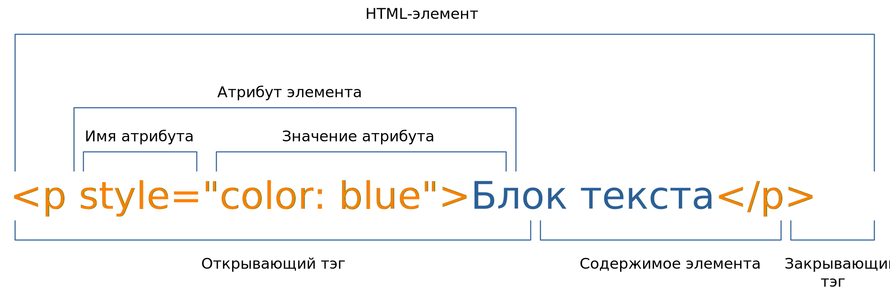

# План курса

Общая продолжительность курса - 7 месяцев.

Курс состоит из двух тематических блоков и двух-трёх лабораторных работ. Разбиение блоков по времени:

1. HTML и CSS - 2 месяца (29%),
2. JavaScript - 5 месяцев (71%).

## 1. HTML и CSS

Блок рассчитан на два месяца, т.е. примерно восемь еженедельных занятий по две пары. Ниже рассмотрим план на каждое занятие.

Ожидаемый итог - студент свободно оперирует HTML-элементами и создаёт блоки команд CSS.

В конце блока студенту выдаётся первая лабораторная работа.

### 1.1. Введение

Темы занятия:

1. Инструменты разработчика Chrome.
2. Базовые элементы HTML.
3. Атрибуты элементов, универсальные атрибуты.
4. Свойства CSS для установки цвета текста и фона.

### Что нового?

HTML:

- Тип документа `<!DOCTYPE>`
- Корневой элемент `<html>`
- Блок невизуальных элементов `<head>`
- Блок визуальных элементов `<body>`
- Заголовок документа `<title>`
- Контекстная информация о документе `<meta>` и атрибут `charset`
- Блок текста `<p>`
- Заголовки `<h1>`, `<h2>`, `<h3>`, `<h4>`, `<h5>`, `<h6>`
- Горизонтальная линия `<hr>`
- Комментарий `<!-- -->`
- Универсальный атрибут `title`
- Универсальный строчный элемент `<span>`

CSS:

- Цвет текста `color`
- Цвет фона `baclground-color`

#### Сценарий

Открываем в браузере любой сайт и открываем инструменты разработчика. Демонстрируем, как выглядят HTML и CSS в современном сайте.

Показываем [список элементов HTML](https://webref.ru/html) и [свойств CSS](https://webref.ru/css). Их довольно много, при случае лучше обращаться к этому справочнику.

Показываем структуру HTML-элемента.



Показываем базовую структуру страницы. `<!DOCTYPE>` обозначает тип документа.

```html
<!DOCTYPE html>

<html>
  <head></head>
  <body></body>
</html>
```

Добавляем в `<head>` заголовок страницы и указание кодировки содержимого. Здесь у `<meta>` появляется атрибут, к тому же этот элемент не требует наличие закрывающего тэга.

```html
<!DOCTYPE html>

<html>
  <head>
    <meta charset="utf-8">
    <title>Заголовок страницы</title>
  </head>
  <body>Содержимое страницы</body>
</html>
```

Заполняем элементами `<body>`. Появляется параграф `<p>`, заголовки шести уровней `<h1>`, `<h2>`, `<h3>`, `<h4>`, `<h5>`, `<h6>` и горизонтальная линия `<hr>`. Показываем, что в HTML можно добавлять комментарии в виде `<!-- -->`. Указываем у любого элемента универсальный атрибут `title` - всплывающая подсказка.

```html
<!DOCTYPE html>

<html>
  <head>
    <meta charset="utf-8">
    <title>Заголовок страницы</title>
  </head>
  <body>
    <!-- Блок текста -->
    <p>Параграф</p>

    <!-- Заголовки -->
    <h1>Заголовок первого уровня</h1>
    <h2>Заголовок второго уровня</h2>
    <h3>Заголовок третьего уровня</h3>
    <h4>Заголовок четвёртого уровня</h4>
    <h5>Заголовок пятого уровня</h5>
    <h6>Заголовок шестого уровня</h6>

    <!-- Горизонтальная линия -->
    <hr title="Горизонтальная линия">
  </body>
</html>
```

Оформляем текст с помощью универсального атрибута `style`. Устанавливаем цвет текста `color` и фона `background-color`. Свойства записываютсяс помощью *объявлений* вида `свойство: значение`. Несколько *объявлений* разделяются точкой с запятой. С помощью элемента `<span>` можно применять стили к отдельным участкам текста внутри элемента `<p>`.

Цвет можно записать по названию, либо по его шестнадцатеричному значению. Подробнее можно прочитать [в статье](https://webref.ru/html/value/color).

```html
<!DOCTYPE html>

<html>
  <head>
    <meta charset="utf-8">
    <title>Заголовок страницы</title>
  </head>
  <body>
    <p style="color: blue">Синий текст</p>
    <p style="background-color: yellow">Текст на жёлтом фоне</p>
    <p style="color: #ffffff; background-color: #ff0000">Белый текст на красном фоне</p>

    <p>
      Lorem ipsum dolor sit amet, consectetuer adipiscing elit, sed diam nonummy nibh euismod tincidunt ut laoreet dolore magna aliquam erat volutpat.
      <span title="Зелёный текст" style="color: green">Ut wisi enim ad minim veniam, quis nostrud exerci tation ullamcorper suscipit lobortis nisl ut aliquip ex ea commodo consequat.</span>
      Duis autem vel eum iriure dolor in hendrerit in vulputate velit esse molestie consequat, vel illum dolore eu feugiat nulla facilisis at vero eros et accumsan et iusto odio dignissim qui blandit praesent luptatum zzril delenit augue duis dolore te feugait nulla facilisi.
    </p>
  </body>
</html>
```

Студенты переходят к выполнению самостоятельных заданий.

### 1.2. "Таблицы и списки + немного CSS"

Темы занятия:

1. Элементы для создания списков.
2. Элементы для создания таблиц.
3. Элемент `style`.
4. Селекторы элементов, идентификаторов и классов.

### 1.3. "Мультимедиа и ссылки + ещё немного CSS"

Темы занятия:

1. Элементы мультимедиа: изображения, аудио и видео.
2. Ссылки.
3. Элемент `iframe`.
3. Элемент `link`: иконка сайта и подключаемые стили.
4. Свойства CSS для установки размеров, границ и др. применимое для рассматриваемых элементов.
5. Псевдоклассы, необходимые для стилизации таблиц.

### 1.4. "Dive into CSS"

Темы занятия:

1. Остальные псевдоклассы.
2. Псевдоэлементы.
3. Остальные виды селекторов.

### 1.5. "Про позиционирование"

Темы занятия:

1. Свойства CSS для позиционирования.
2. CSS Grid Layout.
3. CSS Flexible box Layout.
4. Семантические элементы HTML, описывающие структуру документа.

### 1.6. "Полезные вещи"

Темы занятия:

1. [Emmet](https://emmet.io) - разработка на HTML на стероидах.
2. [Методология БЭМ](https://ru.bem.info).

### 1.7. "Всякие полезности".

Темы занятия:

1. Другие полезные семантические элементы HTML.
2. Полезные метатэги.
3. Другие полезные свойства CSS.
4. Вендорные префиксы.

### 1.8. "Красивости"

Темы занятия:

1. @-правила.
2. Анимации и переходы.

## 2. JavaScript